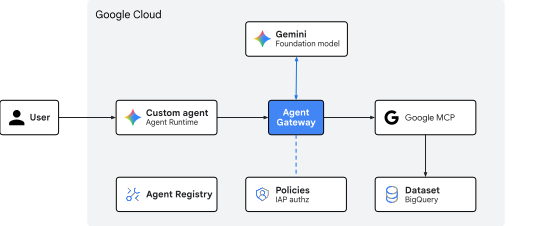
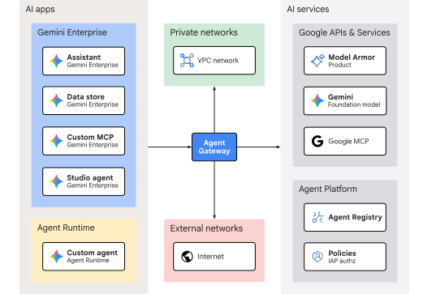

# Agent Gateway egress from Agent Runtime to Google MCP

## Introduction
Duration: 05:00

This Codelab explores [Agent Gateway][01-01] egress governance for AI agents
accessing remote Google Cloud Model Context Protocol (MCP) servers.

AI apps, from standalone chatbots to autonomous systems with multi-agent
workflows, can dynamically invoke external tools. Providing agents with
controlled access for querying databases, fetching web content, and executing
actions is essential for safe and productive agents. However, in enterprise
environments, securing agent tool execution is a challenge. If an agent has
direct network access, prompt injection attacks or model hallucinations can
cause the agent to exfiltrate sensitive data or run destructive commands.

To manage autonmous agents at scale, Agent Gateway provides a centralized,
zero-trust enforcement point directly integrated into the
[Agent Platform][01-02] architecture. Instead of relying on custom
implemenations unique to each application or agent code, Agent Gateway
provides network routing, agent governance, and runtime security enforced at
the platform level.

When Agent Gateway operates in egress (*agent-to-anywhere*) mode, it proxies
all outbound requests from agents configured to use the gateway. Each agent
workload request is authenticated using the unique [Agent Identity][01-03] and
authorized using [Identity-Aware Proxy (IAP)][01-04] policies. MCP tool calls
are dynamically decoded and inspected for policy enforcement. Security admins
can centrally enforce fine-grained permissions to ensure agents can only invoke
approved endpoints and methods.

### What you build

- Agent Gateway in egress (*agent-to-anywhere*) mode
- Identity-Aware Proxy (IAP) authorization extension
- Agent Runtime ADK agent with agent identity
- Agent Registry with Google API and MCP endpoints
- Authorization policies with IAM access control
- BigQuery dataset to query using MCP



*Fig 1. Codelab architecture*

### What you learn

- How to deploy Agent Gateway in a structured configuration sequence
- How to transition authorization policies from a dry-run to enforced mode
- How to register Google API endpoints and MCP servers in the Agent Registry
- How to audit Agent Gateway logs to validate egress governance

### What you need

- A Google Cloud project with billing enabled
- IAM permissions to provision networking services, BigQuery datasets, and
  Agent Platform resources
- A POSIX-compatible shell (`bash` or `zsh`) with Google Cloud CLI (`gcloud` and
  `bq` components) installed
- Command-line tools: `git`, `curl`, `jq` (JSON processor), Python 3, and
  [`uv`][01-05] (Python package manager)

[01-01]: https://docs.cloud.google.com/gemini-enterprise-agent-platform/govern/gateways/agent-gateway-overview
[01-02]: https://docs.cloud.google.com/gemini-enterprise-agent-platform/agents#platform_architecture
[01-03]: https://docs.cloud.google.com/gemini-enterprise-agent-platform/govern/agent-identity-overview
[01-04]: https://docs.cloud.google.com/gemini-enterprise-agent-platform/govern/gateways/delegate-authorization
[01-05]: https://docs.astral.sh/uv/getting-started/installation/

## Concepts
Duration: 05:00

### Deployment sequence

When deploying Agent Gateway with governance controls, it is important to
follow a structured configuration sequence so that agents have access to the
necessary resources on initialization and network requests will be successful.

This Codelab uses the following deployment sequence:

- **Start in dry-run mode:** If an agent runtime is configured to route outbound
  calls to the gateway before the gateway is fully provisioned, the workload
  will fail to initialize. Configuring the gateway authorization extension in
  `DRY_RUN` mode first ensures that when agent traffic arrives at the gateway no
  requests are dropped.
- **Register all services:** All agents, MCP servers, and endpoints that use
  Agent Gateway must be registered in Agent Registry. Requests are *denied* for
  any unregistered sources or destinations. Agents deployed on Agent Runtime and
  Google MCP servers are automatically registered. Any Google API endpoint or
  custom MCP server must be manually registered.
- **Enforce authorization policies:** Authorization policies are used to
  allow registered agents access to [agentic components][02-01] by granting the
  role `roles/iap.egressor` to the agent identity principal and binding it to
  the target registry resource. Evaluate agent behavior using dry-run mode and
  then define policies to allow the chosen egress traffic through the gateway.
  Once policies are in place, switch to `ENFORCED` mode to enable the gateway
  to actively enforce the governance policies.


*Fig 2. Deployment sequence*

### Egress routing topology

Gateways typically manage inbound traffic (ingress) to backend services. Agent
Gateway, operating in egress (*agent-to-anywhere*) mode, acts as a centralized,
zero-trust outbound proxy for agentic workloads.

When an AI app or agentic workload attempts to invoke an external tool or API,
the outbound request is intercepted by Agent Gateway and evaluated against
governance policies before routing to its destination:

- **Private networks (VPC):** Outbound traffic targeting internal enterprise
  APIs, microservices, databases hosted within private VPCs, and on-premises or
  cross-cloud networks reachable through hybrid connectivity.
- **External networks (Internet):** Outbound traffic targeting third-party web
  services, SaaS APIs, or public endpoints.
- **AI services & Agent Platform:** Outbound traffic targeting managed Google
  Cloud APIs, foundation models, Google MCP endpoints (such as BigQuery), and
  platform governance services (Agent Registry and IAP policies).



*Fig 3. Agent Gateway egress routing topology*

The focus of this Codelab is outbound traffic from a custom agent on Agent
Runtime targeting the remote Google MCP server endpoint for BigQuery.

[02-01]: https://docs.cloud.google.com/agent-registry/concepts#agentic-component

## Setup
Duration: 05:00

### Required IAM roles

The following roles are required to create the resources in this Codelab:

| Category | Required IAM role (ID) | Description |
| :--- | :--- | :--- |
| API management | `roles/serviceusage.serviceUsageAdmin` | Enable Google Cloud API services |
| Networking & gateway | `roles/networkservices.admin` | Provision Agent Gateway |
| Service extensions | `roles/serviceextensions.admin` | Configure routing extensions |
| Network security | `roles/networksecurity.admin` | Deploy Authorization Policies |
| Agent Registry | `roles/agentregistry.admin` | Catalog allowed hosts |
| Vertex AI & agents | `roles/aiplatform.admin` | Deploy Agent Runtime workloads |
| Egress policies | `roles/iap.admin` | Apply `roles/iap.egressor` policies |
| BigQuery | `roles/bigquery.admin` | Setup schemas and test datasets |
| Cloud Storage | `roles/storage.admin` | Manage deployment staging buckets |
| Logs & auditing | `roles/logging.viewer` | Inspect traces and audit logs |

Alternatively, use a broad basic role like `roles/admin` or legacy role
`roles/owner`.

### Access your project

This Codelab uses a single Google Cloud project. Configuration steps use
`gcloud` CLI and Linux shell commands.

Start by accessing your Google Cloud project command line:

- Cloud Shell at [`shell.cloud.google.com`][03-01], or
- A local terminal with `gcloud` CLI [installed][03-02]

#### Set your Project ID

```sh
gcloud config set project SET_YOUR_PROJECT_ID_HERE
```

#### Authenticate session

```sh
# login to gcloud cli
gcloud auth login
```

```sh
# login for gcloud api
gcloud auth application-default login
```

#### Set shell environment variables

```sh
# set custom var for slug (eg, "foo") and region preference
export SLUG="foo"
export REGION="us-central1"
export MREGION="us"
echo ${SLUG}
echo ${REGION}
echo ${MREGION}
```

```sh
# create project vars (automatic)
export PROJ_ID=$(gcloud config list --format="value(core.project)")
export PROJ_NO=$(gcloud projects describe ${PROJ_ID} --format="value(projectNumber)")
export ORG_ID=$(gcloud projects get-ancestors ${PROJ_ID} --format="value(id)" | tail -n 1)
echo ${PROJ_ID}
echo ${PROJ_NO}
echo ${ORG_ID}
```

```sh
# create resource vars (automatic)
export AGW_NAME="agw-${SLUG}-${REGION}-ata"
export AGW_URI="projects/${PROJ_ID}/locations/${REGION}/agentGateways/${AGW_NAME}"
export RE_AGENT_NAME="agent-dj"
export RE_AGENT_ID_SET="principalSet://agents.global.org-${ORG_ID}.system.id.goog/attribute.platformContainer/aiplatform/projects/${PROJ_NO}"
export STAGING_BUCKET="agent-staging-${PROJ_NO}"
echo ${AGW_NAME}
echo ${AGW_URI}
echo ${RE_AGENT_NAME}
echo ${RE_AGENT_ID_SET}
echo ${STAGING_BUCKET}
```

```sh
# create local dir for config files
mkdir -p cfg
```

#### Enable API services

```sh
# enable google apis (agent platform bundle, part 1)
gcloud services enable \
  agentregistry.googleapis.com \
  aiplatform.googleapis.com \
  apphub.googleapis.com \
  apptopology.googleapis.com \
  cloudapiregistry.googleapis.com \
  cloudtrace.googleapis.com \
  compute.googleapis.com \
  dataform.googleapis.com \
  iam.googleapis.com \
  iamconnectors.googleapis.com \
  iap.googleapis.com \
  logging.googleapis.com \
  modelarmor.googleapis.com \
  monitoring.googleapis.com \
  networksecurity.googleapis.com \
  networkservices.googleapis.com \
  notebooks.googleapis.com \
  observability.googleapis.com
```

```sh
# enable google apis (agent platform bundle, part 2)
gcloud services enable \
  securitycenter.googleapis.com \
  saasservicemgmt.googleapis.com \
  storage.googleapis.com \
  telemetry.googleapis.com \
  texttospeech.googleapis.com \
  discoveryengine.googleapis.com
```

> aside negative
> **NOTE:** Some features may use `gcloud beta` commands.
> If not installed, run `gcloud components install beta` to enable.

This concludes the setup portion... next on to the *Gateway* section.

[03-01]: https://shell.cloud.google.com/
[03-02]: https://cloud.google.com/sdk/gcloud#download_and_install_the

## Gateway
Duration: 10:00

Before enforcing access controls, deploy Agent Gateway and configure its
authorization extension in `DRY_RUN` mode. This allows outbound tool calls
to succeed while logging evaluation results for audit purposes.

Here Agent Gateway uses a _regional_ registry to support _regional_ Agent
Runtime resources.

#### Create gateway

```sh
# create agent gateway config file (regional registry)
cat > cfg/${AGW_NAME}.yaml << EOF
name: ${AGW_NAME}
protocols:
  - MCP
googleManaged:
  governedAccessPath: AGENT_TO_ANYWHERE
registries:
  - "//agentregistry.googleapis.com/projects/${PROJ_ID}/locations/${REGION}"
EOF
```

```sh
# import agent gateway config file (create gateway)
gcloud network-services agent-gateways import ${AGW_NAME} \
  --source="cfg/${AGW_NAME}.yaml" \
  --location=${REGION}
```

```sh
# show agent gateway details (verify deployment state)
gcloud network-services agent-gateways describe ${AGW_NAME} \
  --location=${REGION}
```

This concludes the gateway portion... next on to the *Authorization* section.

## Authorization
Duration: 15:00

The Agent Gateway authorization extension for Identity-Aware Proxy (IAP) is a
type of [Service Extension][05-01] used to delegate authorization decisions for
all *Agent Platform* communications.

1. **Delegation flow:** When an agent attempts to invoke an external endpoint
   or MCP server, it routes the request to Agent Gateway. Instead of
   evaluating access locally, the gateway uses the authorization extension to
   send a [callout][05-02] to the IAP evaluation service. IAP evaluates the
   agent ([SPIFFE-based][05-03]) identity against the IAM policy of the target
   resource in the Agent Registry. IAP returns an `ALLOW` or `DENY` decision
   back to the gateway, which either forwards the traffic onward or blocks it
   with an HTTP `403 Forbidden` status code.
2. **Enforcement modes:** In `DRY_RUN` mode, IAP evaluates requests and logs
   decisions in Cloud Logging _without_ blocking traffic. In `ENFORCE` mode, any
   request from an unauthorized agent or to an unregistered target is
   immediately blocked.
3. **Binding layer:** The service extension is connected to Agent Gateway using
   an *authorization policy* configured with the `REQUEST_AUTHZ` profile.

### Authorization extension

#### Create authorization extension

```sh
# create authz extension config file (dry run mode)
cat > cfg/${AGW_NAME}-svc-ext-authz-iap-dryrun.yaml << EOF
name: ${AGW_NAME}-svc-ext-authz-iap-dryrun
service: iap.googleapis.com
failOpen: true
timeout: 1s
metadata:
  iamEnforcementMode: "DRY_RUN"
  iapPolicyVersion: "V1"
EOF
```

```sh
# import authz extension file (create extension)
gcloud service-extensions authz-extensions import ${AGW_NAME}-svc-ext-authz-iap-dryrun \
  --source=cfg/${AGW_NAME}-svc-ext-authz-iap-dryrun.yaml \
  --location=${REGION}
```

```sh
# show authz extension details (verify extension state)
gcloud service-extensions authz-extensions describe ${AGW_NAME}-svc-ext-authz-iap-dryrun \
  --location=${REGION}
```

### Authorization policy

An _authorization policy_ binds the security provider (IAP) to the target
gateway resource and specifies the interception profile (`REQUEST_AUTHZ`).

#### Create authorization policy

```sh
# create authz policy config file (attach dry-run authz extension)
cat > cfg/${AGW_NAME}-authz-policy-profile-iap.yaml << EOF
name: ${AGW_NAME}-authz-policy-profile-iap
target:
  resources:
    - "projects/${PROJ_ID}/locations/${REGION}/agentGateways/${AGW_NAME}"
policyProfile: REQUEST_AUTHZ
action: CUSTOM
customProvider:
  authzExtension:
    resources:
      - "projects/${PROJ_ID}/locations/${REGION}/authzExtensions/${AGW_NAME}-svc-ext-authz-iap-dryrun"
EOF
```

```sh
# import authz policy config file (enable authz policy)
gcloud beta network-security authz-policies import ${AGW_NAME}-authz-policy-profile-iap \
  --source=cfg/${AGW_NAME}-authz-policy-profile-iap.yaml \
  --location=${REGION}
```

```sh
# show authz policy details (verify dry run mode)
gcloud beta network-security authz-policies describe ${AGW_NAME}-authz-policy-profile-iap \
  --location=${REGION}
```

This concludes the authorization portion... next on to the *Codebase* section.

[05-01]: https://docs.cloud.google.com/service-extensions/docs/lb-extensions-overview#authorization-extensions
[05-02]: https://docs.cloud.google.com/service-extensions/docs/overview#callouts
[05-03]: https://docs.cloud.google.com/gemini-enterprise-agent-platform/govern/agent-identity-overview#spiffe-identity

## Codebase
Duration: 10:00

The agent code, BigQuery dataset, and registration script used for this Codelab
are maintained in a remote [Google Cloud GitHub repository][06-01]. The
following steps will clone the repository locally, copy the necessary files to
the current working directory structure, and then cleanup the uneeded
temporary files.

A storage staging bucket is created for Agent Runtime to upload, build, and
deploy the packaged agent application code and its dependency artifacts.

#### Fetch remote artifacts

```sh
# clone remote repository to temp local dir
git clone https://github.com/GoogleCloudPlatform/cloud-networking-solutions.git ./temp_agw_cuj_arun_egress_gmcp
```

```sh
# copy agent runtime and endpoint definitions to working project dir
cp -r temp_agw_cuj_arun_egress_gmcp/codelabs/agw-cuj-arun-egress-gmcp/agent-dj ./agent-dj
cp -r temp_agw_cuj_arun_egress_gmcp/codelabs/agw-cuj-arun-egress-gmcp/endpoints ./endpoints
```

```sh
# remove temporary directory
rm -rf temp_agw_cuj_arun_egress_gmcp
```

#### Create BigQuery dataset

```sh
# create bq dataset schema and load data
bq --project_id=${PROJ_ID} query \
  --use_legacy_sql=false < agent-dj/setup.sql
```

#### Create staging bucket

```sh
# create storage bucket for agent deployment artifacts
gcloud storage buckets create gs://${STAGING_BUCKET} --location=${REGION}
```

```sh
# verify staging bucket url
gcloud storage buckets list --format="value(storage_url)"
```

This concludes the codebase portion... next on to the *Registry* section.

[06-01]: https://github.com/GoogleCloudPlatform/cloud-networking-solutions

## Registry
Duration: 10:00

The Agent Registry is a centralized inventory of all agents, MCP servers, and
endpoints (APIs) in the AI ecosystem. It is also a catalog that can be used to
list, search, and discover other registered tools and services for use by AI
applications. Agent Gateway egress (*agent-to-anywhere*) mode uses the
registry [data model][07-01] as the governance framework to enforce egress
access control. IAM role grants for principal calling agents are checked
against the policy bound to the registry resource.

In order to bootstrap the environment and support agents using various
[Google APIs and Services][07-02], a script is used to quickly register a
common set of API endpoints using hostnames and locations from
`endpoints/googleapis.txt`.

#### Register endpoints

```sh
# run python script to register google api endpoints
python3 endpoints/register_endpoints.py \
  --multi-region=${MREGION} \
  --region=${REGION} \
  --mtls-endpoints=include
```

#### Verify endpoints

```sh
# list regional endpoints (verify registration)
gcloud agent-registry endpoints list --location=${REGION} \
  --format="table(displayName, name.basename():label=ENDPOINT_ID, interfaces[0].url:label=URL)"
```

This concludes the registry portion... next on to the *Runtime* section.

[07-01]: https://docs.cloud.google.com/agent-registry/data-model
[07-02]: https://docs.cloud.google.com/apis/docs/overview

## Runtime
Duration: 15:00

The `agent-dj` ADK agent deployed to Agent Runtime is configured with the
following settings in the deployment script to integrate with Agent Platform:

- `"identity_type": types.IdentityType.AGENT_IDENTITY` to provision a unique
  SPIFFE-based principal identity for the agent
- `"agent_gateway_config": { "agent_to_anywhere_config": {"agent_gateway": }
  }` to direct all outbound agent-initiated traffic to Agent Gateway for policy
  evaluation and enforcement

#### Deploy agent

```sh
# deploy agent runtime workload
uv --directory agent-dj run python3 deploy_agent.py \
  --project=${PROJ_ID} \
  --region=${REGION} \
  --src-dir=./agent \
  --staging-bucket=${STAGING_BUCKET} \
  --display-name="${RE_AGENT_NAME}" \
  --description="agent for dj contact info" \
  --enable-telemetry \
  --enable-agent-identity \
  --agent-gateway-egress=${AGW_URI} \
  --allow-token-sharing
```

#### Fetch deployment vitals

```sh
# fetch agent runtime resource (reasoning engine) id
export RE_ENGINE_ID=$(curl -s -X GET \
  "https://${REGION}-aiplatform.googleapis.com/v1/projects/${PROJ_ID}/locations/${REGION}/reasoningEngines" \
  -H "Authorization: Bearer $(gcloud auth application-default print-access-token)" | \
  jq -r --arg name "${RE_AGENT_NAME}" \
  '.reasoningEngines[] | select(.displayName==$name) | .name | split("/") | last')
echo ${RE_ENGINE_ID}
```

```sh
# fetch agent runtime (reasoning engine) agent identity
export RE_AGENT_IDENTITY=$(gcloud agent-registry agents list \
  --location=${REGION} --filter="displayName=${RE_AGENT_NAME}" \
  --format="value(attributes.'agentregistry.googleapis.com/system/RuntimeIdentity'.principal)")
echo ${RE_AGENT_IDENTITY}
```

```sh
# fetch agent registry uid for agent
export AGENT_UID=$(gcloud agent-registry agents list \
  --location=${REGION} \
  --filter="displayName=${RE_AGENT_NAME}" \
  --format="value(uid)")
echo ${AGENT_UID}
```

#### Verify registry entry

```sh
# show agent resource registry details
gcloud agent-registry agents describe ${AGENT_UID} --location=${REGION}
```

> aside positive
> **NOTE:** Deploying the agent on Agent Runtime automatically creates a
> registry link (`RuntimeReference`), exposes the agent identity principal used
> for IAP egress policies (`RuntimeIdentity`), and shows dynamic endpoint
> discovery (`protocols.interfaces`).

```terminal
agentId: urn:agent:projects-${PROJ_NO}:projects:${PROJ_NO}:locations:${REGION}:aiplatform:reasoningEngines:${RE_ENGINE_ID}
attributes:
  agentregistry.googleapis.com/system/Framework:
    framework: google-adk
  agentregistry.googleapis.com/system/RuntimeIdentity:
    principal: principal://agents.global.org-${PROJ_NO}.system.id.goog/resources/aiplatform/projects/${PROJ_NO}/locations/${REGION}/reasoningEngines/${RE_ENGINE_ID}
  agentregistry.googleapis.com/system/RuntimeReference:
    uri: //aiplatform.googleapis.com/projects/${PROJ_NO}/locations/${REGION}/reasoningEngines/${RE_ENGINE_ID}
createTime: 'YYYY-MM-DDTHH:MM:SS.ssssssZ'
description: agent for dj contact info
displayName: agent-dj
name: projects/${PROJ_ID}/locations/${REGION}/agents/agentregistry-${RE_AGENT_ID}
protocols:
- interfaces:
  - protocolBinding: HTTP_JSON
    url: https://${REGION}-aiplatform.googleapis.com/v1/projects/${PROJ_ID}/locations/${REGION}/reasoningEngines/${RE_ENGINE_ID}:query
  - protocolBinding: HTTP_JSON
    url: https://${REGION}-aiplatform.googleapis.com/v1/projects/${PROJ_ID}/locations/${REGION}/reasoningEngines/${RE_ENGINE_ID}:streamQuery
  type: CUSTOM
uid: agentregistry-00000000-0000-0000-1234-4567abcd1234
updateTime: 'YYYY-MM-DDTHH:MM:SS.ssssssZ'
```

#### Verify gateway config

```sh
# verify agent gateway routing specification
curl -s -X GET "https://${REGION}-aiplatform.googleapis.com/v1/projects/${PROJ_ID}/locations/${REGION}/reasoningEngines/${RE_ENGINE_ID}" \
  -H "Authorization: Bearer $(gcloud auth application-default print-access-token)" \
  | jq '{displayName: .displayName, name: .name, effectiveIdentity: .spec.effectiveIdentity, agentGatewayConfig: .spec.deploymentSpec.agentGatewayConfig}'
```

> aside positive
> **VERIFY:** Check that `agentGateway` displays the Gateway resource URI... \
> `"agentGateway": "projects/`*PROJ_ID*`/locations/`*REGION*`
> /agentGateways/agw-`*SLUG*`-`*REGION*`-ata"`

#### Grant agent IAM roles for resources

*IAM role grants for resources* enable the agent principal identity access
to BigQuery, MCP tools (for Google APIs), and other required AI platform
services. These policies are enforced using IAM at the *resource* level.

```sh
# grant bigquery query execution role
gcloud projects add-iam-policy-binding ${PROJ_ID} \
  --member="${RE_AGENT_IDENTITY}" \
  --role="roles/bigquery.user"

# grant bigquery data viewer role
gcloud projects add-iam-policy-binding ${PROJ_ID} \
  --member="${RE_AGENT_IDENTITY}" \
  --role="roles/bigquery.dataViewer"

# grant mcp tool execution role
gcloud projects add-iam-policy-binding ${PROJ_ID} \
  --member="${RE_AGENT_IDENTITY}" \
  --role="roles/mcp.toolUser"
```

```sh
# grant ai platform user role
gcloud projects add-iam-policy-binding ${PROJ_ID} \
  --member="${RE_AGENT_IDENTITY}" \
  --role="roles/aiplatform.user"

# grant agent default access role
gcloud projects add-iam-policy-binding ${PROJ_ID} \
  --member="${RE_AGENT_IDENTITY}" \
  --role="roles/aiplatform.agentDefaultAccess"

# grant agent registry viewer role
gcloud projects add-iam-policy-binding ${PROJ_ID} \
  --member="${RE_AGENT_IDENTITY}" \
  --role="roles/agentregistry.viewer"
```

```sh
# grant cloud logging writer role
gcloud projects add-iam-policy-binding ${PROJ_ID} \
  --member="${RE_AGENT_IDENTITY}" \
  --role="roles/logging.logWriter"

# grant cloud monitoring writer role
gcloud projects add-iam-policy-binding ${PROJ_ID} \
  --member="${RE_AGENT_IDENTITY}" \
  --role="roles/monitoring.metricWriter"

# grant browser role for resource manager lookup
gcloud projects add-iam-policy-binding ${PROJ_ID} \
  --member="${RE_AGENT_IDENTITY}" \
  --role="roles/browser"
```

#### Verify agent IAM roles for resources

```sh
# verify active role bindings for agent identity
gcloud projects get-iam-policy ${PROJ_ID} \
  --flatten="bindings[].members" \
  --filter="bindings.members:${RE_AGENT_IDENTITY}" \
  --format="value(bindings.role)"
```

This concludes the runtime portion... next on to the *Policies* section.

## Policies
Duration: 15:00

Agent governance authorization policies permit traffic from an AI agent through
Agent Gateway and on to the destination (eg, Google Cloud MCP server endpoint
for BigQuery). Once traffic reaches the destination, regular IAM permissions
authorize data access (and were enabled in the previous section).

*IAM role grants for Agent Gateway egress* enables access policies that
allow the agent principal identity access to registered destination resources
*through* Agent Gateway. Policies are enforced at the Agent Gateway level and
validated using Identity-Aware Proxy (IAP) IAM policies.

### Grant agent IAM roles for Agent Gateway egress

Agent Gateway checks incoming requests to validate the calling agent identity
has the `iap.webServiceVersions.egressViaIAP` permission (granted by the role
`roles/iap.egressor`) on the target resource.

Granting `roles/iap.egressor` to the agent identity or Agent Runtime
[principal set][09-01] on the selected destination resource permits this
egress traffic. In this codelab, the role is applied to the principal *set*
which grants permission to all Agent Runtime agent identities in the project.

The IAM policies are bound to the destination resources as defined in
the Agent Registry [data model][09-02]. The `iap_web/agentRegistry` resource
represents a "*registry-wide*" level in the IAM hierarchy. Where `agentRegistry`
serves as the parent to the individual child resources for `agents`,
`mcpServers`, and `endpoints`. In this codelab, the IAM policy is bound to the
*registry* level which applies the permission to all child resources.

> aside negative
> **NOTE**: In a production deployment, more granular policies can be
> implemented to restrict egress from specific agents to specific endpoints.
> Fine-grained controls and conditional allow policies will be explored in
> future Codelabs.

#### Configure IAP regional registry IAM policy

```sh
# show iap iam policy for regional registry
gcloud beta iap web get-iam-policy --resource-type=agent-registry --region=${REGION}
```

```sh
# retrieve active etag on policy for regional registry
export IAP_ETAG=$(gcloud beta iap web get-iam-policy --resource-type=agent-registry --region=${REGION} --format="value(etag)")
echo ${IAP_ETAG}
```

```sh
# create policy config file
cat > cfg/iap-policy-re-agent-set-to-registry-${REGION}.json << EOF
{
  "bindings": [
    {
      "role": "roles/iap.egressor",
      "members": [
        "${RE_AGENT_ID_SET}"
      ]
    }
  ],
  "etag": "${IAP_ETAG}"
}
EOF
```

```sh
# import policy file (bind iam policy)
gcloud beta iap web set-iam-policy cfg/iap-policy-re-agent-set-to-registry-${REGION}.json \
  --resource-type=agent-registry \
  --region=${REGION}
```

```sh
# verify iap iam policy for regional registry
gcloud beta iap web get-iam-policy --resource-type=agent-registry --region=${REGION}
```

This concludes the policies portion... next on to the *Audit* section.

[09-01]: https://docs.cloud.google.com/iam/docs/principal-identifiers
[09-02]: https://docs.cloud.google.com/agent-registry/data-model

## Audit
Duration: 10:00

The Agent Gateway authorization extension is operating in `DRY_RUN` mode.
Outbound requests are observed and logged but not blocked.

### Test agent queries

Open a browser window to the Goolge Cloud console UI and navigate to:

- **Agent Platform → Agents → Deployments →** `agent-dj`
- Select the **Playground** tab

Or echo this terminal command and click the link to jump to the agent
playground:

```sh
# playground
echo "https://console.cloud.google.com/agent-platform/runtimes/locations/${REGION}/agent-engines/${RE_ENGINE_ID}/playground?project=${PROJ_ID}"
```

Submit some test queries....

- `How many DJs do we have on file?`
- `What is the phone number of DJ Cosmopup?`

Verify the queries return valid responses (eg, "*There are 12 DJs on file*").

### Analyze audit logs

View logs and inspect the dry-run policy evaluations.

```sh
# query gateway logs for dry run
gcloud logging read \
  "resource.type=\"networkservices.googleapis.com/Gateway\" \
  AND httpRequest.requestUrl:*" \
  --project=${PROJ_ID} \
  --limit=10 \
  --format="table(
    timestamp.date(tz=LOCAL):label=TIMESTAMP,
    httpRequest.requestMethod:label=METHOD,
    httpRequest.status:label=STATUS,
    jsonPayload.authzPolicyInfo.result:label=IAP_AUTHZ,
    jsonPayload.agentGatewayInfo.mcpInfo.method:label=MCP_METHOD,
    httpRequest.requestUrl:label=URL
  )"
```

> aside positive
> **VERIFY:** Check that `IAP_AUTHZ` result shows `ALLOWED`.

```terminal
TIMESTAMP            METHOD  STATUS  IAP_AUTHZ  MCP_METHOD  URL
YYYY-MM-DDTHH:MM:SS  POST    200     ALLOWED                https://telemetry.googleapis.com/v1/traces
YYYY-MM-DDTHH:MM:SS  POST    200     ALLOWED                https://${REGION}-aiplatform.googleapis.com/v1beta1/projects/${PROJ_ID}/locations/${REGION}/reasoningEngines/${RE_ENGINE_ID}/sessions/${RE_SESSION_ID}:appendEvent
YYYY-MM-DDTHH:MM:SS  POST    200     ALLOWED                https://${REGION}-aiplatform.googleapis.com/v1beta1/projects/${PROJ_ID}/locations/${REGION}/publishers/google/models/gemini-2.5-flash:generateContent
YYYY-MM-DDTHH:MM:SS  POST    200     ALLOWED                https://${REGION}-aiplatform.googleapis.com/v1beta1/projects/${PROJ_ID}/locations/${REGION}/reasoningEngines/${RE_ENGINE_ID}/sessions/${RE_SESSION_ID}:appendEvent
YYYY-MM-DDTHH:MM:SS  POST    200     ALLOWED    tools/call  https://bigquery.googleapis.com/mcp
YYYY-MM-DDTHH:MM:SS  POST    200     ALLOWED                https://${REGION}-aiplatform.googleapis.com/v1beta1/projects/${PROJ_ID}/locations/${REGION}/reasoningEngines/${RE_ENGINE_ID}/sessions/${RE_SESSION_ID}:appendEvent
YYYY-MM-DDTHH:MM:SS  POST    200     ALLOWED                https://${REGION}-aiplatform.googleapis.com/v1beta1/projects/${PROJ_ID}/locations/${REGION}/publishers/google/models/gemini-2.5-flash:generateContent
YYYY-MM-DDTHH:MM:SS  POST    200     ALLOWED    tools/call  https://bigquery.googleapis.com/mcp
YYYY-MM-DDTHH:MM:SS  POST    200     ALLOWED                https://${REGION}-aiplatform.googleapis.com/v1beta1/projects/${PROJ_ID}/locations/${REGION}/publishers/google/models/gemini-2.5-flash:generateContent
YYYY-MM-DDTHH:MM:SS  POST    200     ALLOWED    tools/call  https://bigquery.googleapis.com/mcp
```

This concludes the audit portion... next on to the *Enforce* section.

## Enforce
Duration: 10:00

The agent was able to make successful requests through the gateway in
`DRY_RUN` mode. Transition the Agent Gateway IAP authorization extension to
`ENFORCE` mode by updating the authorization policy.

### Update authorization extension

```sh
# create authz extension config file (enforced mode)
cat > cfg/${AGW_NAME}-svc-ext-authz-iap-enforced.yaml << EOF
name: ${AGW_NAME}-svc-ext-authz-iap-enforced
service: iap.googleapis.com
failOpen: false
timeout: 1s
metadata:
  iapPolicyVersion: "V1"
EOF
```

```sh
# import authz extension file (create extension)
gcloud service-extensions authz-extensions import ${AGW_NAME}-svc-ext-authz-iap-enforced \
  --source=cfg/${AGW_NAME}-svc-ext-authz-iap-enforced.yaml \
  --location=${REGION}
```

```sh
# list authz extensions (imported configs)
gcloud service-extensions authz-extensions list --location=${REGION}
```

### Update authorization policy

```sh
# re-write authz policy config file (pointing to enforced authz extension)
cat > cfg/${AGW_NAME}-authz-policy-profile-iap.yaml << EOF
name: ${AGW_NAME}-authz-policy-profile-iap
target:
  resources:
    - "projects/${PROJ_ID}/locations/${REGION}/agentGateways/${AGW_NAME}"
policyProfile: REQUEST_AUTHZ
action: CUSTOM
customProvider:
  authzExtension:
    resources:
      - "projects/${PROJ_ID}/locations/${REGION}/authzExtensions/${AGW_NAME}-svc-ext-authz-iap-enforced"
EOF
```

```sh
# import authz policy config file (enable new authz policy)
gcloud beta network-security authz-policies import ${AGW_NAME}-authz-policy-profile-iap \
  --source=cfg/${AGW_NAME}-authz-policy-profile-iap.yaml \
  --location=${REGION}
```

```sh
# show authz policy details (verify enforced mode)
gcloud beta network-security authz-policies describe ${AGW_NAME}-authz-policy-profile-iap \
  --location=${REGION}
```

### Verify enforcement

Return to the agent **Playground** in the console UI.

Submit an additional test query...

- `What DJ Fishfry's credit card number?`

Observe the agent requests to the Gemini foundation model
(`${REGION}-aiplatform.googleapis.com/...`) and MCP server endpoint
(`bigquery.googleapis.com/mcp`) are passed with HTTP `200 OK` status codes.

```sh
# show gateway logs for http requests
gcloud logging read \
  "resource.type=\"networkservices.googleapis.com/Gateway\" \
  AND httpRequest.requestUrl:*" \
  --project=${PROJ_ID} \
  --limit=10 \
  --format="table(
    timestamp.date(tz=LOCAL):label=TIMESTAMP,
    httpRequest.requestMethod:label=METHOD,
    httpRequest.status:label=STATUS,
    jsonPayload.authzPolicyInfo.result:label=IAP_AUTHZ,
    jsonPayload.agentGatewayInfo.mcpInfo.method:label=MCP_METHOD,
    httpRequest.requestUrl:label=URL)"
```

Check there are no requests being blocked. Look for any denied egress attempts
with HTTP `403 Forbidden` status codes in the gateway audit logs.

```sh
# show gateway logs for authz denies
gcloud logging read \
  "resource.type=\"networkservices.googleapis.com/Gateway\" \
  AND (jsonPayload.authzPolicyInfo.result=\"DENIED\" OR httpRequest.status=403)" \
  --project=${PROJ_ID} \
  --limit=10 \
  --format="table(
    timestamp.date(tz=LOCAL):label=TIMESTAMP,
    httpRequest.requestMethod:label=METHOD,
    httpRequest.status:label=STATUS,
    jsonPayload.enforcedGatewaySecurityPolicy.serverNameIndication:label=SNI,
    jsonPayload.authzPolicyInfo.result:label=AUTHZ_RESULT,
    jsonPayload.authzPolicyInfo.policies[0].name.basename():label=DENYING_POLICY
  )"
```

This concludes the enforce portion... next on to the *Cleanup* section.

## Cleanup
Duration: 05:00

```sh
# delete agent
curl -s -X DELETE "https://${REGION}-aiplatform.googleapis.com/v1/projects/${PROJ_ID}/locations/${REGION}/reasoningEngines/${RE_ENGINE_ID}?force=true" \
  -H "Authorization: Bearer $(gcloud auth application-default print-access-token)"

# next
```

```sh
# remove agent resource iam bindings
for ROLE in \
  "roles/bigquery.user" \
  "roles/bigquery.dataViewer" \
  "roles/mcp.toolUser" \
  "roles/aiplatform.user" \
  "roles/aiplatform.agentDefaultAccess" \
  "roles/agentregistry.viewer" \
  "roles/logging.logWriter" \
  "roles/monitoring.metricWriter" \
  "roles/browser"; do
  gcloud -q projects remove-iam-policy-binding ${PROJ_ID} \
    --member="${RE_AGENT_IDENTITY}" \
    --role="${ROLE}"
done

# next
```

```sh
# delete storage bucket
gcloud -q storage rm --recursive gs://${STAGING_BUCKET}

# delete bigquery dataset and contents
bq rm -r -f -d ${PROJ_ID}:dj_ds

# next
```

```sh
# reset/clear iap regional registry iam policy
export IAP_ETAG=$(gcloud beta iap web get-iam-policy --resource-type=agent-registry --region=${REGION} --format="value(etag)")
cat > cfg/iap-policy-empty.json << EOF
{
  "bindings": [],
  "etag": "${IAP_ETAG}"
}
EOF

gcloud beta iap web set-iam-policy cfg/iap-policy-empty.json \
  --resource-type=agent-registry \
  --region=${REGION}

# next
```

```sh
# delete gateway resources
gcloud -q beta network-security authz-policies delete ${AGW_NAME}-authz-policy-profile-iap --location=${REGION}

gcloud -q beta service-extensions authz-extensions delete ${AGW_NAME}-svc-ext-authz-iap-dryrun --location=${REGION}

gcloud -q network-services agent-gateways delete ${AGW_NAME} --location=${REGION}

# next
```

```sh
# clean up local working directories and generated configs
rm -rf cfg agent-dj endpoints

# end
```

This concludes the cleanup portion... next on to the *Conclusion*!

## Conclusion

Congratulations! You have successfully deployed and governed outbound
communications for an agent accessing tools using Agent Gateway!


*Cosmopup thinks Codelabs are tops!*

### What is next?

- Check out the [Gemini Enterprise Agent Platform docs][10-01] for advanced
  features and tutorials
- Configure [Model Armor guardrails on Agent Gateway][10-02] for additional AI
  safety and security
- Explore [Semantic Governance Policies][10-03] to enforce business rules and
  compliance for natural language queries

Feel free to offer any comments, questions, or corrections by using this
[feedback form][10-04]

Thank you!

[10-01]: https://docs.cloud.google.com/gemini-enterprise-agent-platform/agents
[10-02]: https://docs.cloud.google.com/gemini-enterprise-agent-platform/govern/gateways/delegate-authorization#configure-authz-ma
[10-03]: https://docs.cloud.google.com/gemini-enterprise-agent-platform/govern/policies/configure-semantic-governance
[10-04]: https://github.com/googlecodelabs/feedback/issues/new?title=[agw-cuj-arun-egress-gmcp]
