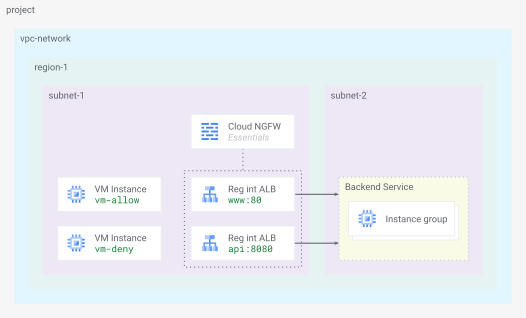
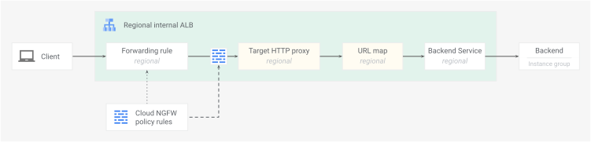

{# disableFinding(HEADING_NO_ID_H2) #}
{# disableFinding(HEADING_NO_ID_H3) #}

# Cloud NGFW Essentials for Load Balancers

## Introduction
Duration: 05:00

This Codelab explores Cloud Next Generation Firewall (NGFW)
[*Essentials*][01-01] for internal Application Load Balancers (ALB) and proxy
Network Load Balancers (NLB) using [regional network firewall policies][01-02].

Cloud NGFW is a fully distributed firewall service with advanced threat
protection and micro-segmentation capabilities to protect Google Cloud
workloads. Enabling Cloud NGFW at the load balancer level applies consistent
firewall policy rules to any *TCP* traffic ingressing internal proxy-based
load balancers. It simplifies provisioning an organizational security posture
by offering broader enforcement of policies for all services.

The following Cloud NGFW and Cloud load balancer products and features
are covered in this Codelab:

- Cloud NGFW *Essentials*
- Regional network firewall policies
- Regional internal Application Load Balancer
- Backend managed instance group (MIG) and Private Service Connect (PSC) network
endpoint group (NEG)

**NOTE:** Refer to Cloud NFGW documentation for the latest supported features
and limitations of firewall policy rules for load balancer [targets][01-03].

### What you learn

- Enabling basic Cloud NGFW firewall policy rules targeting load balancers
- Protecting an internal consumer load balancer service with VM instance and PSC
backends
- Testing client access and verifying firewall logs

### What you need

- A Google Cloud project
- Familiarity with Google Cloud networking concepts and using Google Cloud CLI
- IAM permissions: [`roles/compute.instanceAdmin.v1`][01-04],
[`roles/compute.networkAdmin`][01-05], [`roles/compute.securityAdmin`][01-06],
and [`roles/storage.admin`][01-07]

[01-01]: https://docs.cloud.google.com/firewall/docs/about-firewalls#firewall-essentials
[01-02]: https://docs.cloud.google.com/firewall/docs/regional-network-app-lb
[01-03]: https://docs.cloud.google.com/firewall/docs/firewall-policies-rule-details#targets
[01-04]: https://docs.cloud.google.com/compute/docs/access/iam#compute.instanceAdmin.v1
[01-05]: https://docs.cloud.google.com/compute/docs/access/iam#compute.networkAdmin
[01-06]: https://docs.cloud.google.com/compute/docs/access/iam#compute.securityAdmin
[01-07]: https://docs.cloud.google.com/storage/docs/access-control/iam-roles#storage.admin

## Concepts
Duration: 05:00

### Firewall feature tiers

Cloud NGFW has [three feature tiers][02-01]: Essentials, Standard, and Enterprise.
Each progressive tier offers additional levels of network traffic filtering and
inspection capabilities.

A summary of Cloud NGFW *Essentials* filtering capabilities:

| Tier | Capability | Network layers | Example rule parameters |
| :--- | :--- | :--- | :--- |
| Essentials | IP address & range filtering | IP | `--src-ip-ranges=1.1.1.0/24,2.2.2.2/32` |
| Essentials | Address groups | IP | `--src-address-groups=special-ranges` |
| Essentials | Protocol & port Filtering | TCP | `--layer4-configs=tcp` |
| Essentials | Secure tags | Metadata | `--src-secure-tags=tagValues/987654321098` |
| Essentials | Network type filtering | IP / metadata | `--src-network-type=INTRA_VPC` |

Load balancer forwarding rules explicitly define the destination TCP port. The
firewall rule `--layer4-configs=` parameter can only specify `tcp`. The port
value is implied by the forwarding rule itself.

Address groups and network types can be useful to make firewall policy rules
more efficient. The network types `VPC_NETWORKS` and `INTRA_VPC` are supported
with firewall policy rules for load balancers.

**NOTE:** Firewall policy rules for load balancers only support
`--direction=INGRESS`. These rules are designed to control access *to*
services exposed by the load balancer.

> aside positive
> **NOTE:** This Codelab covers Cloud NGFW *Essentials* firewall policy rules
> for load balancers.  The implementation of Cloud NFGW *Enterprise* firewall
> policy rules for load balancers is covered in separate Codelabs.

### Data plane filtering

Cloud NFGW *Essentials* features cover basic Layer 3 (IP address) and Layer 4
(TCP port) stateful firewall rules. These firewall policy rule features are
all performed efficiently in the load balancer data plane *without* the need
for full packet inspection.

Cloud NGFW *Essentials* policy rules targeting **VM instances** are enforced in
the distributed VPC network fabric as part of the core Google Cloud
software-defined network ([*Andromeda*][02-02]). Packet filtering and firewall
policy rules are enforced at the hypervisor level of each individual VM
instance, before the packet reaches the VM instance network interface.

Cloud NGFW *Essentials* policy rules targeting **load balancers** are enforced
using the [underlying technologies of Google Cloud load balancers][02-03],
specifically the Envoy service proxy infrastructure. Using the same Cloud NFGW
resource model and rule structure, stateful packet filtering is enforced
directly in the proxy-based load balancer data plane.

### Load balancer targets

There are a few key differences between Cloud NGFW policies targeting
*load balancers* and policies targeting *VM instances*.

Firewall policy rules can be applied to target *a single* load balancer by
specifying `--target-type=INTERNAL_MANAGED_LB` along with the specific
reference to the load balancer forwarding rule
`--target-forwarding-rules=`*FR_NAME*. To target *all* load balancer forwarding
rules in the VPC network region (where region is scoped by the policy), the
specific reference should be omitted, and only the
`--target-type=INTERNAL_MANAGED_LB` flag is needed.

If the `--target-type` parameter is *not* set in the rule configuration, then
the rule defaults to automatically apply to all *VM instances* and ***not***
the load balancers.

> aside negative
> **NOTE:** The default firewall policy rule behavior for load balancers is
> `action=allow`. This is normal everyday behavior for internal load balancers
> *without* firewall policies attached. However, this also applies to load
> balancers *with* firewall policies attached *when* packets do not match any
> defined rules. To change this default behavior, configure an explicit
> "deny all" rule with a lower priority (higher priority *number*) as a
> catchall.

### Codelab network

This Codelab uses a single project with one VPC network and the following
resources:

- Two regional subnets
- One regional network firewall policy
- Three regional internal Application Load Balancers
  - `www` HTTP service with VM instance group backend
  - `api` HTTP service with VM instance group backend
  - `gcs` HTTPS service with PSC NEG backend to Google APIs
- Two VM instances to test various allow and deny policies



*Fig 1. Codelab network*

Firewall policy rules targeting load balancers are linked to the load balancer
forwarding rule resources. Load balancers themselves are made up of
individually defined resources configured together to provide a complete load
balancing service. The forwarding rule definition directly references a
specific target proxy resource defined for it.



*Fig 1. Cloud NFGW for load balancer resources*

Cloud NGFW *Essentials* filters are programmed into the load balancer data
plane and implemented at the defined target proxy service layer--analogous to
a VM instance interface--using the same distributed and consistent firewall
mechanisms to enforce policies.

[02-01]: https://docs.cloud.google.com/firewall/docs/about-firewalls
[02-02]: https://www.usenix.org/system/files/conference/nsdi18/nsdi18-dalton.pdf
[02-03]: https://docs.cloud.google.com/load-balancing/docs/load-balancing-overview#tech-gclb

## Project setup
Duration: 05:00

#### Access your project

This Codelab uses a single Google Cloud project. Configuration steps use
`gcloud cli` CLI and Linux shell commands.

Start by accessing your Google Cloud project command line:

- Cloud Shell at [`shell.cloud.google.com`][03-01], or
- A local terminal with `gcloud` CLI [installed][03-02]

#### Set your Project ID

```sh
gcloud config set project YOUR_PROJECT_ID_HERE
```

#### Enable API services

```sh
gcloud services enable \
  cloudresourcemanager.googleapis.com \
  compute.googleapis.com \
  dns.googleapis.com \
  networksecurity.googleapis.com \
  certificatemanager.googleapis.com
```

#### Set shell environment variables

```sh
# set your region preference
export REGION_1="us-west1"
```

```sh
# set your zone preference
export ZONE_1="us-west1-c"
```

```sh
# fetch project info and verify vars set
export PROJECT_ID=$(gcloud config list --format="value(core.project)")
export PROJECT_NO=$(gcloud projects describe ${PROJECT_ID} --format="value(projectNumber)")
echo ${REGION_1}
echo ${ZONE_1}
echo ${PROJECT_ID}
echo ${PROJECT_NO}
```

> aside negative
> **NOTE:** Pre GA features may use `gcloud beta` commands.
> If not installed, run `gcloud components install beta` to enable.

[03-01]: https://shell.cloud.google.com/
[03-02]: https://cloud.google.com/sdk/gcloud#download_and_install_the

## Network foundation
Duration: 10:00

In this section you will deploy a network foundation with:

- Global VPC network and regional subnets
- Regional network firewall policy to secure the VPC network
- Cloud Router and Cloud NAT for servers to fetch software packages
- IP address reservations and DNS records for load balancer ingress

### Create network resources

```sh
# create vpc network
gcloud compute networks create vnet-foo --subnet-mode=custom
```

```sh
# create subnet for clients
gcloud compute networks subnets create subnet-foo-1 \
  --network=vnet-foo \
  --region=${REGION_1} \
  --range=10.0.0.0/24 \
  --enable-private-ip-google-access
```

```sh
# create subnet for backend servers
gcloud compute networks subnets create subnet-foo-2 \
  --network=vnet-foo \
  --region=${REGION_1} \
  --range=172.16.0.0/24 \
  --enable-private-ip-google-access
```

```sh
# create proxy subnet
gcloud compute networks subnets create subnet-foo-3 \
  --purpose=REGIONAL_MANAGED_PROXY \
  --role=ACTIVE \
  --network=vnet-foo \
  --region=${REGION_1} \
  --range=172.16.128.0/23
```

### Create firewall components

The basic regional network firewall policy created here will be used later when
adding load balancer specific targets. The policy must be in the same region as
the load balancer.

#### Create address group

Start by creating an address group to identify the source health check
[probe IP ranges][04-01] that support load balancer functionality. These ranges
need to be allowed for the load balancer backends to be considered healthy. It
will also be used later with firewall policy rules targeting load balancers.

```sh
# create address group
gcloud network-security address-groups create uhc-probes \
  --description="health check probes" \
  --type=IPv4 \
  --capacity=42 \
  --location=${REGION_1}
```

```sh
# add ip ranges to address group
gcloud network-security address-groups add-items uhc-probes \
  --items=35.191.0.0/16,130.211.0.0/22 \
  --location=${REGION_1}
```

#### Create firewall policy

```sh
# create fw policy
gcloud compute network-firewall-policies create fw-policy-foo-${REGION_1} \
  --description="foo fw ${REGION_1}" \
  --region=${REGION_1}
```

```sh
# create fw policy rule to allow in iap
gcloud compute network-firewall-policies rules create 1001 \
  --description="allow iap for ssh" \
  --firewall-policy=fw-policy-foo-${REGION_1} \
  --firewall-policy-region=${REGION_1} \
  --action=allow \
  --direction=INGRESS \
  --layer4-configs=tcp:22 \
  --src-ip-ranges=35.235.240.0/20
```

```sh
# create fw policy rule to allow in health checks
gcloud compute network-firewall-policies rules create 1002 \
  --description="allow health checks to backends" \
  --firewall-policy=fw-policy-foo-${REGION_1} \
  --firewall-policy-region=${REGION_1} \
  --action=allow \
  --direction=INGRESS \
  --layer4-configs=tcp \
  --src-address-groups=projects/${PROJECT_ID}/locations/${REGION_1}/addressGroups/uhc-probes
```

```sh
# create fw policy rule to allow in lb proxies
gcloud compute network-firewall-policies rules create 1003 \
  --description="allow lb proxy" \
  --firewall-policy=fw-policy-foo-${REGION_1} \
  --firewall-policy-region=${REGION_1} \
  --action=allow \
  --direction=INGRESS \
  --layer4-configs=tcp:80,tcp:443,tcp:8080 \
  --src-ip-ranges=172.16.128.0/23
```

```sh
# associate fw policy to vnet
gcloud compute network-firewall-policies associations create \
  --name=fw-policy-association-foo-${REGION_1} \
  --firewall-policy=fw-policy-foo-${REGION_1} \
  --network=vnet-foo \
  --firewall-policy-region=${REGION_1}
```

### Configure network services

#### Create Cloud Router and NAT Gateway

```sh
# create router for nat
gcloud compute routers create cr-nat-foo \
  --network=vnet-foo \
  --asn=16550 \
  --region=${REGION_1}
```

```sh
# create nat gateway
gcloud compute routers nats create natgw-foo \
  --router=cr-nat-foo \
  --region=${REGION_1} \
  --auto-allocate-nat-external-ips \
  --nat-all-subnet-ip-ranges
```

#### Reserve IP addresses

```sh
# reserve vip for lb www service
gcloud compute addresses create vip-foo-www \
  --region=${REGION_1} \
  --subnet=subnet-foo-1 \
  --addresses=10.0.0.101
```

```sh
# reserve vip for lb api service
gcloud compute addresses create vip-foo-api \
  --region=${REGION_1} \
  --subnet=subnet-foo-1 \
  --addresses=10.0.0.102
```

```sh
# reserve vip for lb gcs service
gcloud compute addresses create vip-foo-gcs \
  --region=${REGION_1} \
  --subnet=subnet-foo-1 \
  --addresses=10.0.0.103
```

#### Create DNS records

```sh
# create dns zone
gcloud dns managed-zones create zone-foo \
  --description="private zone for foo" \
  --dns-name=foo.com \
  --networks=vnet-foo \
  --visibility=private
```

```sh
# create dns record for www service
gcloud dns record-sets create www.foo.com \
  --zone=zone-foo \
  --type=A \
  --ttl=300 \
  --rrdatas="10.0.0.101"
```

```sh
# create dns record for api service
gcloud dns record-sets create api.foo.com \
  --zone=zone-foo \
  --type=A \
  --ttl=300 \
  --rrdatas="10.0.0.102"
```

```sh
# create dns record for gcs service
gcloud dns record-sets create gcs.foo.com \
  --zone=zone-foo \
  --type=A \
  --ttl=300 \
  --rrdatas="10.0.0.103"
```

This concludes the network setup portion... next on to configuring load
balancers.

[04-01]: https://docs.cloud.google.com/load-balancing/docs/health-check-concepts#ip-ranges

## Load balancer services
Duration: 10:00

In this section you will deploy load balancer components (backend services, URL
maps, target proxies, and forwarding rules) for three services:

1. `www` service (`ilb-foo-www`) on port `80`
1. `api` service (`ilb-foo-api`) on port `8080`
1. `gcs` service (`ilb-foo-gcs`) on port `443` with TLS certificate

Along with the supporting backend resources:

1. VM instances running HTTP servers in a managed instance group
1. Private Service Connect (PSC) network endpoint group (NEG) to Google APIs
1. Google Cloud Storage (GCS) bucket

### Setup backend resources

#### Create VM instance group servers

The `www` load balancer will use the VM instance group backend servers running
Apache web server listening on port `80`.

The `api` load balancer will use the same VM instance group listening on port
`8080`.

```sh
# create vm startup config with http server
cat > vm-server-startup.sh << 'OEOF'
#! /bin/bash
set -e
apt-get update
apt-get install apache2 -y
vm_hostname="$(curl -H "Metadata-Flavor:Google" \
http://169.254.169.254/computeMetadata/v1/instance/name)"
vm_zone="$(curl -H "Metadata-Flavor:Google" \
http://169.254.169.254/computeMetadata/v1/instance/zone | cut -d/ -f4)"
echo "www served from: $vm_hostname in zone $vm_zone on port 80" | \
tee /var/www/html/index.html
echo "Listen 8080" | tee -a /etc/apache2/ports.conf
mkdir -p /var/www/api
echo "api served from: $vm_hostname in zone $vm_zone on port 8080" | \
tee /var/www/api/index.html
tee /etc/apache2/sites-available/api.conf << EOF
<VirtualHost *:8080>
    DocumentRoot /var/www/api
</VirtualHost>
EOF
a2ensite api.conf
systemctl restart apache2
OEOF
```

```sh
# create managed instance group template
gcloud compute instance-templates create mig-template-foo \
  --machine-type=e2-micro \
  --network=vnet-foo \
  --region=${REGION_1} \
  --subnet=subnet-foo-2 \
  --no-address \
  --shielded-secure-boot \
  --metadata-from-file=startup-script=vm-server-startup.sh
```

```sh
# create regional managed instance group
gcloud compute instance-groups managed create mig-foo \
  --region=${REGION_1} \
  --size=2 \
  --template=mig-template-foo \
  --base-instance-name=service-foo
```

```sh
# create named ports for instance group
gcloud compute instance-groups managed set-named-ports mig-foo \
  --named-ports=www-port:80,api-port:8080 \
  --region=${REGION_1}
```

#### Create storage bucket

The `gcs` load balancer will use the PSC NEG backend to connect through the
Google APIs frontend to the Cloud Storage bucket.

```sh
# create random bucket name
export BUCKET=$(openssl rand -hex 12)
echo ${BUCKET}
```

```sh
# create bucket
gcloud storage buckets create gs://${BUCKET} --location=${REGION_1}
```

```sh
# give compute sa object admin role on bucket
gcloud storage buckets add-iam-policy-binding gs://${BUCKET} \
  --member=serviceAccount:${PROJECT_NO}-compute@developer.gserviceaccount.com \
  --role=roles/storage.objectAdmin
```

#### Create certificate

The `gcs` load balancer will terminate client HTTPS requests with a self-signed
certificate deployed to the target HTTPS proxy.

```sh
# create cert
openssl req -x509 -newkey rsa:2048 \
  -nodes \
  -days 365 \
  -keyout foo-gcs-key.pem \
  -out foo-gcs-cert.pem \
  -subj "/CN=Foo, Inc." \
  -addext "subjectAltName=DNS:gcs.foo.com"
```

```sh
# upload to certificate manager
gcloud certificate-manager certificates create cert-foo-gcs \
  --private-key-file=foo-gcs-key.pem \
  --certificate-file=foo-gcs-cert.pem \
  --location=${REGION_1}
```

### Create load balancer components

Use the following script to automate the deployment of the load balancer
components. This will help with speed and accuracy across all the configuration
elements involved.

#### Deploy load balancer creation script

```sh
# create script file
cat > create_lbs.sh << EOF
#!/bin/bash
set -e

# --- Create load balancer for www service port 80 ---
echo "--- Creating Load Balancer for WWW Service (ilb-foo-www) on port 80 ---"

echo "ilb-foo-www: creating health check (hc-foo-www)"
gcloud compute health-checks create http hc-foo-www \
  --use-serving-port \
  --region=${REGION_1}

echo "ilb-foo-www: creating backend service (bes-foo-www)"
gcloud compute backend-services create bes-foo-www \
  --load-balancing-scheme=INTERNAL_MANAGED \
  --protocol=HTTP \
  --port-name=www-port \
  --health-checks=hc-foo-www \
  --health-checks-region=${REGION_1} \
  --region=${REGION_1}

echo "ilb-foo-www: adding managed instance group (mig-foo) to backend service (bes-foo-www)"
gcloud compute backend-services add-backend bes-foo-www \
  --balancing-mode=UTILIZATION \
  --instance-group=mig-foo \
  --instance-group-region=${REGION_1} \
  --region=${REGION_1}

echo "ilb-foo-www: creating url map (ilb-foo-www)"
gcloud compute url-maps create ilb-foo-www \
  --default-service=bes-foo-www \
  --region=${REGION_1}

echo "ilb-foo-www: creating target http proxy (proxy-foo-www)"
gcloud compute target-http-proxies create proxy-foo-www \
  --url-map=ilb-foo-www \
  --url-map-region=${REGION_1} \
  --region=${REGION_1}

echo "ilb-foo-www: creating forwarding rule (fr-foo-www)"
gcloud compute forwarding-rules create fr-foo-www \
  --load-balancing-scheme=INTERNAL_MANAGED \
  --network=vnet-foo \
  --subnet=subnet-foo-1 \
  --subnet-region=${REGION_1} \
  --address=vip-foo-www \
  --ports=80 \
  --target-http-proxy=proxy-foo-www \
  --target-http-proxy-region=${REGION_1} \
  --region=${REGION_1}

echo "--- Successfully created Load Balancer for WWW Service (ilb-foo-www) ---"
echo

# --- Create load balancer for api service port 8080 ---
echo "--- Creating Load Balancer for API Service (ilb-foo-api) on port 8080 ---"

echo "ilb-foo-api: creating health check (hc-foo-api)"
gcloud compute health-checks create http hc-foo-api \
  --use-serving-port \
  --region=${REGION_1}

echo "ilb-foo-api: creating backend service (bes-foo-api)"
gcloud compute backend-services create bes-foo-api \
  --load-balancing-scheme=INTERNAL_MANAGED \
  --protocol=HTTP \
  --port-name=api-port \
  --health-checks=hc-foo-api \
  --health-checks-region=${REGION_1} \
  --region=${REGION_1}

echo "ilb-foo-api: adding managed instance group (mig-foo) to backend service (bes-foo-api)"
gcloud compute backend-services add-backend bes-foo-api \
  --balancing-mode=UTILIZATION \
  --instance-group=mig-foo \
  --instance-group-region=${REGION_1} \
  --region=${REGION_1}

echo "ilb-foo-api: creating url map (ilb-foo-api)"
gcloud compute url-maps create ilb-foo-api \
  --default-service=bes-foo-api \
  --region=${REGION_1}

echo "ilb-foo-api: creating target http proxy (proxy-foo-api)"
gcloud compute target-http-proxies create proxy-foo-api \
  --url-map=ilb-foo-api \
  --url-map-region=${REGION_1} \
  --region=${REGION_1}

echo "ilb-foo-api: creating forwarding rule (fr-foo-api)"
gcloud compute forwarding-rules create fr-foo-api \
  --load-balancing-scheme=INTERNAL_MANAGED \
  --network=vnet-foo \
  --subnet=subnet-foo-1 \
  --subnet-region=${REGION_1} \
  --address=vip-foo-api \
  --ports=8080 \
  --target-http-proxy=proxy-foo-api \
  --target-http-proxy-region=${REGION_1} \
  --region=${REGION_1}

echo "--- Successfully created Load Balancer for API Service (ilb-foo-api) ---"
echo

# --- Create load balancer for gcs service port 443 ---
echo "--- Creating Load Balancer for GCS Service (ilb-foo-gcs) on port 443 ---"

echo "ilb-foo-gcs: creating network endpoint group (neg-psc-gcs)"
gcloud compute network-endpoint-groups create neg-psc-gcs \
  --network-endpoint-type=private-service-connect \
  --psc-target-service=storage.${REGION_1}.rep.googleapis.com \
  --region=${REGION_1}

echo "ilb-foo-gcs: creating backend service (bes-foo-gcs)"
gcloud compute backend-services create bes-foo-gcs \
  --load-balancing-scheme=INTERNAL_MANAGED \
  --protocol=HTTPS \
  --region=${REGION_1}

echo "ilb-foo-gcs: adding network endpoint group (neg-psc-gcs) to backend service (bes-foo-gcs)"
gcloud compute backend-services add-backend bes-foo-gcs \
  --network-endpoint-group=neg-psc-gcs \
  --network-endpoint-group-region=${REGION_1} \
  --region=${REGION_1}

echo "ilb-foo-gcs: creating url map (ilb-foo-gcs)"
gcloud compute url-maps create ilb-foo-gcs \
  --default-service=bes-foo-gcs \
  --region=${REGION_1}

echo "ilb-foo-gcs: creating target https proxy (proxy-foo-gcs)"
gcloud compute target-https-proxies create proxy-foo-gcs \
  --url-map=ilb-foo-gcs \
  --url-map-region=${REGION_1} \
  --certificate-manager-certificates=cert-foo-gcs \
  --region=${REGION_1}

echo "ilb-foo-gcs: creating forwarding rule (fr-foo-gcs)"
gcloud compute forwarding-rules create fr-foo-gcs \
  --load-balancing-scheme=INTERNAL_MANAGED \
  --network=vnet-foo \
  --subnet=subnet-foo-1 \
  --subnet-region=${REGION_1} \
  --address=vip-foo-gcs \
  --ports=443 \
  --target-https-proxy=proxy-foo-gcs \
  --target-https-proxy-region=${REGION_1} \
  --region=${REGION_1}

echo "--- Successfully created Load Balancer for GCS Service (ilb-foo-gcs) ---"
echo

echo "All load balancers created successfully."
EOF
```

```sh
# make script executable
chmod +x create_lbs.sh
```

```sh
# run script
./create_lbs.sh
```

#### Verify load balancer creation

Check forwarding rules and backend services have been deployed.

```sh
# check forwarding rules
gcloud compute forwarding-rules list
```

```sh
# check backend services
gcloud compute backend-services list
```

This concludes the load balancer setup portion... next on to configuring client
VM instances.

## Client access
Duration: 15:00

### Create VM client resources

In this section you will deploy clients and verify end to end connectivity.

#### Create VM instances

```sh
# set variables for client ip addresses
export VM_ALLOW_IP="10.0.0.11"
export VM_DENY_IP="10.0.0.12"
echo ${VM_ALLOW_IP}
echo ${VM_DENY_IP}
```

```sh
# create client 1 vm
gcloud compute instances create vm-allow \
  --machine-type=e2-micro \
  --zone=${ZONE_1} \
  --subnet=subnet-foo-1 \
  --no-address \
  --private-network-ip=${VM_ALLOW_IP} \
  --scopes=cloud-platform \
  --shielded-secure-boot
```

```sh
# create client 2 vm
gcloud compute instances create vm-deny \
  --machine-type=e2-micro \
  --zone=${ZONE_1} \
  --subnet=subnet-foo-1 \
  --no-address \
  --private-network-ip=${VM_DENY_IP} \
  --scopes=cloud-platform \
  --shielded-secure-boot
```

### Test baseline service

#### Test from client `vm-allow`

**NOTE:** The VM instances will come online and be accessible over `ssh` using
IAP shortly after issuing the `instances create` commands. You may need to wait
a moment if the request fails on first try.

```sh
# send request to foo www service
gcloud compute ssh vm-allow --zone=${ZONE_1} --command="
  curl -s www.foo.com"
```

```sh
# send request to foo api service
gcloud compute ssh vm-allow --zone=${ZONE_1} --command="
  curl -s api.foo.com:8080"
```

> aside positive
> Check for successful responses: \
> `www served from: service-foo-{uid} in zone {zone} on port 80` \
> `api served from: service-foo-{uid} in zone {zone} on port 8080`

Test uploading a file to Google Cloud Storage through the load balancer.

```sh
# send request to foo gcs service
gcloud compute ssh vm-allow --zone=${ZONE_1} --command="
  echo 'test one on the way' > test-upload-1.txt
  TOKEN=\$(gcloud auth print-access-token)
  curl -s -k -X POST \"https://gcs.foo.com/upload/storage/v1/b/${BUCKET}/o?uploadType=media&name=test-upload-object-1.txt\" \
  -H \"Authorization: Bearer \${TOKEN}\" \
  -H \"Content-Type: text/plain\" \
  --data-binary @test-upload-1.txt"
```

> aside positive
> Check for successful acknowledgement: \
> `"kind": "storage#object",` \
> `"id": "${BUCKET}/test-upload-object-1.txt/{GENID}",`

The Cloud Storage API response confirms the network path is working correctly.

#### Test from client `vm-deny`

```sh
# send request to foo www service
gcloud compute ssh vm-deny --zone=${ZONE_1} --command="
  curl -s www.foo.com"
```

```sh
# send request to foo api service
gcloud compute ssh vm-deny --zone=${ZONE_1} --command="
  curl -s api.foo.com:8080"
```

```sh
# send request to foo gcs service
gcloud compute ssh vm-deny --zone=${ZONE_1} --command="
  echo 'test two on the way' > test-upload-2.txt
  TOKEN=\$(gcloud auth print-access-token)
  curl -s -k -X POST \"https://gcs.foo.com/upload/storage/v1/b/${BUCKET}/o?uploadType=media&name=test-upload-object-2.txt\" \
  -H \"Authorization: Bearer \${TOKEN}\" \
  -H \"Content-Type: text/plain\" \
  --data-binary @test-upload-2.txt"
```

**NOTE:** These tests should also succeed because no firewall rules have
targeted the load balancer yet.

This concludes all the main setup portions... next on to creating load balancer
firewall rules.

## Load balancer firewall
Duration: 10:00

In this section you will deploy firewall policy rules targeting load balancers.
The sequence of configurations will build toward a security posture that
permits `vm-allow` access and blocks `vm-deny` traffic to all services.

### Allow select traffic to `fr-foo-www`

Add a new firewall policy rule to the existing firewall policy
`fw-policy-foo-${REGION_1}`

- Allow a source IP range that includes `vm-allow` and excludes `vm-deny` IP
addresses
- Add an additional source filter [`INTRA_VPC`][07-01] to make use of
*network type* in a firewall policy rule targeting the load balancer

The source *network type* of `INTRA_VPC` and `VPC_NETWORKS` are supported in
firewall policies rules targeting load balancers when used *in combination*
with another source parameter. The evaluation logic is an `AND` between the two
source parameters. Here the traffic must meet the criteria for
[`INTRA_VPC`][07-01] *and* `--src-ip-ranges=${VM_ALLOW_IP}/32` to be allowed.

#### Create rule to allow `vm-allow` targeting `fr-foo-www`

```sh
# create fw policy rule
gcloud beta compute network-firewall-policies rules create 2001 \
  --description="allow vm traffic to fr-www" \
  --firewall-policy=fw-policy-foo-${REGION_1} \
  --firewall-policy-region=${REGION_1} \
  --enable-logging \
  --action=allow \
  --direction=INGRESS \
  --layer4-configs=tcp \
  --src-network-type=INTRA_VPC \
  --src-ip-ranges=${VM_ALLOW_IP}/32 \
  --target-type=INTERNAL_MANAGED_LB \
  --target-forwarding-rules=projects/${PROJECT_ID}/regions/${REGION_1}/forwardingRules/fr-foo-www
```

#### Test from client `vm-allow`

```sh
# send request to foo www service
gcloud compute ssh vm-allow --zone=${ZONE_1} --command="
  curl -s www.foo.com"
```

> aside positive
> Check for successful response: \
> `www served from: service-foo-{uid} in zone {zone} on port 80`

#### Test from client `vm-deny`

```sh
# send request to foo www service
gcloud compute ssh vm-deny --zone=${ZONE_1} --command="
  curl -s www.foo.com"
```

> aside negative
> Check for successful response: \
> `www served from: service-foo-{uid} in zone {zone} on port 80`

**NOTE:** This succeeds because the *implicit* default firewall policy rule
behavior for load balancers is `--action=allow`. A default (*catchall*) deny
rule is needed to change this.

### Deny default traffic to `fr-foo-www`

Add a new lower priority (higher priority *number*) firewall policy rule.

- Deny all traffic from *any* source IP address
- Traffic from `vm-allow` to `fr-foo-www` will be allowed before hitting the
deny rule

#### Create rule to deny traffic targeting `fr-foo-www`

```sh
# create fw policy rule
gcloud beta compute network-firewall-policies rules create 2999 \
  --description="allow vm traffic to fr-www" \
  --firewall-policy=fw-policy-foo-${REGION_1} \
  --firewall-policy-region=${REGION_1} \
  --enable-logging \
  --action=deny \
  --direction=INGRESS \
  --layer4-configs=tcp \
  --src-ip-ranges=0.0.0.0/0 \
  --target-type=INTERNAL_MANAGED_LB \
  --target-forwarding-rules=projects/${PROJECT_ID}/regions/${REGION_1}/forwardingRules/fr-foo-www
```

#### Considerations for health checks

Like with firewall policy rules targeting *VM instances*, the default catchall
(implicit) deny ingress rule blocks traffic sourced from the health check probe
ranges destined to load balancer *backends*. So an explicit allow rule was
configured to allow ingress health check probe ranges (see rule `1002`).

**IMPORTANT**: Similarly, when creating a catchall (explicit) deny ingress rule
for *load balancer targets*, another higher priority (lower priority *number*)
rule must be created to allow ingress from the health check probe range. This
rule needs to [target the load balancer(s)][07-02].

```sh
# create fw policy rule
gcloud beta compute network-firewall-policies rules create 2002 \
  --description="allow health checks to fr-www" \
  --firewall-policy=fw-policy-foo-${REGION_1} \
  --firewall-policy-region=${REGION_1} \
  --action=allow \
  --direction=INGRESS \
  --layer4-configs=tcp \
  --src-address-groups=projects/${PROJECT_ID}/locations/${REGION_1}/addressGroups/uhc-probes \
  --target-type=INTERNAL_MANAGED_LB \
  --target-forwarding-rules=projects/${PROJECT_ID}/regions/${REGION_1}/forwardingRules/fr-foo-www
```

#### Test from client `vm-deny`

```sh
# send request to foo www service
gcloud compute ssh vm-deny --zone=${ZONE_1} --command="
  curl -s www.foo.com"
```

This should now fail because firewall rule `2999` denies all traffic sourced
from the VPC network. The higher priority (lower priority *number*) rule `2001`
only allowed a source range that includes `vm-allow`.

> aside positive
> Check for *unsuccessful* response:
> `...`

Stop `curl` process by pressing `Ctrl+C`.

```sh
# send request to foo api service
gcloud compute ssh vm-deny --zone=${ZONE_1} --command="
  curl -s api.foo.com:8080"
```

> aside negative
> Check for successful response: \
> `api served from: service-foo-{uid} in zone {zone} on port 8080`

`vm-deny` can still access the API service! This succeeded because the firewall
rule was only specifically applied to the forwarding rule `fr-foo-www` and did
not target `fr-foo-api`.

### Update rules to target all load balancers

**NOTE:** Firewall policy rules can be applied to *all* load balancers in a
VPC network by omitting `--target-forwarding-rules=`*FR_NAME*.

Change the firewall policy rules to now apply to all load balancer forwarding
rule targets in the VPC network.

1. Create a new ingress *allow* rule `2003` targeting all forwarding rules to
allow VM traffic (`vm-allow` IP range)
1. Create a new ingress *allow* rule `2004` targeting all forwarding rules to
allow health checks (`uhc-probes` address group)
traffic.
1. Create new ingress *deny* rule `2998` targeting all forwarding rules as a
catchall deny for all other traffic

#### Modify firewall rules to target all load balancers

```sh
# create fw policy rule
gcloud beta compute network-firewall-policies rules create 2003 \
  --description="allow vm traffic to all vnet lb fr" \
  --firewall-policy=fw-policy-foo-${REGION_1} \
  --firewall-policy-region=${REGION_1} \
  --enable-logging \
  --action=allow \
  --direction=INGRESS \
  --layer4-configs=tcp  \
  --src-ip-ranges=${VM_ALLOW_IP}/32 \
  --target-type=INTERNAL_MANAGED_LB
```

```sh
# create fw policy rule
gcloud beta compute network-firewall-policies rules create 2004 \
  --description="allow health checks to all vnet lb fr" \
  --firewall-policy=fw-policy-foo-${REGION_1} \
  --firewall-policy-region=${REGION_1} \
  --enable-logging \
  --action=allow \
  --direction=INGRESS \
  --layer4-configs=tcp \
  --src-address-groups=projects/${PROJECT_ID}/locations/${REGION_1}/addressGroups/uhc-probes \
  --target-type=INTERNAL_MANAGED_LB
```

```sh
# create fw policy rule
gcloud beta compute network-firewall-policies rules create 2998 \
  --description="deny all vnet traffic to all vnet lb fr" \
  --firewall-policy=fw-policy-foo-${REGION_1} \
  --firewall-policy-region=${REGION_1} \
  --enable-logging \
  --action=deny \
  --direction=INGRESS \
  --layer4-configs=tcp \
  --src-ip-ranges=0.0.0.0/0 \
  --target-type=INTERNAL_MANAGED_LB
```

The previous firewall policy rules targeting *explicit* load balancer
forwarding rules can be removed since they are now redundant with the rules
targeting all forwarding rules in the VPC network.

```sh
# delete redundant fw policy rules
gcloud beta compute network-firewall-policies rules delete 2001 \
  --firewall-policy=fw-policy-foo-${REGION_1} \
  --firewall-policy-region=${REGION_1}

gcloud beta compute network-firewall-policies rules delete 2002 \
  --firewall-policy=fw-policy-foo-${REGION_1} \
  --firewall-policy-region=${REGION_1}

gcloud beta compute network-firewall-policies rules delete 2999 \
  --firewall-policy=fw-policy-foo-${REGION_1} \
  --firewall-policy-region=${REGION_1}
```

#### Test from client `vm-deny`

```sh
# send request to foo api service
gcloud compute ssh vm-deny --zone=${ZONE_1} --command="
  curl -s api.foo.com:8080"
```

This should now fail because `fr-foo-api` is also targeted by all firewall
policy rules with `--target-type=INTERNAL_MANAGED_LB`.

> aside positive
> Check for *unsuccessful* response: \
> `...`

Stop `curl` process by pressing `Ctrl+C`.

Test downloading a file from Google Cloud Storage through the load balancer.

```sh
# send request to foo gcs service
gcloud compute ssh vm-deny --zone=${ZONE_1} --command="
  TOKEN=\$(gcloud auth print-access-token)
  curl -s -k \"https://gcs.foo.com/storage/v1/b/${BUCKET}/o/test-upload-object.txt?alt=media\" \
  -H \"Authorization: Bearer \${TOKEN}\" \
  -o test-download.txt"
```

Stop `curl` process by pressing `Ctrl+C`.

#### Test from client `vm-allow`

```sh
# send request to foo www service
gcloud compute ssh vm-allow --zone=${ZONE_1} --command="
  curl -s www.foo.com"
```

```sh
# send request to foo api service
gcloud compute ssh vm-allow --zone=${ZONE_1} --command="
  curl -s api.foo.com:8080"
```

> aside positive
> Check for successful responses: \
> `www served from: service-foo-{uid} in zone {zone} on port 80` \
> `api served from: service-foo-{uid} in zone {zone} on port 8080`

```sh
# send request to foo gcs service
gcloud compute ssh vm-allow --zone=${ZONE_1} --command="
  TOKEN=\$(gcloud auth print-access-token)
  curl -s -k \"https://gcs.foo.com/storage/v1/b/${BUCKET}/o/test-upload-object-1.txt?alt=media\" \
  -H \"Authorization: Bearer \${TOKEN}\" \
  -o test-download-1.txt"
```

Verify download content

```sh
# send request from vm
gcloud compute ssh vm-allow --zone=${ZONE_1} --command="
  cat test-download-1.txt"
```

> aside positive
> Check for successful output: \
> `test one on the way`

All of the load balancers services are available to `vm-allow` and are
successfully blocked to `vm-deny`.

This concludes the testing portion... next a brief look at logging.

[07-01]: https://docs.cloud.google.com/firewall/docs/understand-network-contexts#intra-vpc-network-context-criteria
[07-02]: https://docs.cloud.google.com/firewall/docs/regional-network-app-lb#create-ngfw-resources

## Firewall rules logging

The [firewall log format][08-01] has fields and records for rules that target
load balancers (`--target-type=INTERNAL_MANAGED_LB`).

The logs will contain an additional field labeled `load_balancer_details` with
more information on the load balancer where the firewall policy rule was
targeted. This is analogous to the `InstanceDetails` field format when VM
instances are targeted in firewall policy rules.

- `load_balancer_details.forwarding_rule_name` shows the target forwarding rule
of the firewall policy rule
- `load_balancer_details.type` indicates which flavor of proxy-based load
balancer is targeted
- `load_balancer_details.url_map_name` logs the URL map resource used when the
type is an application load balancer

### View logs

Query the firewall logs to see the results of the firewall policy rules.

```sh
gcloud logging read \
  "logName=projects/${PROJECT_ID}/logs/compute.googleapis.com%2Ffirewall \
  AND (jsonPayload.connection.src_ip=\"${VM_ALLOW_IP}\" OR jsonPayload.connection.src_ip=\"${VM_DENY_IP}\")" \
  --project=${PROJECT_ID} \
  --freshness=30m \
  --limit=50 \
  --format="table(
    timestamp:label=TIMESTAMP,
    jsonPayload.connection.src_ip:label=SRC_IP,
    jsonPayload.connection.src_port:label=SRC_PORT,
    jsonPayload.connection.dest_ip:label=DEST_IP,
    jsonPayload.connection.dest_port:label=DEST_PORT,
    jsonPayload.disposition:label=ACTION,
    jsonPayload.rule_details.priority:label=PRIORITY,
    jsonPayload.load_balancer_details.forwarding_rule_name:label=FWD_RULE
  )"
```

The log output shows the effective rules enforced by the policy:

- All `vm-allow` traffic to all load balancers is allowed by rule `2011`
- All traffic destined to load balancers is denied by rule `2998`

```log
TIMESTAMP                       SRC_IP     SRC_PORT  DEST_IP     DEST_PORT  ACTION   PRIORITY  FWD_RULE
YYYY-MM-DDTHH:MM:SS.850967068Z  10.0.0.11  48480     10.0.0.103  443        ALLOWED  2003      fr-foo-gcs
YYYY-MM-DDTHH:MM:SS.418613380Z  10.0.0.11  37340     10.0.0.101  80         ALLOWED  2003      fr-foo-www
YYYY-MM-DDTHH:MM:SS.213234118Z  10.0.0.12  55950     10.0.0.103  443        DENIED   2998      fr-foo-gcs
YYYY-MM-DDTHH:MM:SS.981484412Z  10.0.0.11  41738     10.0.0.101  80         ALLOWED  2003      fr-foo-www
YYYY-MM-DDTHH:MM:SS.189358071Z  10.0.0.12  55950     10.0.0.103  443        DENIED   2998      fr-foo-gcs
YYYY-MM-DDTHH:MM:SS.061463883Z  10.0.0.12  55950     10.0.0.103  443        DENIED   2998      fr-foo-gcs
YYYY-MM-DDTHH:MM:SS.965498098Z  10.0.0.12  53284     10.0.0.102  8080       DENIED   2998      fr-foo-api
```

Logs are also viewable in Google Cloud Console using Logs Explorer. Navigate to
[`console.cloud.google.com/logs/query`][08-02] and use the standard VPC firewall
log `compute.googleapis.com/firewall`.

```sql
logName=projects/${PROJECT_ID}/logs/compute.googleapis.com%2Ffirewall
```

This concludes the logging portion... on to clean up!

[08-01]: https://docs.cloud.google.com/firewall/docs/firewall-rules-logging#log-format
[08-02]: http://console.cloud.google.com/logs/query

## Cleanup
Duration: 5:00

```sh
# delete client compute resources
gcloud -q compute instances delete vm-deny --zone=${ZONE_1}

gcloud -q compute instances delete vm-allow --zone=${ZONE_1}

# next
```

```sh
# delete load balancer resources for gcs
gcloud -q compute forwarding-rules delete fr-foo-gcs --region=${REGION_1}

gcloud -q compute target-https-proxies delete proxy-foo-gcs --region=${REGION_1}

gcloud -q compute url-maps delete ilb-foo-gcs --region=${REGION_1}

gcloud -q compute backend-services delete bes-foo-gcs --region=${REGION_1}

gcloud -q compute addresses delete vip-foo-gcs --region=${REGION_1}

# next
```

```sh
# delete load balancer resources for api
gcloud -q compute forwarding-rules delete fr-foo-api --region=${REGION_1}

gcloud -q compute target-http-proxies delete proxy-foo-api --region=${REGION_1}

gcloud -q compute url-maps delete ilb-foo-api --region=${REGION_1}

gcloud -q compute backend-services delete bes-foo-api --region=${REGION_1}

gcloud -q compute health-checks delete hc-foo-api --region=${REGION_1}

gcloud -q compute addresses delete vip-foo-api --region=${REGION_1}

# next
```

```sh
# delete load balancer resources for www
gcloud -q compute forwarding-rules delete fr-foo-www --region=${REGION_1}

gcloud -q compute target-http-proxies delete proxy-foo-www --region=${REGION_1}

gcloud -q compute url-maps delete ilb-foo-www --region=${REGION_1}

gcloud -q compute backend-services delete bes-foo-www --region=${REGION_1}

gcloud -q compute health-checks delete hc-foo-www --region=${REGION_1}

gcloud -q compute addresses delete vip-foo-www --region=${REGION_1}

# next
```

```sh
# delete service backend resources
gcloud -q storage rm --recursive gs://${BUCKET}

gcloud -q certificate-manager certificates delete cert-foo-gcs --location=${REGION_1}

gcloud -q compute network-endpoint-groups delete neg-psc-gcs --region=${REGION_1}

gcloud -q compute instance-groups managed delete mig-foo --region=${REGION_1}

gcloud -q compute instance-templates delete mig-template-foo --global

# next
```

```sh
# delete dns, nat, fw resources
gcloud -q dns record-sets delete gcs.foo.com --type=A --zone=zone-foo

gcloud -q dns record-sets delete api.foo.com --type=A --zone=zone-foo

gcloud -q dns record-sets delete www.foo.com --type=A --zone=zone-foo

gcloud -q dns managed-zones delete zone-foo

gcloud -q compute routers delete cr-nat-foo --region=${REGION_1}

gcloud -q compute network-firewall-policies associations delete \
  --firewall-policy=fw-policy-foo-${REGION_1} \
  --name=fw-policy-association-foo-${REGION_1} \
  --firewall-policy-region=${REGION_1}

gcloud -q compute network-firewall-policies delete fw-policy-foo-${REGION_1} --region=${REGION_1}

gcloud -q network-security address-groups delete uhc-probes --location=${REGION_1}

# next
```

```sh
# delete network resources
gcloud -q compute networks subnets delete subnet-foo-3 --region=${REGION_1}

gcloud -q compute networks subnets delete subnet-foo-2 --region=${REGION_1}

gcloud -q compute networks subnets delete subnet-foo-1 --region=${REGION_1}

gcloud -q compute networks delete vnet-foo

# next
```

```sh
# delete shell variables and local files
unset PROJECT_ID REGION_1 ZONE_1 VM_ALLOW_IP VM_DENY_IP BUCKET

rm vm-server-startup.sh create_lbs.sh foo-gcs-key.pem foo-gcs-cert.pem

# end
```

## Conclusion

Congratulations! You have successfully configured Cloud NGFW *Essentials*
for load balancers!

Feel free to offer any comments, questions, or corrections by using this
[feedback form][10-01]

Thank you!

[10-01]: https://github.com/googlecodelabs/feedback/issues/new?title=[lb-fw-ga]