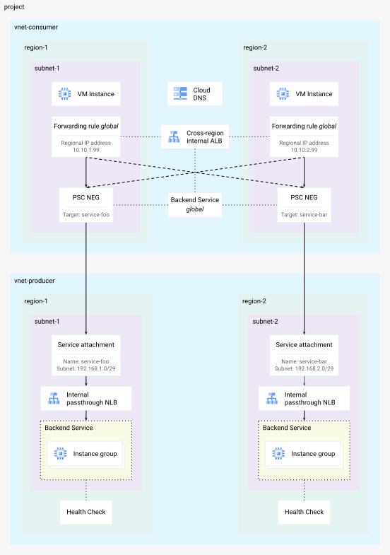
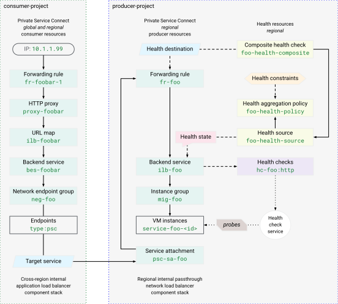

# Composite Health for Private Service Connect

## Introduction
Duration: 05:00

This Codelab explores [Composite Health][1] for Private Service Connect (PSC)
for automatic regional failover. Composite Health for PSC is a networking
feature that provides improved service resiliency and availability.

Composite Health allows service producers to define customized health
policies (what *state* defines a healthy or unhealthy service) and automatically
propagate these signals to service consumers connecting to the service with PSC
[backends][2]. This feature is designed specifically to support
automatic cross-region failover. If a regional producer service becomes
unhealthy, the consumer load balancer automatically stops routing traffic to
that region and directs traffic to a healthy service in another region.

Compared to previous methods for cross-region failover, like
[outlier detection][3], Composite Health offers a more accurate failover
signal because it is based directly on the aggregated health of the producer
service backends (VM instance groups or network endpoints). Producers can define
their own health logic, ensuring the producer only receives traffic when the
service truly meets the necessary health criteria.

[1]: https://cloud.google.com/vpc/docs/about-composite-health
[2]: https://cloud.google.com/vpc/docs/private-service-connect-backends
[3]: https://cloud.google.com/vpc/docs/private-service-connect-backends#outlier-detection

### What you learn

-   Components of Composite Health and how they work together to
    determine the health state of a producer service
-   Implementing Composite Health for PSC for a producer service using gcloud
    commands
-   Configuration of a cross-region PSC consumer access load balancer to use the
    health signals from the producer Composite Health policy
-   Testing service failure scenarios and validating automatic cross-region
    failover

### What you need

-   A Google Cloud project
-   IAM permissions granted to the predefined `roles/compute.admin` role or a
    broad basic role like `roles/admin` or legacy `roles/owner`
-   Familiarity with Google Cloud networking concepts and using Google Cloud CLI

## Concepts
Duration: 05:00

### PSC networking

This Codelab network topology includes a consumer and producer VPC network in
two active Google Cloud regions.

The consumer side has regional subnets with client VM instances used to access
the producer service through a
[cross-regional internal Application Load Balancer][4] with PSC network
endpoint group (NEG) backends. There are two regional load balancer forwarding
rules, with regional IP addresses, for global (cross-regional) client ingress.
The backend service is a *global* resource that supports NEGs across different
regions. In a failover scenario, a client connecting to either regional frontend
forwarding rule can be directed to a healthy global backend.



*Fig 1. Codelab network topology*

The producer side has regional subnets with regional
[internal passthrough Network Load Balancers][5] exposing a service through a
regional PSC service attachment resource. The backend services contain regional
Managed Instance Groups (MIGs) and are [health checked][6] by probing `http`
requests and validating `200 (OK)` responses.

Refer to the latest documentation on Private Service Connect compatibility for
[Producer configuration][7] to see which load balancers support
Composite Health for PSC.

[4]: https://cloud.google.com/load-balancing/docs/l7-internal#components
[5]: https://cloud.google.com/load-balancing/docs/l7-internal#components
[6]: https://cloud.google.com/load-balancing/docs/health-check-concepts#criteria-protocol-http
[7]: https://cloud.google.com/vpc/docs/private-service-connect-compatibility#producer-configuration-backends

### Service health

The producer backend service health check, configured during creation of the
load balancer, serves as the originating signal for the
*Composite Health* for PSC feature. The *health source* resource uses that
signal along with additional constraints defined in the
*health aggregation policy* resource to determine a *health state* for a
single backend service.

By default, a service is considered healthy when both of these constraints are
met:

-   minimum of `x` percent of backends are healthy (default `60`)
-   minimum of `y` number of backends are healthy (default `1`)

The *composite health check* references all the *health sources* for all the
backend services to determine the overall health of the entire regional producer
service. In the case of this lab, each regional producer service has only *one*
backend service health source rolling up to the one composite health check.



*Fig 2. Composite Health for PSC resource model*

The *composite health check* resource definition also refers to the forwarding
rule of the producer service load balancer. The consumer access load balancer
backend PSC NEG is logically connected to the producer PSC service attachment
and the producer load balancer forwarding rule. This ties the consumer access
load balancer to the producer service *composite health check* state. The
overall service health for the regional producer service is then propagated
to the consumer load balancer to make the appropriate backend selection.

## Project setup
Duration: 05:00

#### Access your project

This Codelab is written to use a *single* Google Cloud project. Configuration
steps use `gcloud` and Linux shell commands.

> **NOTE:** In a production deployment, PSC consumer resources and producer
> services are typically in different projects.

Start by accessing your Google Cloud project command line, using:

-   Cloud Shell
    [`http://shell.cloud.google.com/`](http://shell.cloud.google.com/), or
-   A local terminal with `gcloud` CLI [installed][8]

[8]: https://cloud.google.com/load-balancing/docs/l7-internal#components

#### Set your Project ID

```sh
gcloud config set project YOUR_PROJECT_ID_HERE
```

#### Set shell environment variables

```sh
export PROJECT_ID=$(gcloud config list --format="value(core.project)")
export REGION_1="us-west1"
export ZONE_1="us-west1-c"
export REGION_2="us-east1"
export ZONE_2="us-east1-c"
echo ${PROJECT_ID}
echo ${REGION_1}
echo ${ZONE_1}
echo ${REGION_2}
echo ${ZONE_2}
```

#### Enable API services

```sh
gcloud services enable compute.googleapis.com
gcloud services enable dns.googleapis.com
```

## Producer service
Duration: 15:00

### Create shared resources

#### Create network

```sh
gcloud compute networks create vnet-producer --subnet-mode=custom
```

#### Create subnets

```sh
# create subnet for service workload in region 1
gcloud compute networks subnets create subnet-foo \
  --network=vnet-producer \
  --region=${REGION_1} \
  --range=172.16.1.0/24 \
  --enable-private-ip-google-access

# create subnet for psc nat in region 1
gcloud compute networks subnets create subnet-foo-pscnat \
  --network=vnet-producer \
  --region=${REGION_1} \
  --range=192.168.1.0/29 \
  --purpose=PRIVATE_SERVICE_CONNECT
```

```sh
# create subnet for service workload in region 2
gcloud compute networks subnets create subnet-bar \
  --network=vnet-producer \
  --region=${REGION_2} \
  --range=172.16.2.0/24 \
  --enable-private-ip-google-access

# create subnet for psc nat in region 2
gcloud compute networks subnets create subnet-bar-pscnat \
  --network=vnet-producer \
  --region=${REGION_2} \
  --range=192.168.2.0/29 \
  --purpose=PRIVATE_SERVICE_CONNECT
```

#### Create firewall components

Firewall rules are needed to allow traffic to VM resources (the implied default
firewall rules are to deny ingress and allow egress). Policies are the preferred
way to deploy firewall rules by creating a network firewall policy resource,
creating and adding rules to the policy, and then associating the policy to a
VPC network.

```sh
# create fw policy
gcloud compute network-firewall-policies create fw-policy-producer --global
```

```sh
# create fw policy rules
gcloud compute network-firewall-policies rules create 1001 \
  --description="allow iap for ssh" \
  --firewall-policy=fw-policy-producer \
  --global-firewall-policy \
  --action=allow \
  --direction=INGRESS \
  --layer4-configs=tcp:22  \
  --src-ip-ranges=35.235.240.0/20

gcloud compute network-firewall-policies rules create 1002 \
  --description="allow health checks" \
  --firewall-policy=fw-policy-producer \
  --global-firewall-policy \
  --action=allow \
  --direction=INGRESS \
  --layer4-configs=tcp,udp,icmp  \
  --src-ip-ranges=130.211.0.0/22,35.191.0.0/16

gcloud compute network-firewall-policies rules create 1003 \
  --description="allow psc nat clients" \
  --firewall-policy=fw-policy-producer \
  --global-firewall-policy \
  --action=allow \
  --direction=INGRESS \
  --layer4-configs=tcp:80  \
  --src-ip-ranges=192.168.1.0/29,192.168.2.0/29
```

```sh
# associate fw policy to vnet
gcloud compute network-firewall-policies associations create \
  --firewall-policy=fw-policy-producer \
  --network=vnet-producer \
  --name=fw-policy-association-producer \
  --global-firewall-policy
```

#### Create Cloud Routers and NAT Gateways

```sh
# create routers for nat in each region
gcloud compute routers create cr-nat-foo \
  --network=vnet-producer \
  --asn=16550 \
  --region=${REGION_1}

gcloud compute routers create cr-nat-bar \
  --network=vnet-producer \
  --asn=16550 \
  --region=${REGION_2}
```

```sh
# create nat gateways in each region
gcloud compute routers nats create natgw-foo \
  --router=cr-nat-foo \
  --region=${REGION_1} \
  --auto-allocate-nat-external-ips \
  --nat-all-subnet-ip-ranges

gcloud compute routers nats create natgw-bar \
  --router=cr-nat-bar \
  --region=${REGION_2} \
  --auto-allocate-nat-external-ips \
  --nat-all-subnet-ip-ranges
```

#### Create a VM startup config with HTTP server

```sh
cat > vm-server-startup.sh << 'EOF'
#! /bin/bash
apt-get update
apt-get install apache2 -y
vm_hostname="$(curl -H "Metadata-Flavor:Google" \
http://169.254.169.254/computeMetadata/v1/instance/name)"
vm_zone="$(curl -H "Metadata-Flavor:Google" \
http://169.254.169.254/computeMetadata/v1/instance/zone)"
echo "Page served from: $vm_hostname in zone $vm_zone" | \
tee /var/www/html/index.html
systemctl restart apache2
EOF
```

### Set up service `foo` in region 1

#### Create service compute

```sh
# create managed instance group template
gcloud compute instance-templates create mig-template-foo \
  --machine-type=e2-micro \
  --network=vnet-producer \
  --region=${REGION_1} \
  --subnet=subnet-foo \
  --no-address \
  --shielded-secure-boot \
  --metadata-from-file=startup-script=vm-server-startup.sh
```

```sh
# create regional managed instance group
gcloud compute instance-groups managed create mig-foo \
  --region=${REGION_1} \
  --size=2 \
  --template=mig-template-foo \
  --base-instance-name=service-foo
```

#### Create service load balancer components

```sh
# create lb health check
gcloud compute health-checks create http hc-foo-http \
  --region=${REGION_1} \
  --port=80 \
  --enable-logging
```

```sh
# create backend service
gcloud compute backend-services create ilb-foo \
  --load-balancing-scheme=INTERNAL \
  --protocol=tcp \
  --region=${REGION_1} \
  --health-checks=hc-foo-http \
  --health-checks-region=${REGION_1}

# add managed instance group to backend service
gcloud compute backend-services add-backend ilb-foo \
  --instance-group=mig-foo \
  --instance-group-region=${REGION_1} \
  --region=${REGION_1}
```

```sh
# create forwarding rule
gcloud compute forwarding-rules create fr-foo \
  --region=${REGION_1} \
  --load-balancing-scheme=INTERNAL \
  --network=vnet-producer \
  --subnet=subnet-foo \
  --address=172.16.1.99 \
  --ip-protocol=TCP \
  --ports=80 \
  --backend-service=ilb-foo \
  --backend-service-region=${REGION_1} \
  --allow-global-access
```

#### Publish PSC service

```sh
# create psc service attachment
gcloud compute service-attachments create psc-sa-foo \
  --region=${REGION_1} \
  --target-service=projects/${PROJECT_ID}/regions/${REGION_1}/forwardingRules/fr-foo \
  --connection-preference=ACCEPT_AUTOMATIC \
  --nat-subnets=subnet-foo-pscnat
```

### Set up service `bar` in region 2

#### Create service compute

```sh
# create managed instance group template
gcloud compute instance-templates create mig-template-bar \
  --machine-type=e2-micro \
  --network=vnet-producer \
  --region=${REGION_2} \
  --subnet=subnet-bar \
  --no-address \
  --shielded-secure-boot \
  --metadata-from-file=startup-script=vm-server-startup.sh
```

```sh
# create regional managed instance group
gcloud compute instance-groups managed create mig-bar \
  --region=${REGION_2} \
  --size=2 \
  --template=mig-template-bar \
  --base-instance-name=service-bar
```

#### Create service load balancer components

```sh
# create lb health check
gcloud compute health-checks create http hc-bar-http \
  --region=${REGION_2} \
  --port=80 \
  --enable-logging
```

```sh
# create backend service
gcloud compute backend-services create ilb-bar \
  --load-balancing-scheme=INTERNAL \
  --protocol=tcp \
  --region=${REGION_2} \
  --health-checks=hc-bar-http \
  --health-checks-region=${REGION_2}

# add managed instance group to backend service
gcloud compute backend-services add-backend ilb-bar \
  --instance-group=mig-bar \
  --instance-group-region=${REGION_2} \
  --region=${REGION_2}
```

```sh
# create forwarding rule
gcloud compute forwarding-rules create fr-bar \
  --region=${REGION_2} \
  --load-balancing-scheme=INTERNAL \
  --network=vnet-producer \
  --subnet=subnet-bar \
  --address=172.16.2.99 \
  --ip-protocol=TCP \
  --ports=80 \
  --backend-service=ilb-bar \
  --backend-service-region=${REGION_2} \
  --allow-global-access
```

#### Publish PSC service

```sh
# create psc service attachment
gcloud compute service-attachments create psc-sa-bar \
  --region=${REGION_2} \
  --target-service=projects/${PROJECT_ID}/regions/${REGION_2}/forwardingRules/fr-bar \
  --connection-preference=ACCEPT_AUTOMATIC \
  --nat-subnets=subnet-bar-pscnat
```

## Consumer access
Duration: 15:00

### Set up client resources

#### Create network components

```sh
# create vpc network
gcloud compute networks create vnet-consumer --subnet-mode=custom
```

```sh
# create client subnet in each region
gcloud compute networks subnets create subnet-client-1 \
  --network=vnet-consumer \
  --region=${REGION_1} \
  --range=10.10.1.0/24 \
  --enable-private-ip-google-access

gcloud compute networks subnets create subnet-client-2 \
  --network=vnet-consumer \
  --region=${REGION_2} \
  --range=10.10.2.0/24 \
  --enable-private-ip-google-access
```

The consumer Application (proxy-based) load balancer requires
[proxy-only subnets][99]. These subnets provide a pool of IP addresses used by
proxy-based load balancers as internal source addresses when sending traffic
to backends.

[99]: https://cloud.google.com/load-balancing/docs/proxy-only-subnets

```sh
# create proxy subnet in each region
gcloud compute networks subnets create subnet-proxy-1 \
  --purpose=GLOBAL_MANAGED_PROXY \
  --role=ACTIVE \
  --network=vnet-consumer \
  --region=${REGION_1} \
  --range=10.10.128.0/23

gcloud compute networks subnets create subnet-proxy-2 \
  --purpose=GLOBAL_MANAGED_PROXY \
  --role=ACTIVE \
  --network=vnet-consumer \
  --region=${REGION_2} \
  --range=10.10.130.0/23
```

#### Create firewall components

```sh
# create fw policy
gcloud compute network-firewall-policies create fw-policy-consumer --global
```

```sh
# create fw policy rules
gcloud compute network-firewall-policies rules create 1001 \
  --description="allow iap for ssh" \
  --firewall-policy=fw-policy-consumer \
  --global-firewall-policy \
  --action=allow \
  --direction=INGRESS \
  --layer4-configs=tcp:22  \
  --src-ip-ranges=35.235.240.0/20
```

```sh
# associate fw policy to vnet
gcloud compute network-firewall-policies associations create \
  --firewall-policy=fw-policy-consumer \
  --network=vnet-consumer \
  --name=fw-policy-association-consumer \
  --global-firewall-policy
```

#### Create load balancer components

```sh
# create psc network endpoint group per region
gcloud compute network-endpoint-groups create neg-foo \
  --network-endpoint-type=private-service-connect \
  --psc-target-service=projects/${PROJECT_ID}/regions/${REGION_1}/serviceAttachments/psc-sa-foo \
  --region=${REGION_1} \
  --network=vnet-consumer \
  --subnet=subnet-client-1

gcloud compute network-endpoint-groups create neg-bar \
  --network-endpoint-type=private-service-connect \
  --psc-target-service=projects/${PROJECT_ID}/regions/${REGION_2}/serviceAttachments/psc-sa-bar \
  --region=${REGION_2} \
  --network=vnet-consumer \
  --subnet=subnet-client-2
```

```sh
# verify psc connections
gcloud compute network-endpoint-groups list --format="value(selfLink, pscData.pscConnectionStatus)"
```

> [!note] positive
> **VERIFY:** Check for two accepted PSC connections... \
> ...`/regions/`*REGION_1*`/networkEndpointGroups/neg-foo	ACCEPTED` \
> ...`/regions/`*REGION_2*`/networkEndpointGroups/neg-bar	ACCEPTED`

```sh
# create global backend service
gcloud compute backend-services create bes-foobar \
  --load-balancing-scheme=INTERNAL_MANAGED \
  --protocol=HTTP \
  --global
```

```sh
# add negs to backend service
gcloud compute backend-services add-backend bes-foobar \
  --network-endpoint-group=neg-foo \
  --network-endpoint-group-region=${REGION_1} \
  --global

gcloud compute backend-services add-backend bes-foobar \
  --network-endpoint-group=neg-bar \
  --network-endpoint-group-region=${REGION_2} \
  --global
```

```sh
# create global url map
gcloud compute url-maps create ilb-foobar \
  --default-service=bes-foobar \
  --global
```

```sh
# create global target proxy
gcloud compute target-http-proxies create proxy-foobar \
  --url-map=ilb-foobar \
  --global
```

```sh
# create global forwarding rule for region 1
gcloud compute forwarding-rules create fr-foobar-1 \
  --load-balancing-scheme=INTERNAL_MANAGED \
  --network=vnet-consumer \
  --subnet=subnet-client-1 \
  --subnet-region=${REGION_1} \
  --address=10.10.1.99 \
  --ports=80 \
  --target-http-proxy=proxy-foobar \
  --global
```

```sh
# create global forwarding rule for region 2
gcloud compute forwarding-rules create fr-foobar-2 \
  --load-balancing-scheme=INTERNAL_MANAGED \
  --network=vnet-consumer \
  --subnet=subnet-client-2 \
  --subnet-region=${REGION_2} \
  --address=10.10.2.99 \
  --ports=80 \
  --target-http-proxy=proxy-foobar \
  --global
```

#### Create DNS records

```sh
# create dns zone
gcloud dns managed-zones create zone-foobar \
  --description="private zone for foobar" \
  --dns-name=foobar.com \
  --networks=vnet-consumer \
  --visibility=private
```

```sh
# create geo dns record
gcloud dns record-sets create www.foobar.com \
  --zone=zone-foobar \
  --type=A \
  --ttl=300 \
  --routing-policy-type=GEO \
  --routing-policy-item="location=${REGION_1},rrdatas=10.10.1.99" \
  --routing-policy-item="location=${REGION_2},rrdatas=10.10.2.99"
```

#### Create compute resources

```sh
# create client vm in region 1
gcloud compute instances create client-1 \
  --machine-type=e2-micro \
  --zone=${ZONE_1} \
  --subnet=subnet-client-1 \
  --no-address \
  --shielded-secure-boot
```

```sh
# create client vm in region 2
gcloud compute instances create client-2 \
  --machine-type=e2-micro \
  --zone=${ZONE_2} \
  --subnet=subnet-client-2 \
  --no-address \
  --shielded-secure-boot
```

### Test service baseline

#### From client VM in region 1

```sh
# send request from vm to service using hostname
gcloud compute ssh client-1 --zone=${ZONE_1} --command='
  curl -s -v www.foobar.com'
```

```sh
# send request from vm to load balancer forwarding rule region 1
gcloud compute ssh client-1 --zone=${ZONE_1} --command='
  curl -s 10.10.1.99'
```

> [!note] positive
> **VERIFY:** Check response comes from service in region 1... \
> `Page served from: service-foo-{`*UID*`} in zone `
> `projects/{`*PROJECT_NO*`}/zones/{`*REGION_1_ZONE*`}`

```sh
# send request from vm to load balancer forwarding rule region 2
gcloud compute ssh client-1 --zone=${ZONE_1} --command='
  curl -s 10.10.2.99'
```

> [!note] positive
> **VERIFY:** Check response comes from service in region 1... \
> `Page served from: service-bar-{`*UID*`} in zone `
> `projects/{`*PROJECT_NO*`}/zones/{`*REGION_2_ZONE*`}`

*Optional:* Try the same tests from the client VM in region 2:
`gcloud compute ssh client-2 --zone=${ZONE_2}`

**KEY POINT:** Normal load balancer behavior for client requests ingressing
a forwarding rule in `region-x` is to prefer backends in the same `region-x`.
If all backend resources are healthy, the lowest latency region wins. Global
backends will failover to the other region with the proper health signal.

But because the actual *producer* service resources are behind the *producer*
load balancer in the *producer* VPC network, these health signals were
previously opaque to the *consumer* load balancer -- and therefore the
*consumer* side was unable to make such backend failover determinations. PSC
health addresses this by propagating service health information from the
producer side to the *consumer* side.

## Health resources
Duration: 10:00

Composite Health for PSC resources are configured by the *producer* to represent
the overall health of the regional service. The health policy is based on what
the service *producer* defines as appropriate to maintain a functioning service
level. Thresholds are set to notify consumers to failover when the *producer*
defined conditions are no longer being met.

### Set up service health `foo` in region 1

#### Create a health aggregation policy

```sh
gcloud compute health-aggregation-policies create foo-health-policy \
  --region=${REGION_1} \
  --healthy-percent-threshold=60 \
  --min-healthy-threshold=1
```

> [!note] positive
> **NOTE:** Conditions are using the default values:
> `--healthy-percent-threshold=60` and `--min-healthy-threshold=1`

#### Create a health source

```sh
gcloud compute health-sources create foo-health-source \
  --region=${REGION_1} \
  --source-type=BACKEND_SERVICE \
  --sources=ilb-foo \
  --health-aggregation-policy=foo-health-policy
```

> [!note] positive
> **NOTE:** The *health source* is defined by the backend service resource and
> the *health aggregation policy* conditions.

#### Create a composite health check

```sh
gcloud compute composite-health-checks create foo-health-composite \
  --region=${REGION_1} \
  --health-sources=foo-health-source \
  --health-destination=projects/${PROJECT_ID}/regions/${REGION_1}/forwardingRules/fr-foo
```

> [!note] positive
> **NOTE:** The *composite health check* references the *health source(s)*
> and defines the *health destination*... and the end to end health linkage
> between producer service and consumer access is now complete!

#### Verify service `foo` health *configuration*

Health resource configurations can be viewed with list (and [describe][9])
commands per region

```sh
# show health aggregation policies
gcloud compute health-aggregation-policies list --regions=${REGION_1}

# show health sources
gcloud compute health-sources list --regions=${REGION_1}

# show composite health checks
gcloud compute composite-health-checks list --regions=${REGION_1}
```

[9]: https://docs.cloud.google.com/vpc/docs/manage-private-service-connect-health

### Set up service health `bar` in region 2

#### Create a health aggregation policy

```sh
gcloud compute health-aggregation-policies create bar-health-policy \
  --region=${REGION_2} \
  --healthy-percent-threshold=60 \
  --min-healthy-threshold=1
```

#### Create a health source

```sh
gcloud compute health-sources create bar-health-source \
  --region=${REGION_2} \
  --source-type=BACKEND_SERVICE \
  --sources=ilb-bar \
  --health-aggregation-policy=bar-health-policy
```

#### Create a composite health check

```sh
gcloud compute composite-health-checks create bar-health-composite \
  --region=${REGION_2} \
  --health-sources=bar-health-source \
  --health-destination=projects/${PROJECT_ID}/regions/${REGION_2}/forwardingRules/fr-bar
```

#### Verify service `bar` health *configuration*

```sh
# show health aggregation policies
gcloud compute health-aggregation-policies list --regions=${REGION_2}

# show health sources
gcloud compute health-sources list --regions=${REGION_2}

# show composite health checks
gcloud compute composite-health-checks list --regions=${REGION_2}
```

This concludes the configuration portion... on to testing.

## Failover testing
Duration: 15:00

### Service `foo` region 1 unhealthy scenario

This scenario simulates a failure of the PSC producer service `foo` in region 1
by stopping the web server on one of the two VM instances.

#### Get server VM details

```sh
# set env var for a foo service vm name
export FOO_FAIL_NAME=$(gcloud compute instance-groups managed list-instances mig-foo \
  --limit=1 \
  --region=${REGION_1} \
  --format="value(name)")
echo ${FOO_FAIL_NAME}
```

```sh
# set env var for a foo service zone
export FOO_FAIL_ZONE=$(gcloud compute instance-groups managed list-instances mig-foo \
  --limit=1 \
  --region=${REGION_1} \
  --format="value(ZONE)")
echo ${FOO_FAIL_ZONE}
```

#### Stop region 1 `http` server

```sh
# stop apache http server to fail service
gcloud compute ssh ${FOO_FAIL_NAME} --zone=${FOO_FAIL_ZONE} --command='
  sudo systemctl stop apache2'
```

```sh
# verify service dead
gcloud compute ssh ${FOO_FAIL_NAME} --zone=${FOO_FAIL_ZONE} --command='
  sudo systemctl status apache2 | grep Active:'
```

#### Verify regional service is unhealthy

```sh
# check health state of backend service
gcloud compute backend-services get-health ilb-foo --region=${REGION_1}
```

> [!note] negative
> `healthState: UNHEALTHY`

The output should look similar to this...

```none {:.devsite-disable-click-to-copy}
backend: .../regions/us-west1/instanceGroups/mig-foo
status:
  healthStatus:
  -   forwardingRule: .../regions/us-west1/forwardingRules/fr-foo
    forwardingRuleIp: 172.16.1.99
    healthState: UNHEALTHY
    instance: .../zones/us-west1-a/instances/service-foo-<UID_1>
    ipAddress: 172.16.1.2
    port: 80
  -   forwardingRule: .../regions/us-west1/forwardingRules/fr-foo
    forwardingRuleIp: 172.16.1.99
    healthState: HEALTHY
    instance: .../zones/us-west1-b/instances/service-foo-<UID_2>
    ipAddress: 172.16.1.3
    port: 80
  kind: compute#backendServiceGroupHealth
```

```sh
# check health state of health source
gcloud compute health-sources get-health foo-health-source --region=${REGION_1}
```

The output should look similar to this...

```none {:.devsite-disable-click-to-copy}
healthState: UNHEALTHY
kind: compute#healthSourceHealth
sources:
- backends:
  - endpointCount: 1
    group: .../zones/us-west1-a/instanceGroups/mig-foo
    healthyEndpointCount: 0
  - endpointCount: 0
    group: .../zones/us-west1-c/instanceGroups/mig-foo
    healthyEndpointCount: 0
  - endpointCount: 1
    group: .../zones/us-west1-b/instanceGroups/mig-foo
    healthyEndpointCount: 1
  forwardingRule: .../regions/us-west1/forwardingRules/fr-foo
  source: .../regions/us-west1/backendServices/ilb-foo
```

#### Test region 1 client failover

```sh
# send request to service using hostname
gcloud compute ssh client-1 --zone=${ZONE_1} --command='
  curl -s -v www.foobar.com'
```

```sh
# curl to ilb vip in region 1
gcloud compute ssh client-1 --zone=${ZONE_1} --command='
  curl -s 10.10.1.99'
```

```sh
# curl to ilb vip in region 2
gcloud compute ssh client-1 --zone=${ZONE_1} --command='
  curl -s 10.10.2.99'
```

> [!note] positive
> **VERIFY:** Check response comes from service in region 2... \
> `Page served from: service-bar-{`*UID*`} in zone `
> `projects/{`*PROJECT_NO*`}/zones/{`*REGION_2_ZONE*`}`

Composite Health for PSC has updated the consumer load balancer and directed
it to avoid the unhealthy backend service in region 1. It has instead
directed traffic to the healthy service `bar` in region 2.

#### Restart region 1 `http` server

```sh
# start apache http server to return service to healthy
gcloud compute ssh ${FOO_FAIL_NAME} --zone=${FOO_FAIL_ZONE} --command='
  sudo systemctl start apache2'
```

```sh
# verify service running
gcloud compute ssh ${FOO_FAIL_NAME} --zone=${FOO_FAIL_ZONE} --command='
  sudo systemctl status apache2 | grep Active:'
```

```sh
# check health state of health source
gcloud compute health-sources get-health foo-health-source --region=${REGION_1}
```

The output should now report a `HEALTHY` status similar to this...

```none {:.devsite-disable-click-to-copy}
healthState: HEALTHY
kind: compute#healthSourceHealth
sources:
- backends:
  - endpointCount: 1
    group: .../zones/us-west1-a/instanceGroups/mig-foo
    healthyEndpointCount: 1
  - endpointCount: 0
    group: .../zones/us-west1-c/instanceGroups/mig-foo
    healthyEndpointCount: 0
  - endpointCount: 1
    group: .../zones/us-west1-b/instanceGroups/mig-foo
    healthyEndpointCount: 1
  forwardingRule: .../regions/us-west1/forwardingRules/fr-foo
  source: .../regions/us-west1/backendServices/ilb-foo
```

### Change health policy

*Producers* can tune service health policies based on different criteria. The
*health aggregation policy* resource specifies the minimum thresholds needed to
maintain a healthy status across all the different *health sources* (backend
services).

> [!note] negative
> **NOTE:** This change demonstrates invoking a different condition in the
> health aggregation policy by using `--min-healthy-threshold`

#### Update `bar` service health aggregation policy

```sh
gcloud compute health-aggregation-policies update bar-health-policy \
  --region=${REGION_2} \
  --description="min 40% threshold" \
  --healthy-percent-threshold=40 \
  --min-healthy-threshold=2
```

```sh
# verify new policy is applied
gcloud compute health-aggregation-policies list --regions=${REGION_2}
```

This *producer* health policy change accomplishes the following:
1. Decreases the minimum healthy threshold percent from 60% to 40%
-- now a single VM instance failure will *not* trigger an unhealthy state based
on `--healthy-percent-threshold` (failure state will be 50% and only need 40%
to be healthy)
2. Increases the minimum healthy number of backends from 1 to 2 VM instances
-- now a single VM instance failure *will* trigger an unhealthy state based on
`--min-healthy-threshold` (failure state will be 1 but need 2 to be healthy)

### Service `bar` region 2 unhealthy scenario

This scenario simulates a failure of the PSC producer service `bar` in region 2
by stopping the web server on one of the two VM instances.

#### Get server VM details

```sh
# set env var for a bar service vm name
export BAR_FAIL_NAME=$(gcloud compute instance-groups managed list-instances mig-bar \
  --limit=1 \
  --region=${REGION_2} \
  --format="value(name)")
echo ${BAR_FAIL_NAME}
```

```sh
# set env var for a bar service zone
export BAR_FAIL_ZONE=$(gcloud compute instance-groups managed list-instances mig-bar \
  --limit=1 \
  --region=${REGION_2} \
  --format="value(ZONE)")
echo ${BAR_FAIL_ZONE}
```

#### Stop region 2 `http` server

```sh
# stop apache http server to fail service
gcloud compute ssh ${BAR_FAIL_NAME} --zone=${BAR_FAIL_ZONE} --command='
  sudo systemctl stop apache2'
```

```sh
# verify service dead
gcloud compute ssh ${BAR_FAIL_NAME} --zone=${BAR_FAIL_ZONE} --command='
  sudo systemctl status apache2 | grep Active:'
```

#### Verify regional service is unhealthy

```sh
# check health state of backend service
gcloud compute backend-services get-health ilb-bar --region=${REGION_2}
```

> [!note] negative
> `healthState: UNHEALTHY`

The output should look similar to this...

```none {:.devsite-disable-click-to-copy}
backend: .../regions/us-east1/instanceGroups/mig-bar
status:
  healthStatus:
  -   forwardingRule: .../regions/us-east1/forwardingRules/fr-bar
    forwardingRuleIp: 172.16.2.99
    healthState: UNHEALTHY
    instance: .../zones/us-east1-b/instances/service-bar-<UID_1>
    ipAddress: 172.16.2.3
    port: 80
  -   forwardingRule: .../regions/us-east1/forwardingRules/fr-bar
    forwardingRuleIp: 172.16.2.99
    healthState: HEALTHY
    instance: .../zones/us-east1-d/instances/service-foo-<UID_2>
    ipAddress: 172.16.2.2
    port: 80
  kind: compute#backendServiceGroupHealth
```

```sh
# check health state of health source
gcloud compute health-sources get-health bar-health-source --region=${REGION_2}
```

The output should look similar to this...

```none {:.devsite-disable-click-to-copy}
healthState: UNHEALTHY
kind: compute#healthSourceHealth
sources:
- backends:
  - endpointCount: 1
    group: .../zones/us-east1-b/instanceGroups/mig-bar
    healthyEndpointCount: 0
  - endpointCount: 1
    group: .../zones/us-east1-d/instanceGroups/mig-bar
    healthyEndpointCount: 1
  - endpointCount: 0
    group: .../zones/us-east1-c/instanceGroups/mig-bar
    healthyEndpointCount: 0
  forwardingRule: .../regions/us-west1/forwardingRules/fr-bar
  source: .../regions/us-west1/backendServices/ilb-bar
```

#### Test region 2 client failover

```sh
# send request to service using hostname
gcloud compute ssh client-2 --zone=${ZONE_2} --command='
  curl -s -v www.foobar.com'
```

```sh
# curl to ilb vip in region 1
gcloud compute ssh client-2 --zone=${ZONE_2} --command='
  curl -s 10.10.1.99'
```

```sh
# curl to ilb vip in region 2
gcloud compute ssh client-2 --zone=${ZONE_2} --command='
  curl -s 10.10.2.99'
```

> [!note] positive
> **VERIFY:** Check response comes from service in region 1... \
> `Page served from: service-foo-{`*UID*`} in zone `
> `projects/{`*PROJECT_NO*`}/zones/{`*REGION_1_ZONE*`}`

Composite Health for PSC has updated the consumer load balancer and
directed it to avoid the unhealthy backend service in region 2. It has
instead directed traffic to the healthy service `foo` in region 1.

In a situation where the consumer load balancer sees *all* producer services as
unhealthy, then the load balancer cannot *failover* to a healthy instance. The
expected behavior is for the load balancer to distribute traffic across all the
unhealthy backends (fail open).

This concludes the testing portion... on to monitoring.

## Monitor health

Changes in health state are logged by default. *Producer* projects can see logs
for health sources and composite health checks. *Consumer* projects can see
logs for PSC NEGs connected to published services using Composite Health.

Although this lab deploys both the consumer and producer resources in the same
project for simplicity, when deployed in separate projects, the logs will show
the two roles decoupled.

| Monitored resource | View | Log name |
| :--- | :--- | :--- |
| **Health sources & composite checks** | **Producer view** | `.../logs/compute.googleapis.com%2Fcompositehealth` |
| **Private Service Connect NEGs** | **Consumer view** | `.../logs/compute.googleapis.com%2Fservicehealthchecks` |

### Producer logs

The producer logs show the **internal health rollup** of the producer services:

- `HealthSource`: the health of individual backend services (eg, the VM
  statuses of `mig-bar` and `mig-foo`)
- `CompositeHealthCheck`: the aggregated regional health of the published
  service mapped to the producer forwarding rule destination (eg, `fr-bar` or
  `fr-foo`)

```sh
# query logs for producer
gcloud logging read \
  'logName="projects/'${PROJECT_ID}'/logs/compute.googleapis.com%2Fcompositehealth"' \
  --project=${PROJECT_ID} \
  --limit=10 \
  --format='table(
    timestamp.date(format="%I:%M:%S %p", tz=LOCAL):label=TIME,
    resource.type.basename():label=TYPE,
    resource.labels.location:label=REGION,
    jsonPayload.healthState:label=STATE,
    jsonPayload.sources[0].backends[].group.basename().join(","):label=BACKENDS,
    jsonPayload.sources[0].backends[].healthyEndpointCount.join(","):label=HEALTHY,
    jsonPayload.sources[0].backends[].endpointCount.join(","):label=TOTAL,
    jsonPayload.healthDestination.basename():label=DESTINATION
  )'
```

### Consumer logs

The consumer logs show the **propagated health status** of the consumer
resources:

- `NetworkEndpointGroup`: the propagated health state of the PSC NEG
  connected to the published service (eg, `neg-bar` and `neg-foo`)

> [!note] negative
> **NOTE:** Because the consumer NEGs are in the same project and VPC network
> as the producer resources, the duplicate consumer NEG logging events are not
> shown (they are identical state transitions to the producer side).

In a separate consumer and producer setup, use this log query in the consumer
project to target composite health events for PSC NEGs...

```sh
# query logs for consumer
gcloud logging read \
  "logName=projects/${CONSUMER_PROJECT_ID}/logs/compute.googleapis.com%2Fservicehealthchecks 
  AND resource.type=\"compute.googleapis.com/NetworkEndpointGroupV2\"" \
  --project=${CONSUMER_PROJECT_ID} \
  --freshness=30m \
  --limit=10 \
  --format="table(
    timestamp.date(format='%I:%M:%S %p', tz=LOCAL):label=TIME,
    resource.labels.location:label=REGION,
    jsonPayload.serviceHealthCheckResult.neg.basename():label=PSC_NEG,
    jsonPayload.healthState:label=STATE,
    jsonPayload.previousHealthState:label=PREV_STATE,
    resource.labels.network_endpoint_group_id:label=NEG_ID
  )"
```

This concludes the monitoring portion... on to cleanup.

## Cleanup
Duration: 10:00

```sh
# delete health resources
gcloud -q compute composite-health-checks delete foo-health-composite --region=${REGION_1}

gcloud -q compute health-sources delete foo-health-source --region=${REGION_1}

gcloud -q compute health-aggregation-policies delete foo-health-policy --region=${REGION_1}

gcloud -q compute composite-health-checks delete bar-health-composite --region=${REGION_2}

gcloud -q compute health-sources delete bar-health-source --region=${REGION_2}

gcloud -q compute health-aggregation-policies delete bar-health-policy --region=${REGION_2}
```

```sh
# delete consumer compute and load balancer resources
gcloud -q compute instances delete client-2 --zone=${ZONE_2}

gcloud -q compute instances delete client-1 --zone=${ZONE_1}

gcloud -q dns record-sets delete www.foobar.com --type=A --zone=zone-foobar

gcloud -q dns managed-zones delete zone-foobar

gcloud -q compute forwarding-rules delete fr-foobar-2 --global

gcloud -q compute forwarding-rules delete fr-foobar-1 --global

gcloud -q compute target-http-proxies delete proxy-foobar --global

gcloud -q compute url-maps delete ilb-foobar --global

gcloud -q compute backend-services delete bes-foobar --global


```

```sh
# delete consumer network resources
gcloud -q compute network-endpoint-groups delete neg-bar --region=${REGION_2}

gcloud -q compute network-endpoint-groups delete neg-foo --region=${REGION_1}

gcloud -q compute networks subnets delete subnet-proxy-2 --region=${REGION_2}

gcloud -q compute networks subnets delete subnet-proxy-1 --region=${REGION_1}

gcloud -q compute networks subnets delete subnet-client-2 --region=${REGION_2}

gcloud -q compute networks subnets delete subnet-client-1 --region=${REGION_1}

gcloud -q compute network-firewall-policies associations delete \
  --firewall-policy=fw-policy-consumer \
  --name=fw-policy-association-consumer \
  --global-firewall-policy

gcloud -q compute network-firewall-policies delete fw-policy-consumer --global

gcloud -q compute networks delete vnet-consumer
```

```sh
# delete producer load balancer resources
gcloud -q compute service-attachments delete psc-sa-bar --region=${REGION_2}

gcloud -q compute service-attachments delete psc-sa-foo --region=${REGION_1}

gcloud -q compute forwarding-rules delete fr-bar --region=${REGION_2}

gcloud -q compute forwarding-rules delete fr-foo --region=${REGION_1}

gcloud -q compute backend-services delete ilb-bar --region=${REGION_2}

gcloud -q compute backend-services delete ilb-foo --region=${REGION_1}

gcloud -q compute health-checks delete hc-bar-http --region=${REGION_2}

gcloud -q compute health-checks delete hc-foo-http --region=${REGION_1}
```

```sh
# delete producer compute resources
gcloud -q compute instance-groups managed delete mig-bar --region=${REGION_2}

gcloud -q compute instance-groups managed delete mig-foo --region=${REGION_1}

gcloud -q compute instance-templates delete mig-template-bar --global

gcloud -q compute instance-templates delete mig-template-foo --global
```

```sh
# delete producer network resources
gcloud -q compute networks subnets delete subnet-bar-pscnat --region=${REGION_2}

gcloud -q compute networks subnets delete subnet-foo-pscnat --region=${REGION_1}

gcloud -q compute networks subnets delete subnet-bar --region=${REGION_2}

gcloud -q compute networks subnets delete subnet-foo --region=${REGION_1}

gcloud -q compute routers delete cr-nat-bar --region=${REGION_2}

gcloud -q compute routers delete cr-nat-foo --region=${REGION_1}

gcloud -q compute network-firewall-policies associations delete \
  --firewall-policy=fw-policy-producer \
  --name=fw-policy-association-producer \
  --global-firewall-policy

gcloud -q compute network-firewall-policies delete fw-policy-producer --global

gcloud -q compute networks delete vnet-producer
```

```sh
# delete shell variables and script file
unset FOO_FAIL_NAME FOO_FAIL_ZONE BAR_FAIL_NAME BAR_FAIL_ZONE

unset PROJECT_ID REGION_1 ZONE_1 REGION_2 ZONE_2

rm vm-server-startup.sh
#
```

## Conclusion

Congratulations! You have successfully configured Composite Health for PSC and
tested automatic regional failover!

Feel free to offer any comments, questions, or corrections by using this
[feedback form][10].

Thank you!

[10]: https://github.com/googlecodelabs/feedback/issues/new?title=[psc-health-ga]