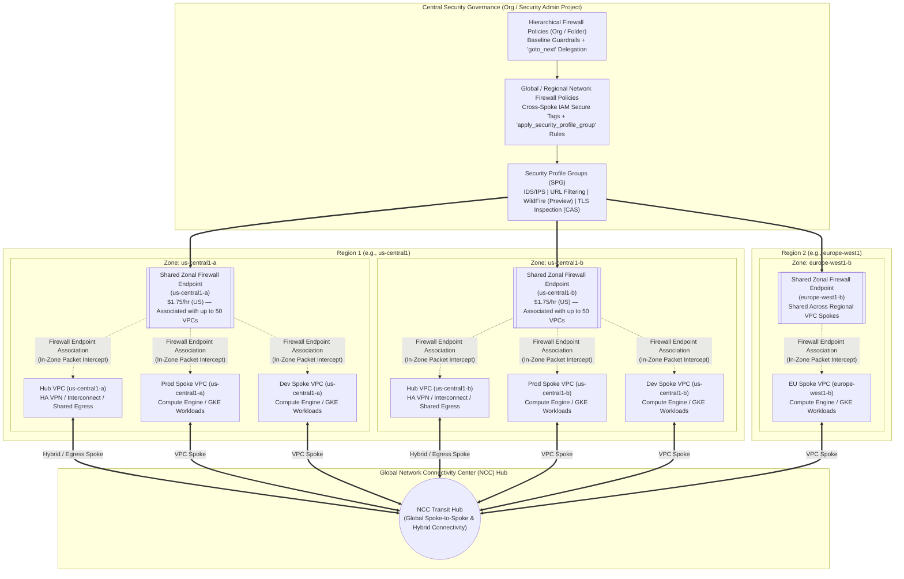
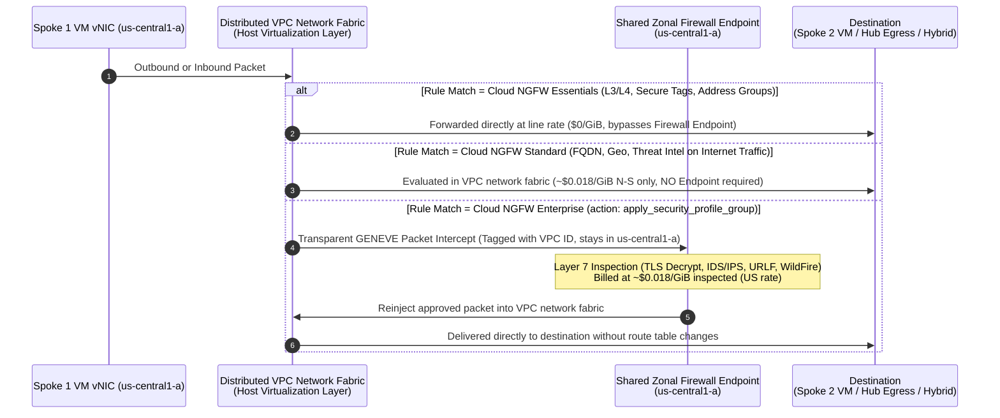

# Cloud NGFW in a Global Hub-and-Spoke Architecture: Placement, Scaling, and Cost Optimization

## Executive Summary: How Cloud NGFW Redefines Hub-and-Spoke Security

In traditional cloud firewall architectures (such as third-party Network Virtual Appliances or legacy hub-based firewalls), securing a **global hub-and-spoke topology** requires hair-pinning ("tromboning") all spoke-to-spoke (East-West) and spoke-to-internet/hybrid (North-South) traffic through a central inspection Hub VPC using custom static/BGP routes and internal load balancers. This introduces extra latency hops, cross-zone data transfer fees, and complex route table management.

**Google Cloud Next Generation Firewall (Cloud NGFW)** eliminates traffic tromboning by combining two architectural layers:

1. **Distributed L3/L4 Enforcement (Cloud NGFW Essentials & Standard):**
   Firewall rules are enforced directly at the hypervisor of each individual VM instance and at supported Envoy-based load balancers as part of Google Cloud's **distributed VPC network fabric** (powered by [Andromeda](https://cloud.google.com/vpc/docs/private-service-connect-architecture), Google's software-defined network virtualization stack—see the [USENIX NSDI '18 Andromeda whitepaper (PDF)](https://www.usenix.org/system/files/conference/nsdi18/nsdi18-dalton.pdf)). This layer requires **zero firewall endpoints** and **zero routing changes**.
2. **Zonal Packet Intercept for Layer 7 Deep Packet Inspection (Cloud NGFW Enterprise):**
   For Layer 7 capabilities—including **Intrusion Detection and Prevention (IDS/IPS)**, **URL Filtering**, **Advanced malware sandbox (WildFire)** *(Preview)*, and **TLS Inspection**—Cloud NGFW uses **Google-managed Zonal Firewall Endpoints** with built-in **Packet Intercept** (GENEVE encapsulation).
   * **Crucial Placement Distinction:** You do **not** deploy Firewall Endpoints inside a central Hub VPC and route spoke traffic to them via static or BGP routes. Instead, you create **one Zonal Firewall Endpoint per active zone** (at the Organization level or in a central Security Admin project) and **associate that single endpoint with up to 50 VPC networks (both Hub and Spoke VPCs) in that same zone**.
   * When a packet matches an L7 inspection rule (`apply_security_profile_group`), the distributed VPC network fabric transparently intercepts the packet at the workload VM's virtual NIC (vNIC) in its local zone, steers it to the local zone's shared Firewall Endpoint (tagged with a unique VPC network identifier), and reinjects the approved packet directly onto the VPC network fabric without modifying route tables.

---

## 1. Reference Architecture Diagrams

### Diagram A: Global Hub-and-Spoke Topology with Shared Zonal Firewall Endpoints

In this recommended global deployment model:
* **Network Connectivity Center (NCC)** acts as the global transit hub connecting regional workload Spoke VPCs and the Hybrid/Egress Hub VPC.
* **Policy Hierarchy Separation:**
  * **Hierarchical Firewall Policies** (at the Organization/Folder level) enforce global baseline guardrails and delegate workload evaluation downward via `goto_next`.
  * **Global (or Regional) Network Firewall Policies** (attached to each Hub and Spoke VPC) enforce **IAM-governed Secure Tags** across NCC VPC spokes and trigger **Layer 7 inspection (`apply_security_profile_group`)**. *(Note: Network-scoped Secure Tags and cross-NCC spoke tag matching require Network Firewall Policies rather than Hierarchical Firewall Policies.)*
* **Shared Zonal Firewall Endpoints:** A single Firewall Endpoint in each active zone is associated with both the Hub VPC and all Spoke VPCs operating in that zone.

---

### Diagram B: In-Zone Packet Intercept & Cost-Tiered Evaluation Flow

This sequence shows how the **distributed VPC network fabric** evaluates traffic at the workload boundary and steers only matching Layer 7 flows to the local zone's shared Firewall Endpoint:

---

## 2. Where Endpoints Are Placed, Scaled, and Governed

### A. Endpoint Placement Rules & Architectural Boundaries
1. **Strict Zonal Co-location (Avoiding Uninspected Fail-Open Bypass):**
   * Firewall Endpoints are **zonal resources**. To inspect traffic for a workload VM, **the Firewall Endpoint must be in the exact same zone as the workload** and associated with that workload's VPC network.
   * **Important Fail-Open Behavior:** If a VPC has workloads in a zone where **no Firewall Endpoint is associated** (for example, VMs are deployed in `us-central1-c` when endpoints only exist in `a` and `b`), traffic matching an `apply_security_profile_group` rule in `us-central1-c` **will be allowed to proceed without Layer 7 inspection** ([see Troubleshooting Layer 7 Inspection](https://cloud.google.com/firewall/docs/troubleshoot/layer-7-inspection-setup#all-connections-are-allowed-or-denied-but-not-intercepted)). Always align workload zone placement with endpoint associations.
2. **Multi-VPC Sharing (1 Endpoint $\rightarrow$ Up to 50 VPCs per Zone):**
   * A single Organization-level or Project-level Firewall Endpoint in a zone can be associated with **up to 50 VPC networks** in that zone via **Firewall Endpoint Associations**.
   * Because Packet Intercept encapsulates redirected packets in GENEVE headers stamped with each VPC's unique network identifier, a single shared zonal endpoint can inspect traffic across up to 50 Hub and Spoke VPCs **even if those Spoke VPCs use overlapping IP address ranges**.
3. **Workload Boundary vs. Pure Hybrid Transit Inspection:**
   * Cloud NGFW Packet Intercept attaches to **Compute Engine / GKE VM network interfaces (vNICs)** and **supported Envoy-based Internal Application Load Balancers**.
   * When traffic flows between an on-premises network (connected via Cloud Interconnect or HA VPN in the Hub VPC) and a workload VM in a Spoke VPC, **L7 inspection occurs at the Spoke VM's vNIC** (using the Firewall Endpoint associated with the Spoke VPC in that VM's zone).
   * *Note on Pure Transit Traffic:* If traffic passes purely between two external/hybrid networks through the transit Hub VPC (e.g., On-Premises Site A $\rightarrow$ Hub VPC $\rightarrow$ On-Premises Site B) without terminating on a GCP VM vNIC or supported Internal Application Load Balancer, Cloud NGFW cannot intercept it; use Network Virtual Appliances (NVAs) in the Hub VPC if pure hybrid-to-hybrid transit inspection is required ([see Cross-Cloud Network NCC Design Guide](https://cloud.google.com/architecture/ccn-distributed-apps-design/ccn-ncc-vpn-ra#security-and-compliance)).

### B. Scaling & Capacity Limits per Zonal Endpoint
Google provisions and manages dedicated underlying inspection instances with built-in high-availability failover for every zonal Firewall Endpoint.

| Metric / Capability | Without TLS Inspection | With TLS Inspection | Operational Guidance |
| :--- | :--- | :--- | :--- |
| **Max Aggregate Throughput (per Zonal Endpoint)** | **Up to 10 Gbps** | **Up to 2 Gbps** | Monitor `networksecurity.googleapis.com/firewall_endpoint` utilization metrics. Warm up traffic gradually when onboarding high-volume spokes. |
| **Max Per-Connection (Single Flow) Throughput** | **1.25 Gbps** | **250 Mbps** | Maximum bandwidth for a single 5-tuple connection. |
| **Cross-Region Internal ALB Inspection** *(Preview)* | **1.6 Gbps** | **1.6 Gbps** | Applies when targeting `--target-type=INTERNAL_MANAGED_LB`. |
| **Overload Behavior** | **Drops unapproved packets** | **Drops unapproved packets** | Unlike missing endpoints (which bypass L7), an **overloaded** endpoint is fail-closed and drops packets it cannot inspect. |
| **Max VPC Associations per Zonal Endpoint** | **50 VPCs** | **50 VPCs** | Keep Security Profile Groups (SPGs) consolidated across the organization to maximize VPC association scale. |
| **Max Packet Size (MTU)** | **1,460 B** *(Default)* / **8,588 B** *(Jumbo)* | **1,460 B** *(Default)* / **8,588 B** *(Jumbo)* | Enable Jumbo Frame support at endpoint creation if VPC MTU > 1,460 B (reserves 308 B for GENEVE headers up to 8,896 B). |

* **Scaling Beyond 10 Gbps (or 2 Gbps TLS) in a Single Zone:**
  While a single VPC can only be associated with **1 Firewall Endpoint per zone**, you can create up to **50 Firewall Endpoints per zone** in an organization or project. If aggregate zonal throughput across your spokes exceeds 10 Gbps (or 2 Gbps with TLS), shard your Spoke VPC associations across multiple zonal endpoints in that zone (e.g., Endpoint A serves Spokes 1–15; Endpoint B serves Spokes 16–30).

---

## 3. Costing Model & Cost Optimization Playbook

### A. Cloud NGFW Tier Pricing Breakdown
Cloud NGFW charges dynamically based on the feature tier of the rule that evaluates your traffic—there is no upfront subscription commitment:

| Cloud NGFW Tier | Capabilities Included | Fixed Endpoint Fee | Data Processing Fee |
| :--- | :--- | :--- | :--- |
| **Essentials** | Stateful L3/L4 rules, IAM-governed **Secure Tags**, Address Groups, Network Contexts (`INTRA_VPC`, `VPC_NETWORKS`, `INTERNET`) | **$0** | **$0 / GiB** (Free for all N-S and E-W traffic) |
| **Standard** | **FQDN** domain objects, **Geolocation** objects, **Google Threat Intelligence** lists | **$0** (No endpoint needed) | **~$0.018 – $0.0193 / GiB** *(US baseline; charged **only on North-South Internet traffic**—East-West is $0)* |
| **Enterprise** | **L7 IDS/IPS** (Palo Alto Networks threat engine), **URL Filtering**, **WildFire malware sandbox** *(Preview)*, **TLS Inspection** | **~$1.75 / endpoint / hour** *(~$1,277.50 / mo per zone in US; ~$1.925–$2.10/hr in select intl. regions)* | **~$0.018 – $0.0193 / GiB** *(US baseline; charged on N-S, E-W, and LB traffic matching an `apply_security_profile_group` rule)* |

> [!NOTE]
> **Preview & Ancillary TCO Reminders:**
> * **Preview Features:** *Advanced malware sandbox (WildFire)* and *Layer 7 inspection on cross-region Internal Application Load Balancers* are currently in **Preview** and subject to the [Pre-GA Offerings Terms](https://cloud.google.com/terms/service-terms#1).
> * **Related Infrastructure Costs to Factor Into TCO:**
>   1. **Certificate Authority Service (CAS):** Enabling **TLS Inspection** requires a Private CA pool (e.g., Subordinate CA) to dynamically mint intermediate certificates, which incurs standard [CAS monthly CA and certificate issuance charges](https://cloud.google.com/certificate-authority-service/pricing).
>   2. **Cloud Logging:** Enabling VPC Firewall Rules Logging, Threat Logs, or URL Filtering Logs incurs standard [Cloud Logging ingestion charges ($0.50/GiB beyond the free allotment)](https://cloud.google.com/stackdriver/pricing).
>   3. **Cloud NAT & Network Egress:** Outbound Internet NAT processing and standard cross-zone/cross-region data transfer are billed separately under [VPC Pricing](https://cloud.google.com/vpc/pricing).

---

### B. 5 Cost-Optimization Best Practices for Global Hub-and-Spoke Deployments

1. **Share Zonal Endpoints Across Hub & Spoke VPCs (Save Up to 98% on Fixed Hourly Fees)**
   * **Anti-Pattern:** Creating a dedicated Firewall Endpoint per VPC in each zone (e.g., 10 VPCs $\times$ 2 zones = 20 endpoints = **$25,550/month** in US regions).
   * **Best Practice:** Deploy **1 shared Organization-level (or central Security Project) Firewall Endpoint per active zone** and associate all 10 VPCs to it (1 endpoint $\times$ 2 zones = 2 endpoints = **$2,555/month** total for all 10 VPCs in that region).

2. **Consolidate Active Compute Zones per Region (Save 33%–50% on Endpoint Hours)**
   * Because Firewall Endpoints are zonal (`~$1,277.50/mo` per zone in US regions) and every zone with workloads must have an endpoint association to avoid uninspected bypass, spreading VMs across all 3 or 4 zones in a region (`a`, `b`, `c`, `f`) forces you to run 3 or 4 endpoints per region.
   * **Best Practice:** Use Organization Policies (`compute.restrictCloudNatUsage` / zone placement policies) or GKE node-pool zone specifications to standardize workloads into **2 designated HA zones per region** (e.g., `us-central1-a` and `us-central1-b`). You retain full multi-zone high availability while reducing your regional endpoint footprint from 4 endpoints (`~$5,110/mo`) to **2 endpoints (`~$2,555/mo`)**.

3. **Short-Circuit High-Volume Trusted Flows with Higher-Priority "Essentials" Rules (Reduce Per-GiB Fees)**
   * You only incur the Enterprise per-GiB charge (`~$0.018/GiB`) when traffic matches a rule with `action = apply_security_profile_group`.
   * **Best Practice:** Place higher-priority **Cloud NGFW Essentials (`allow` or `deny`) rules** above your L7 inspection rules for high-volume trusted or noisy flows:
     * Storage/Database replication, backup streams, and Private Google Access (`199.36.153.8/30` and `199.36.153.4/30`).
     * Known unauthorized ports/sources (block them immediately with an Essentials `deny` rule at **$0/GiB** rather than sending unwanted traffic to a Layer 7 endpoint).
     * High-throughput intra-cluster GKE node-to-node traffic matched via `INTRA_VPC` or IAM Secure Tags.
   * Every gigabyte matched by an Essentials rule costs **$0/GiB** and preserves your Zonal Firewall Endpoint's 2 Gbps / 10 Gbps throughput headroom.

4. **Eliminate "Double Inspection" on Spoke-to-Spoke (East-West) Traffic (Save 50% on E-W Data Processing)**
   * When Spoke 1 communicates with Spoke 2 over NCC or VPC Peering, Network Firewall Policies are evaluated at **both** Spoke 1 (Egress) and Spoke 2 (Ingress).
   * **Anti-Pattern:** Configuring `apply_security_profile_group` on **both** Egress from Spoke 1 and Ingress to Spoke 2. This causes the same packet to be intercepted twice—doubling latency and **doubling your per-GiB data processing charge**.
   * **Best Practice:** Enforce single-pass inspection by directionalizing your L7 rules:
     * Apply `apply_security_profile_group` on **Egress** only for **Internet-bound traffic** (`0.0.0.0/0` excluding internal RFC 1918 Address Groups).
     * Apply `apply_security_profile_group` on **Ingress** for **East-West Spoke-to-Spoke & Hybrid traffic** (`--src-network-context=VPC_NETWORKS`), while permitting internal Egress via a free Essentials `allow` rule.

5. **Use Cloud NGFW Standard Where Full Payload Decryption Isn't Needed**
   * For development spokes or workloads that only require **outbound FQDN domain allowlisting** (e.g., `*.github.com`, `*.docker.io`), **Geolocation filtering**, or **Google Threat Intelligence IP blocking** without deep packet inspection, use **Cloud NGFW Standard** rules.
   * Standard rules run natively in the distributed VPC network fabric with **zero hourly endpoint fees ($0/hr)** and charge per-GiB **only on North-South Internet traffic**.

---

## 4. Official Google Cloud Documentation References
* [Cloud NGFW Overview & Architecture](https://cloud.google.com/firewall/docs/about-firewalls)
* [Cloud NGFW Tiers (Essentials, Standard, Enterprise)](https://cloud.google.com/firewall/docs/ngfw_tiers)
* [Firewall Endpoints Overview & Deployment Considerations](https://cloud.google.com/firewall/docs/about-firewall-endpoints)
* [Cross-Cloud Network Distributed Application Design: NCC Hub-and-Spoke Reference Architecture](https://cloud.google.com/architecture/ccn-distributed-apps-design/ccn-ncc-vpn-ra)
* [Secure Tags for Firewalls & NCC Spoke Compatibility](https://cloud.google.com/firewall/docs/tags-firewalls-overview)
* [Understanding Network Contexts (`VPC_NETWORKS`, `INTRA_VPC`, `INTERNET`)](https://cloud.google.com/firewall/docs/understand-network-contexts)
* [Cloud NGFW Pricing](https://cloud.google.com/firewall/pricing)