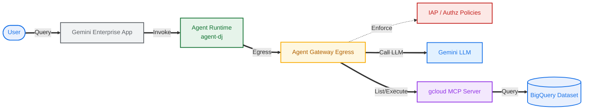

# agent gateway egress w/ goog mcp

> lab diagram



## setup

```sh
# set vars
export SLUG="foo"
export REGION="us-east1"
export MREGION="us"
echo ${SLUG}
echo ${REGION}
echo ${MREGION}
```

```sh
# fetch vars
export PROJ_ID=$(gcloud config list --format="value(core.project)")
export PROJ_NO=$(gcloud projects describe $PROJ_ID --format="value(projectNumber)")
export ORG_ID=$(gcloud projects get-ancestors ${PROJ_ID} | awk '$2 == "organization" {print $1}')
echo ${PROJ_ID}
echo ${PROJ_NO}
echo ${ORG_ID}
```

```sh
# create vars
export AGW_NAME="agw-${SLUG}-${REGION}-ata"
export AGW_URI="projects/${PROJ_ID}/locations/${REGION}/agentGateways/${AGW_NAME}"
export RE_AGENT_NAME="agent-dj"
export RE_AGENT_ID_SET="principalSet://agents.global.org-${ORG_ID}.system.id.goog/attribute.platformContainer/aiplatform/projects/${PROJ_NO}"
export STAGING_BUCKET="agent-staging-${PROJ_NO}"
echo ${AGW_NAME}
echo ${AGW_URI}
echo ${RE_AGENT_NAME}
echo ${RE_AGENT_ID_SET}
echo ${STAGING_BUCKET}
```

```sh
# file bin
mkdir -p cfg
```

```sh
# enable apis (agent platform bundle, part 1)
gcloud services enable \
  agentregistry.googleapis.com \
  aiplatform.googleapis.com \
  apphub.googleapis.com \
  apptopology.googleapis.com \
  cloudapiregistry.googleapis.com \
  cloudtrace.googleapis.com \
  compute.googleapis.com \
  dataform.googleapis.com \
  iam.googleapis.com \
  iamconnectors.googleapis.com \
  iap.googleapis.com \
  logging.googleapis.com \
  modelarmor.googleapis.com \
  monitoring.googleapis.com \
  networksecurity.googleapis.com \
  networkservices.googleapis.com \
  notebooks.googleapis.com \
  observability.googleapis.com
```

```sh
# enable apis (agent platform bundle, part 2)
gcloud services enable \
  saasservicemgmt.googleapis.com \
  storage.googleapis.com \
  telemetry.googleapis.com \
  texttospeech.googleapis.com
```

## gateway (egress)

> [!note]
> regional agw, regional registry, `AGENT_TO_ANYWHERE` access path

```sh
# create config file
cat > cfg/${AGW_NAME}.yaml <<EOF
name: ${AGW_NAME}
protocols:
  - MCP
googleManaged:
  governedAccessPath: AGENT_TO_ANYWHERE
registries:
  - "//agentregistry.googleapis.com/projects/${PROJ_ID}/locations/${REGION}"
EOF
```

```sh
# apply config
gcloud alpha network-services agent-gateways import ${AGW_NAME} \
  --source="cfg/${AGW_NAME}.yaml" \
  --location=${REGION}
```

```sh
# list agent gateways
gcloud alpha network-services agent-gateways list --location=${REGION}

# describe agent gateway
gcloud alpha network-services agent-gateways describe ${AGW_NAME} --location=${REGION}
```

> [!caution]
> if needed... delete agent gateway
> ```sh
> gcloud alpha network-services agent-gateways delete ${AGW_NAME} --location=${REGION}
> ```

### authz (dry run)

#### extension

> [!warning]
> this is for dry run mode (not enforced yet... will later)

```sh
# create config file (DRY RUN mode)
cat > cfg/${AGW_NAME}-svc-ext-authz-iap-dryrun.yaml <<EOF
name: ${AGW_NAME}-svc-ext-authz-iap-dryrun
service: iap.googleapis.com
failOpen: true
timeout: 1s
metadata:
  iamEnforcementMode: "DRY_RUN"
EOF
```

```sh
# apply config (DRY RUN mode)
gcloud beta service-extensions authz-extensions import ${AGW_NAME}-svc-ext-authz-iap-dryrun \
  --source=cfg/${AGW_NAME}-svc-ext-authz-iap-dryrun.yaml \
  --location=${REGION}
```

```sh
# list authz extensions
gcloud beta service-extensions authz-extensions list --location=${REGION}

# describe authz extension
gcloud beta service-extensions authz-extensions describe ${AGW_NAME}-svc-ext-authz-iap-dryrun --location=${REGION}
```

```sh
# list authz extensions (rest)
curl -s -X GET "https://networkservices.googleapis.com/v1beta1/projects/${PROJ_ID}/locations/${REGION}/authzExtensions" \
  -H "Authorization: Bearer $(gcloud auth application-default print-access-token)" -H "Content-Type: application/json" | jq .
```

> [!caution]
> if needed... delete authz extension (after delegation removed)
> ```sh
> gcloud beta service-extensions authz-extensions delete ${AGW_NAME}-svc-ext-authz-iap-dryrun --location=${REGION}
> ```

#### policy

> [!warning]
> this is for dry run mode (not enforced yet... will later)

> [!note]
> aka _delegate_ authorization (to iap)

```sh
# create config file (DRY RUN mode)
cat > cfg/${AGW_NAME}-authz-policy-profile-iap.yaml <<EOF
name: ${AGW_NAME}-authz-policy-profile-iap
target:
  resources:
    - "projects/${PROJ_ID}/locations/${REGION}/agentGateways/${AGW_NAME}"
policyProfile: REQUEST_AUTHZ
action: CUSTOM
customProvider:
  authzExtension:
    resources:
      - "projects/${PROJ_ID}/locations/${REGION}/authzExtensions/${AGW_NAME}-svc-ext-authz-iap-dryrun"
EOF
```

```sh
# apply config
gcloud beta network-security authz-policies import ${AGW_NAME}-authz-policy-profile-iap \
  --source=cfg/${AGW_NAME}-authz-policy-profile-iap.yaml \
  --location=${REGION}
```

```sh
# list authz policies
gcloud beta network-security authz-policies list --location=${REGION}

# describe authz policy
gcloud beta network-security authz-policies describe ${AGW_NAME}-authz-policy-profile-iap --location=${REGION}
```

```sh
# list authz policies
curl -s -X GET "https://networksecurity.googleapis.com/v1beta1/projects/${PROJ_ID}/locations/${REGION}/authzPolicies" \
  -H "Authorization: Bearer $(gcloud auth application-default print-access-token)" -H "Content-Type: application/json" | jq .
```

> [!caution]
> if needed... delete authz policy
> ```sh
> gcloud beta network-security authz-policies delete ${AGW_NAME}-authz-policy-profile-iap --location=${REGION}
> ```

## code
> [!note]
> start pwd in project root dir

```sh
# clone repo
git clone https://github.com/miclarso/public.git ./temp_agw_egress_gmcp

# copy source files for agent
cp -r temp_agw_egress_gmcp/testlabs/agw-egress-gmcp/agent-dj ./agent-dj

# copy source files for endpoints
cp -r temp_agw_egress_gmcp/testlabs/agw-egress-gmcp/endpoints ./endpoints

# delete temp repo
rm -rf temp_agw_egress_gmcp
```

## registry

> [!note]
> all endpoints including google apis need to be registered

> [!note]
> this script registers hostnames from `endpoints/googleapis.txt`

```sh
# run script dry run (see what needs to be registered)
python3 endpoints/register_endpoints.py --multi-region=${MREGION} --region=${REGION} --mtls-endpoints=include --dry-run
```

```sh
# run script
python3 endpoints/register_endpoints.py --multi-region=${MREGION} --region=${REGION} --mtls-endpoints=include
```

```sh
# list registry endpoints (global)
gcloud alpha agent-registry endpoints list \
  --project=${PROJ_ID} \
  --location=global \
  --format="table(displayName, name.basename():label=ENDPOINT_ID, interfaces[0].url:label=URL)"
```

```sh
# list registry endpoints (regional)
gcloud alpha agent-registry endpoints list \
  --project=${PROJ_ID} \
  --location=${REGION} \
  --format="table(displayName, name.basename():label=ENDPOINT_ID, interfaces[0].url:label=URL)"
```

> [!caution]
> if need to clear all registry endpoints...
> ```sh
> # run script - clear all
> python3 endpoints/register_endpoints.py --clear-all
> ```

> [!note]
> or for adding (gapi) endpoints to registry manually...

```sh
# register endpoint (googleapis -> jsonrpc)
gcloud alpha agent-registry services create ${ENDPOINT_RESOURCE_NAME} \
  --project=${PROJ_ID} \
  --location=${REGION} \
  --display-name="something.googleapis.com" \
  --endpoint-spec-type=no-spec \
  --interfaces='url=${ENDPOINT_HOST_NAME},protocolBinding=JSONRPC'
```

## ge app

```sh
# set vars
export GE_LOCATION="global"
export GE_APP_NAME="app-${SLUG}-${GE_LOCATION}"
echo ${GE_LOCATION}
echo ${GE_APP_NAME}
```

> [!note]
> go to console ui [gemini ent landing page][^1], create new app, use any custom (short) name... eg "app-foo-global" or replace shell var with actual

[^1]: https://console.cloud.google.com/gemini-enterprise

> [!tip]
> don't include the auto generated engine name (long random chars)... just use a short name for the app

## re agent

> [!warning]
> run through [`agent-dj.md`](./agent-dj/agent-dj.md) to deploy agent... then come back here for the rest

## test dry run

> [!important]
> for ge -> go to console ui, test through the ge web app, launch link (or preview) from app dashboard

```sh
# app dashboard
echo "https://console.cloud.google.com/gemini-enterprise/locations/${GE_LOCATION}/engines/${GE_APP_ID}/overview/dashboard?project=${PROJ_ID}"
```

> [!caution]
> you must select the agent card from the left `agents >` panel and select the agent card... or in the default chat type `'@'` and select agent-dj

Try some queries
- how many dj's do we have on file?
- what is the phone number of dj cosmopup?
- what is dj fishfry's credit card number?

> [!tip]
> check logs...

```sh
# show ge user activity logs
gcloud logging read \
  "logName=\"projects/${PROJ_ID}/logs/discoveryengine.googleapis.com%2Fgemini_enterprise_user_activity\"" \
  --project=${PROJ_ID} \
  --limit=5 \
  --format='table(
    timestamp.date(tz=LOCAL):label=TIMESTAMP,
    jsonPayload.request.query.text:label=USER_QUERY,
    jsonPayload.response.answer.name.yesno(no="").basename():label=ANSWER_ID,
    jsonPayload.serviceTextReply.yesno(no="").trailoff(120):label=GENERATED_REPLY
  )'
```

```sh
# show gateway logs (requests w/ urls)
gcloud logging read \
  "resource.type=\"networkservices.googleapis.com/Gateway\" AND httpRequest.requestUrl:*" \
  --project=${PROJ_ID} \
  --limit=10 \
  --format='table(
    timestamp.date(tz=LOCAL):label=TIMESTAMP,
    httpRequest.requestMethod:label=METHOD,
    httpRequest.status:label=STATUS,
    jsonPayload.authzPolicyInfo.result:label=IAP_AUTHZ,
    jsonPayload.agentGatewayInfo.mcpInfo.method:label=MCP_METHOD,
    httpRequest.requestUrl.trailoff(101):label=URL
  )'
```

## authz (enforced)

> [!note]
> no policy yet... so should see requests matching 'default-denied' rule

```sh
# show gateway logs (policy info, exclude connect method)
gcloud logging read \
  'resource.type="networkservices.googleapis.com/Gateway" AND NOT httpRequest.requestMethod="CONNECT"' \
  --project=${PROJ_ID} \
  --limit=10 \
  --format="table(timestamp.date(tz=LOCAL):label=TIMESTAMP, httpRequest.remoteIp, httpRequest.serverIp, jsonPayload.enforcedGatewaySecurityPolicy.serverNameIndication, jsonPayload.enforcedGatewaySecurityPolicy.matchedRules.action, jsonPayload.enforcedGatewaySecurityPolicy.matchedRules.name)"
```

```sh
# show gateway logs (policy info for mcp calls)
gcloud logging read \
  'resource.type="networkservices.googleapis.com/Gateway" AND jsonPayload.agentGatewayInfo.mcpInfo:*' \
  --project=${PROJ_ID} \
  --limit=10 \
  --format="table(timestamp.date(tz=LOCAL):label=TIMESTAMP, httpRequest.remoteIp, httpRequest.serverIp, jsonPayload.enforcedGatewaySecurityPolicy.serverNameIndication, jsonPayload.enforcedGatewaySecurityPolicy.matchedRules.action, jsonPayload.enforcedGatewaySecurityPolicy.matchedRules.name)"
```

### global policy

> [!note]
> allow *agent set* to *global* registry (for gmcp et al targets)

```sh
# set var
export REG_LOCATION="global"
echo ${REG_LOCATION}
```

```sh
# get iap policy for target >> @ registry ${location} : agentRegistry
curl -s -X POST "https://iap.googleapis.com/v1beta1/projects/${PROJ_NO}/locations/global/iap_web/agentRegistry:getIamPolicy" \
  -H "Authorization: Bearer $(gcloud auth application-default print-access-token)" \
  -H "X-Goog-User-Project: ${PROJ_ID}" -H "Content-Type: application/json" -d '{"options": {"requestedPolicyVersion": 3}}' | jq .
```

```sh
# fetch etag
export IAP_ETAG=$(curl -s -X POST "https://iap.googleapis.com/v1beta1/projects/${PROJ_NO}/locations/global/iap_web/agentRegistry:getIamPolicy" \
  -H "Authorization: Bearer $(gcloud auth application-default print-access-token)" \
  -H "X-Goog-User-Project: ${PROJ_ID}" -H "Content-Type: application/json" -d '{}' | jq -r '.etag')
echo "Active Etag: ${IAP_ETAG}"
```

```sh
# create iam policy file (w/ etag)
cat > cfg/iap-policy-re-agent-set-to-registry-global.json <<EOF
{
  "policy": {
    "bindings": [
      {
        "role": "roles/iap.egressor",
        "members": [
          "${RE_AGENT_ID_SET}"
        ]
      }
    ],
    "etag": "${IAP_ETAG}"
  }
}
EOF
```

```sh
# apply policy
curl -X POST "https://iap.googleapis.com/v1beta1/projects/${PROJ_NO}/locations/global/iap_web/agentRegistry:setIamPolicy" \
  -H "Authorization: Bearer $(gcloud auth application-default print-access-token)" \
  -H "X-Goog-User-Project: ${PROJ_ID}" -H "Content-Type: application/json" \
  -d @cfg/iap-policy-re-agent-set-to-registry-${REG_LOCATION}.json
```

```sh
# get iap policy for target >> @ registry ${location} : agentRegistry
curl -s -X POST "https://iap.googleapis.com/v1beta1/projects/${PROJ_NO}/locations/global/iap_web/agentRegistry:getIamPolicy" \
  -H "Authorization: Bearer $(gcloud auth application-default print-access-token)" \
  -H "X-Goog-User-Project: ${PROJ_ID}" -H "Content-Type: application/json" -d '{"options": {"requestedPolicyVersion": 3}}' | jq .
```

### regional policy

> [!note]
> allow *agent set* to *regional* registry (for regional aiplatform et al targets)

```sh
# get iap policy for target >> @ registry ${location} : agentRegistry
curl -s -X POST "https://iap.googleapis.com/v1beta1/projects/${PROJ_NO}/locations/${REGION}/iap_web/agentRegistry:getIamPolicy" \
  -H "Authorization: Bearer $(gcloud auth application-default print-access-token)" \
  -H "X-Goog-User-Project: ${PROJ_ID}" -H "Content-Type: application/json" -d '{"options": {"requestedPolicyVersion": 3}}' | jq .
```

```sh
# fetch etag
export IAP_ETAG=$(curl -s -X POST "https://iap.googleapis.com/v1beta1/projects/${PROJ_NO}/locations/${REGION}/iap_web/agentRegistry:getIamPolicy" \
  -H "Authorization: Bearer $(gcloud auth application-default print-access-token)" \
  -H "X-Goog-User-Project: ${PROJ_ID}" -H "Content-Type: application/json" -d '{}' | jq -r '.etag')
echo "Active Etag: ${IAP_ETAG}"
```

```sh
# create iam policy file (w/ etag)
cat > cfg/iap-policy-re-agent-set-to-registry-${REGION}.json <<EOF
{
  "policy": {
    "bindings": [
      {
        "role": "roles/iap.egressor",
        "members": [
          "${RE_AGENT_ID_SET}"
        ]
      }
    ],
    "etag": "${IAP_ETAG}"
  }
}
EOF
```

```sh
# apply policy
curl -X POST "https://iap.googleapis.com/v1beta1/projects/${PROJ_NO}/locations/${REGION}/iap_web/agentRegistry:setIamPolicy" \
  -H "Authorization: Bearer $(gcloud auth application-default print-access-token)" \
  -H "X-Goog-User-Project: ${PROJ_ID}" -H "Content-Type: application/json" \
  -d @cfg/iap-policy-re-agent-set-to-registry-${REGION}.json
```

```sh
# get iap policy for target >> @ registry ${location} : agentRegistry
curl -s -X POST "https://iap.googleapis.com/v1beta1/projects/${PROJ_NO}/locations/${REGION}/iap_web/agentRegistry:getIamPolicy" \
  -H "Authorization: Bearer $(gcloud auth application-default print-access-token)" \
  -H "X-Goog-User-Project: ${PROJ_ID}" -H "Content-Type: application/json" -d '{"options": {"requestedPolicyVersion": 3}}' | jq .
```

> [!warning]
> if need to clear policy binding on the resource...

```sh
# set var
export REGISTRY_LOCATION="global"
# export REGISTRY_LOCATION=${REGION}
echo ${REGISTRY_LOCATION}
```

```sh
# fetch etag
export IAP_ETAG=$(curl -s -X POST "https://iap.googleapis.com/v1beta1/projects/${PROJ_NO}/locations/${REGISTRY_LOCATION}/iap_web/agentRegistry:getIamPolicy" \
  -H "Authorization: Bearer $(gcloud auth application-default print-access-token)" \
  -H "X-Goog-User-Project: ${PROJ_ID}" -H "Content-Type: application/json" -d '{}' | jq -r '.etag')
echo "Active Etag: ${IAP_ETAG}"
```

```sh
# remove all access policies on target
curl -X POST "https://iap.googleapis.com/v1beta1/projects/${PROJ_NO}/locations/${REGISTRY_LOCATION}/iap_web/agentRegistry:setIamPolicy" \
  -H "Authorization: Bearer $(gcloud auth application-default print-access-token)" \
  -H "X-Goog-User-Project: ${PROJ_ID}" -H "Content-Type: application/json" \
  -d @- <<EOF
{
  "policy":
    {
      "etag": "${IAP_ETAG}",
      "bindings": []
    }
} 
EOF
```

### enforce

> [!warning]
> use to switch from dry run to enforced mode

```sh
# create config file (ENFORCED mode)
cat > cfg/${AGW_NAME}-svc-ext-authz-iap-enforced.yaml <<EOF
name: ${AGW_NAME}-svc-ext-authz-iap-enforced
service: iap.googleapis.com
failOpen: true
timeout: 1s
EOF
```

```sh
# apply config (ENFORCED mode)
gcloud beta service-extensions authz-extensions import ${AGW_NAME}-svc-ext-authz-iap-enforced \
  --source=cfg/${AGW_NAME}-svc-ext-authz-iap-enforced.yaml \
  --location=${REGION}
```

> [!note]
> this patch below changes the authz-policy ("delegation") to point to the new authz ext policy (iap enforced config above)

```sh
# patch config
curl -X PATCH "https://networksecurity.googleapis.com/v1alpha1/projects/${PROJ_ID}/locations/${REGION}/authzPolicies/${AGW_NAME}-authz-policy-profile-iap?updateMask=target,action,customProvider" \
  -H "Authorization: Bearer $(gcloud auth application-default print-access-token)" \
  -H "Content-Type: application/json" -H "X-Goog-User-Project: ${PROJ_ID}" \
  -d @- <<EOF
{
  "name": "projects/${PROJ_ID}/locations/${REGION}/authzPolicies/${AGW_NAME}-authz-policy-profile-iap",
  "target": {
    "resources": [
      "projects/${PROJ_ID}/locations/${REGION}/agentGateways/${AGW_NAME}"
    ]
  },
  "action": "CUSTOM",
  "customProvider": {
    "authzExtension": {
      "resources": [
        "projects/${PROJ_ID}/locations/${REGION}/authzExtensions/${AGW_NAME}-svc-ext-authz-iap-enforced"
      ]
    }
  }
}
EOF
```

```sh
# list authz policies
gcloud beta network-security authz-policies list --location=${REGION}

# show authz policy config
gcloud beta network-security authz-policies describe ${AGW_NAME}-authz-policy-profile-iap --location=${REGION}
```

```sh
# get authz policies
curl -s -X GET "https://networksecurity.googleapis.com/v1beta1/projects/${PROJ_ID}/locations/${REGION}/authzPolicies" \
  -H "Authorization: Bearer $(gcloud auth application-default print-access-token)" -H "Content-Type: application/json" | jq .
```

## test enforced

> [!important]
> go to console ui, test through the ge web app, launch link (or preview) from app dashboard

```sh
# app dashboard
echo "https://console.cloud.google.com/gemini-enterprise/locations/${GE_LOCATION}/engines/${GE_APP_ID}/overview/dashboard?project=${PROJ_ID}"
```

> [!caution]
> you must select the agent card from the left `agents >` panel and select the agent card... or in the default chat type `'@'` and select agent-dj

Try some queries
- how many dj's do we have on file?
- what is the phone number of dj cosmopup?
- what is dj fishfry's credit card number?

> [!tip]
> check logs

```sh
# show gateway logs (policy info)
gcloud logging read \
  "resource.type=\"networkservices.googleapis.com/Gateway\" AND \
   jsonPayload.agentGatewayInfo.mcpInfo:*" \
  --project=${PROJ_ID} \
  --limit=10 \
  --format="table(timestamp.date(tz=LOCAL):label=TIMESTAMP, httpRequest.remoteIp, httpRequest.serverIp, jsonPayload.enforcedGatewaySecurityPolicy.serverNameIndication, jsonPayload.enforcedGatewaySecurityPolicy.matchedRules.action, jsonPayload.enforcedGatewaySecurityPolicy.matchedRules.name)"
```

```sh
# show agw iap egress logs (unregistered deny)
gcloud logging read \
  "protoPayload.authorizationInfo.permission=\"iap.webServiceVersions.egressViaIAP\"" \
  --project=${PROJ_ID} \
  --limit=10 \
  --format='table(
    timestamp.date(tz=LOCAL):label=TIMESTAMP,
    protoPayload.resourceName:label=RESOURCE_NAME,
    protoPayload.status.message:label=STATUS,
    protoPayload.request.httpRequest.url:label=URL
  )'
```

```sh
# show traffic denied by authz policy
gcloud logging read \
  'resource.type="networkservices.googleapis.com/Gateway" AND (jsonPayload.authzPolicyInfo.result="DENIED" OR httpRequest.status=403)' \
  --project=${PROJ_ID} \
  --limit=10 \
  --format='table(
    timestamp.date(tz=LOCAL):label=TIMESTAMP,
    httpRequest.requestMethod:label=METHOD,
    httpRequest.status:label=STATUS,
    jsonPayload.enforcedGatewaySecurityPolicy.serverNameIndication:label=SNI,
    jsonPayload.authzPolicyInfo.result:label=AUTHZ_RESULT,
    jsonPayload.authzPolicyInfo.policies[0].name.basename():label=DENYING_POLICY
  )'
```

## cleanup

> gemini ent

```sh
# fetch ge id for re agent
export GE_RE_AGENT_ID=$(curl -s -X GET "https://${GE_LOCATION}-discoveryengine.googleapis.com/v1alpha/projects/${PROJ_ID}/locations/${GE_LOCATION}/collections/default_collection/engines/${GE_APP_ID}/assistants/default_assistant/agents" \
  -H "Authorization: Bearer $(gcloud auth application-default print-access-token)" -H "Content-Type: application/json" \
  -H "X-Goog-User-Project: ${PROJ_ID}" | jq -r --arg name "${RE_AGENT_NAME}" '.agents[] | select(.displayName==$name) | .name | split("/")[-1]')
echo ${GE_RE_AGENT_ID}

# unregister re agent from ge app
curl -s -X DELETE "https://${GE_LOCATION}-discoveryengine.googleapis.com/v1alpha/projects/${PROJ_ID}/locations/${GE_LOCATION}/collections/default_collection/engines/${GE_APP_ID}/assistants/default_assistant/agents/${GE_RE_AGENT_ID}" \
  -H "Authorization: Bearer $(gcloud auth application-default print-access-token)" \
  -H "X-Goog-User-Project: ${PROJ_ID}"

# revoke role binding from discovery engine service agent
gcloud -q projects remove-iam-policy-binding ${PROJ_ID} --member="serviceAccount:service-${PROJ_NO}@gcp-sa-discoveryengine.iam.gserviceaccount.com" --role="roles/aiplatform.user"
```

> iam

```sh
# revoke role bindings from agent identity
gcloud -q projects remove-iam-policy-binding ${PROJ_ID} --member="${RE_AGENT_IDENTITY}" --role="roles/bigquery.user"
gcloud -q projects remove-iam-policy-binding ${PROJ_ID} --member="${RE_AGENT_IDENTITY}" --role="roles/bigquery.dataViewer"
gcloud -q projects remove-iam-policy-binding ${PROJ_ID} --member="${RE_AGENT_IDENTITY}" --role="roles/mcp.toolUser"
gcloud -q projects remove-iam-policy-binding ${PROJ_ID} --member="${RE_AGENT_IDENTITY}" --role="roles/aiplatform.user"

# delete reasoning engine agent
curl -s -X DELETE "https://${REGION}-aiplatform.googleapis.com/v1/projects/${PROJ_ID}/locations/${REGION}/reasoningEngines/${RE_ENGINE_ID}?force=true" \
  -H "Authorization: Bearer $(gcloud auth application-default print-access-token)" \
  -H "Content-Type: application/json"
```

> policies

```sh
# fetch etag for agentRegistry iap policy
export IAP_ETAG=$(curl -s -X POST "https://iap.googleapis.com/v1beta1/projects/${PROJ_NO}/locations/${REGION}/iap_web/agentRegistry:getIamPolicy" \
  -H "Authorization: Bearer $(gcloud auth application-default print-access-token)" \
  -H "X-Goog-User-Project: ${PROJ_ID}" -H "Content-Type: application/json" -d '{}' | jq -r '.etag')

# clear all access policies on agentRegistry
curl -s -X POST "https://iap.googleapis.com/v1beta1/projects/${PROJ_NO}/locations/${REGION}/iap_web/agentRegistry:setIamPolicy" \
  -H "Authorization: Bearer $(gcloud auth application-default print-access-token)" \
  -H "X-Goog-User-Project: ${PROJ_ID}" -H "Content-Type: application/json" \
  -d @- <<EOF
{
  "policy":
    {
      "etag": "${IAP_ETAG}",
      "bindings": []
    }
} 
EOF
```

> registry

```sh
# clear all registered endpoints
python3 endpoints/register_endpoints.py --clear-all
```

> gateway (egress)

```sh
# delete authz policy
gcloud -q beta network-security authz-policies delete ${AGW_NAME}-authz-policy-profile-iap --location=${REGION}

# delete authz extensions
gcloud -q beta service-extensions authz-extensions delete ${AGW_NAME}-svc-ext-authz-iap-dryrun --location=${REGION}
gcloud -q beta service-extensions authz-extensions delete ${AGW_NAME}-svc-ext-authz-iap-enforced --location=${REGION}

# delete agent gateway
gcloud -q alpha network-services agent-gateways delete ${AGW_NAME} --location=${REGION}
```

> bigquery

```sh
# drop bigquery dataset (cascades to tables)
bq rm -r -f -d ${PROJ_ID}:dj_ds
```

> storage

```sh
# delete staging bucket
gcloud -q storage rm --recursive gs://${STAGING_BUCKET}
```

> local

```sh
# remove generated local config files
rm -f cfg/re-agent-set-to-registry-region-iap-policy.json
rm -f cfg/${AGW_NAME}-svc-ext-authz-iap-enforced.yaml

# remove egg-info & venv
rm -rf ./agent-dj/agent_dj.egg-info
rm -rf ./agent-dj/.venv
```
