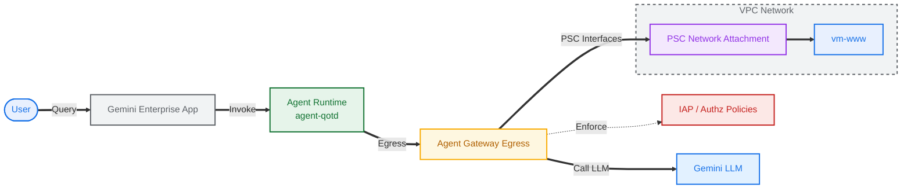

# agent gateway egress w/ vpc

> lab diagram



## setup

```sh
# set custom vars
export SLUG="bar"
export MREGION="eu"
export REGION="europe-west2"
export ZONE=${REGION}-c
export AGW_NAME="agw-${SLUG}-${REGION}-ata"
export RE_AGENT_NAME="agent-qotd"
echo ${SLUG}
echo ${REGION}
echo ${MREGION}
echo ${ZONE}
echo ${AGW_NAME}
echo ${RE_AGENT_NAME}
```

```sh
# fetch vars
export PROJ_ID=$(gcloud config list --format="value(core.project)")
export PROJ_NO=$(gcloud projects describe ${PROJ_ID} --format="value(projectNumber)")
export ORG_ID=$(gcloud projects get-ancestors ${PROJ_ID} | awk '$2 == "organization" {print $1}')
export AGW_URI="projects/${PROJ_ID}/locations/${REGION}/agentGateways/${AGW_NAME}"
export RE_AGENT_ID_SET="principalSet://agents.global.org-${ORG_ID}.system.id.goog/attribute.platformContainer/aiplatform/projects/${PROJ_NO}"
export STAGING_BUCKET="agent-staging-${PROJ_NO}"
echo ${PROJ_ID}
echo ${PROJ_NO}
echo ${ORG_ID}
echo ${AGW_URI}
echo ${RE_AGENT_ID_SET}
echo ${STAGING_BUCKET}
```

```sh
# file bin
mkdir -p cfg
```

```sh
# enable apis (agent platform bundle, part 1)
gcloud services enable \
  agentregistry.googleapis.com \
  aiplatform.googleapis.com \
  apphub.googleapis.com \
  apptopology.googleapis.com \
  cloudapiregistry.googleapis.com \
  cloudtrace.googleapis.com \
  compute.googleapis.com \
  dataform.googleapis.com \
  iam.googleapis.com \
  iamconnectors.googleapis.com \
  iap.googleapis.com \
  logging.googleapis.com \
  modelarmor.googleapis.com \
  monitoring.googleapis.com \
  networksecurity.googleapis.com \
  networkservices.googleapis.com \
  notebooks.googleapis.com \
  observability.googleapis.com
```

```sh
# enable apis (agent platform bundle, part 2)
gcloud services enable \
  saasservicemgmt.googleapis.com \
  storage.googleapis.com \
  telemetry.googleapis.com \
  texttospeech.googleapis.com
```

```sh
# enable apis (network services)
gcloud services enable \
  dns.googleapis.com \
  networkconnectivity.googleapis.com \
  privateca.googleapis.com \
  certificatemanager.googleapis.com
```

## code

> [!note]
> start pwd in working project dir

```sh
# clone repo
git clone https://github.com/miclarso/public.git ./temp_agw_egress_vpc

# copy source files for agent
cp -r temp_agw_egress_vpc/testlabs/agw-egress-vpc/agent-qotd ./agent-qotd

# copy source files for endpoints
cp -r temp_agw_egress_vpc/testlabs/agw-egress-vpc/endpoints ./endpoints

# delete temp repo
rm -rf temp_agw_egress_vpc
```

## network

### vnet

```sh
# create vpc network
gcloud compute networks create vnet-${SLUG} --subnet-mode=custom
```

```sh
# create subnets
gcloud compute networks subnets create subnet-${SLUG}-${REGION}-1 \
  --network=vnet-${SLUG} \
  --region=${REGION} \
  --range=10.128.1.0/24 \
  --enable-private-ip-google-access

gcloud compute networks subnets create subnet-${SLUG}-${REGION}-2 \
  --network=vnet-${SLUG} \
  --region=${REGION} \
  --range=10.128.2.0/24 \
  --enable-private-ip-google-access
```

### fw

```sh
# create fw policy
gcloud compute network-firewall-policies create fw-policy-${SLUG} --global
```

```sh
# create fw policy rules
gcloud compute network-firewall-policies rules create 1001 \
  --description="allow in ssh from iap" \
  --firewall-policy=fw-policy-${SLUG} \
  --global-firewall-policy \
  --action=allow \
  --direction=INGRESS \
  --layer4-configs=tcp:22  \
  --src-ip-ranges=35.235.240.0/20 \
  --global-firewall-policy

gcloud compute network-firewall-policies rules create 2001 \
  --description="allow in any from subnet-1" \
  --firewall-policy=fw-policy-${SLUG} \
  --global-firewall-policy \
  --action=allow \
  --direction=INGRESS \
  --layer4-configs=all \
  --src-ip-ranges=10.128.1.0/24 \
  --global-firewall-policy \
  --enable-logging
```

```sh
# associate fw policy to vnet
gcloud compute network-firewall-policies associations create \
  --name=fw-policy-bind-${SLUG} \
  --firewall-policy=fw-policy-${SLUG} \
  --network=vnet-${SLUG} \
  --global-firewall-policy
```

### psc

```sh
# create psc network attachment
gcloud compute network-attachments create psc-na-${SLUG}-${REGION} \
  --region=${REGION} \
  --connection-preference="ACCEPT_AUTOMATIC" \
  --subnets=subnet-${SLUG}-${REGION}-1
```

```sh
# verify network attachment
gcloud compute network-attachments describe psc-na-${SLUG}-${REGION} --region=${REGION}
```

```sh
# fetch psc sa uri
export PSC_NA_URI=$(gcloud compute network-attachments describe psc-na-${SLUG}-${REGION} \
  --region=${REGION} \
  --format="value(selfLink)" | sed 's|https://www.googleapis.com/compute/v1/||')
echo ${PSC_NA_URI}
```

### dns

```sh
# create private zone
gcloud dns managed-zones create zone-${SLUG} \
  --description="private zone for ${SLUG}-lab" \
  --dns-name=${SLUG}.lab \
  --networks=vnet-${SLUG} \
  --visibility=private
```

```sh
# create record
gcloud dns record-sets create qotd.${SLUG}.lab \
  --zone=zone-${SLUG} \
  --type=A \
  --ttl=300 \
  --rrdatas="10.128.2.99"
```

### nat

```sh
# create router for nat
gcloud compute routers create cr-nat-${SLUG} \
  --network=vnet-${SLUG} \
  --asn=16550 \
  --region=${REGION}
```

```sh
# create nat gw
gcloud compute routers nats create nat-${SLUG} \
  --router=cr-nat-${SLUG} \
  --region=${REGION} \
  --auto-allocate-nat-external-ips \
  --nat-all-subnet-ip-ranges 
```

## iam

```sh
# create identity for aiplatform service agent
gcloud beta services identity create --service=aiplatform.googleapis.com --project=${PROJ_ID}
```

```sh
# create identity for agent gateway service agent
gcloud beta services identity create --service=agentgateway.googleapis.com --project=${PROJ_ID}
```

```sh
# verfiy iam binding on aiplatform sa
gcloud projects get-iam-policy ${PROJ_ID} \
  --flatten="bindings[].members" \
  --filter="bindings.members:serviceAccount:service-${PROJ_NO}@gcp-sa-aiplatform.iam.gserviceaccount.com" \
  --format="table(bindings.role:label=ROLE, bindings.members:label=IDENTITY)"
```

```sh
# verfiy iam binding on agent gateway sa
gcloud projects get-iam-policy ${PROJ_ID} \
  --flatten="bindings[].members" \
  --filter="bindings.members:serviceAccount:service-${PROJ_NO}@gcp-sa-agentgateway.iam.gserviceaccount.com" \
  --format="table(bindings.role:label=ROLE, bindings.members:label=IDENTITY)"
```

> for dns peering (grant permission to agent gateway sa)

```sh
# grant dns peering role to agent gateway service agent
gcloud projects add-iam-policy-binding ${PROJ_ID} \
  --member="serviceAccount:service-${PROJ_NO}@gcp-sa-agentgateway.iam.gserviceaccount.com" \
  --role="roles/dns.peer"
```

```sh
# verify iam binding on agent gateway sa
gcloud projects get-iam-policy ${PROJ_ID} \
  --flatten="bindings[].members" \
  --filter="bindings.members:serviceAccount:service-${PROJ_NO}@gcp-sa-agentgateway.iam.gserviceaccount.com" \
  --format="value(bindings.role)"
```

> for psc (grant permission to aiplatform sa)

```sh
# create custom role for agent gateway and network attachment use
gcloud iam roles create AgentGatewayAccess \
  --project=${PROJ_ID} \
  --title="agent gateway access" \
  --description="custom role for agent gateway access" \
  --permissions="networkservices.agentGateways.get,networkservices.operations.get,compute.networkAttachments.get,compute.networkAttachments.update,compute.regionOperations.get" \
  --stage=ALPHA
```

```sh
# verify custom role permissions
gcloud iam roles describe AgentGatewayAccess --project=${PROJ_ID}
```

```sh
# grant the custom role to aiplatform sa
gcloud projects add-iam-policy-binding ${PROJ_ID} \
  --member="serviceAccount:service-${PROJ_NO}@gcp-sa-aiplatform.iam.gserviceaccount.com" \
  --role="projects/${PROJ_ID}/roles/AgentGatewayAccess"
```

```sh
# verfiy iam binding on aiplatform sa
gcloud projects get-iam-policy ${PROJ_ID} \
  --flatten="bindings[].members" \
  --filter="bindings.members:serviceAccount:service-${PROJ_NO}@gcp-sa-aiplatform.iam.gserviceaccount.com" \
  --format="table(bindings.role:label=ROLE, bindings.members:label=IDENTITY)"
```

## gateway (egress)

> [!note]
> regional agw, regional registry, `AGENT_TO_ANYWHERE` access path

> [!caution]
> dns peering domain name must end with a trailing dot (.)

```sh
# create config file
cat > cfg/${AGW_NAME}.yaml <<EOF
name: ${AGW_NAME}
protocols:
  - MCP
googleManaged:
  governedAccessPath: AGENT_TO_ANYWHERE
registries:
  - "//agentregistry.googleapis.com/projects/${PROJ_ID}/locations/${REGION}"
networkConfig:
  egress:
    networkAttachment: ${PSC_NA_URI}
  dnsPeeringConfig:
    domains:
      - ${SLUG}.lab.
    targetProject: ${PROJ_ID}
    targetNetwork: projects/${PROJ_ID}/global/networks/vnet-${SLUG}
EOF
```

```sh
# apply config
gcloud alpha network-services agent-gateways import ${AGW_NAME} \
  --source="cfg/${AGW_NAME}.yaml" \
  --location=${REGION}
```

```sh
# list agent gateways
gcloud alpha network-services agent-gateways list --location=${REGION}
```

```sh
# describe agent gateway
gcloud alpha network-services agent-gateways describe ${AGW_NAME} --location=${REGION}
```

```sh
# verify network attachment
gcloud compute network-attachments describe psc-na-${SLUG}-${REGION} --region=${REGION}
```

### authz (dry run)

#### extension

> [!warning]
> this is for dry run mode (not enforced yet... will later)

```sh
# create config file (DRY RUN mode)
cat > cfg/${AGW_NAME}-svc-ext-authz-iap-dryrun.yaml <<EOF
name: ${AGW_NAME}-svc-ext-authz-iap-dryrun
service: iap.googleapis.com
failOpen: true
timeout: 1s
metadata:
  iamEnforcementMode: "DRY_RUN"
EOF
```

```sh
# apply config (DRY RUN mode)
gcloud beta service-extensions authz-extensions import ${AGW_NAME}-svc-ext-authz-iap-dryrun \
  --source=cfg/${AGW_NAME}-svc-ext-authz-iap-dryrun.yaml \
  --location=${REGION}
```

```sh
# list authz extensions
gcloud beta service-extensions authz-extensions list --location=${REGION}

# describe authz extension
gcloud beta service-extensions authz-extensions describe ${AGW_NAME}-svc-ext-authz-iap-dryrun --location=${REGION}
```

```sh
# list authz extensions (rest)
curl -s -X GET "https://networkservices.googleapis.com/v1beta1/projects/${PROJ_ID}/locations/${REGION}/authzExtensions" \
  -H "Authorization: Bearer $(gcloud auth application-default print-access-token)" -H "Content-Type: application/json" | jq .
```

> [!caution]
> if needed... delete authz extension (after delegation removed)
> ```sh
> gcloud beta service-extensions authz-extensions delete ${AGW_NAME}-svc-ext-authz-iap-dryrun --location=${REGION}
> ```

#### policy

> [!warning]
> this is for dry run mode (not enforced yet... will later)

> [!note]
> aka _delegate_ authorization (to iap)

```sh
# create config file (DRY RUN mode)
cat > cfg/${AGW_NAME}-authz-policy-profile-iap.yaml <<EOF
name: ${AGW_NAME}-authz-policy-profile-iap
target:
  resources:
    - "projects/${PROJ_ID}/locations/${REGION}/agentGateways/${AGW_NAME}"
policyProfile: REQUEST_AUTHZ
action: CUSTOM
customProvider:
  authzExtension:
    resources:
      - "projects/${PROJ_ID}/locations/${REGION}/authzExtensions/${AGW_NAME}-svc-ext-authz-iap-dryrun"
EOF
```

```sh
# apply config
gcloud beta network-security authz-policies import ${AGW_NAME}-authz-policy-profile-iap \
  --source=cfg/${AGW_NAME}-authz-policy-profile-iap.yaml \
  --location=${REGION}
```

```sh
# list authz policies
gcloud beta network-security authz-policies list --location=${REGION}

# describe authz policy
gcloud beta network-security authz-policies describe ${AGW_NAME}-authz-policy-profile-iap --location=${REGION}
```

```sh
# list authz policies
curl -s -X GET "https://networksecurity.googleapis.com/v1beta1/projects/${PROJ_ID}/locations/${REGION}/authzPolicies" \
  -H "Authorization: Bearer $(gcloud auth application-default print-access-token)" -H "Content-Type: application/json" | jq .
```

> [!caution]
> if needed... delete authz policy
> ```sh
> gcloud beta network-security authz-policies delete ${AGW_NAME}-authz-policy-profile-iap --location=${REGION}
> ```

## registry

> [!note]
> all endpoints including google apis need to be registered

> [!note]
> this script registers hostnames from `endpoints/googleapis.txt`

```sh
# run script dry run (see what needs to be registered)
python3 endpoints/register_endpoints.py --multi-region=${MREGION} --region=${REGION} --mtls-endpoints=include --dry-run
```

```sh
# run script
python3 endpoints/register_endpoints.py --multi-region=${MREGION} --region=${REGION} --mtls-endpoints=include
```

```sh
# list registry endpoints (global)
gcloud alpha agent-registry endpoints list \
  --project=${PROJ_ID} \
  --location=global \
  --format="table(displayName, name.basename():label=ENDPOINT_ID, interfaces[0].url:label=URL)"
```

```sh
# list registry endpoints (regional)
gcloud alpha agent-registry endpoints list \
  --project=${PROJ_ID} \
  --location=${REGION} \
  --format="table(displayName, name.basename():label=ENDPOINT_ID, interfaces[0].url:label=URL)"
```

> [!caution]
> if need to clear all registry endpoints...
> ```sh
> # run script - clear all
> python3 endpoints/register_endpoints.py --clear-all
> ```

## ge app

```sh
# set vars
export GE_LOCATION="global"
export GE_APP_NAME="app-${SLUG}-${GE_LOCATION}"
echo ${GE_LOCATION}
echo ${GE_APP_NAME}
```

> [!note]
> go to console ui [gemini ent landing page][^1], create new app, use any custom (short) name... eg "app-bar-global" or replace shell var with actual

[^1]: https://console.cloud.google.com/gemini-enterprise

> [!tip]
> don't include the auto generated engine name (long random chars)... just use a short name for the app

## re agent

> [!warning]
> run through [`agent-qotd.md`](./agent-qotd.md) to deploy agent... then come back here for the rest

## test dry run

```sh
# fetch re engine id
export RE_ENGINE_ID=$(curl -s -X GET "https://${REGION}-aiplatform.googleapis.com/v1/projects/${PROJ_ID}/locations/${REGION}/reasoningEngines" \
  -H "Authorization: Bearer $(gcloud auth application-default print-access-token)" \
  | jq -r --arg name "${RE_AGENT_NAME}" '.reasoningEngines[] | select(.displayName==$name) | .name | split("/") | last')
echo ${RE_ENGINE_ID}
```

> post a rest query direct to re agent

```sh
# call reasoning engine agent streamQuery
curl --no-buffer -s -X POST "https://${REGION}-aiplatform.googleapis.com/v1beta1/projects/${PROJ_ID}/locations/${REGION}/reasoningEngines/${RE_ENGINE_ID}:streamQuery" \
  -H "Authorization: Bearer $(gcloud auth application-default print-access-token)" \
  -H "Content-Type: application/json" -H "X-Goog-User-Project: ${PROJ_ID}" \
  -d @- <<EOF | jq -r --unbuffered 'if type == "array" then .[] else . end | select(.content.parts != null) | .content.parts[].text // empty'
{
  "input": {
    "message": "what is the quote of the day?",
    "user_id": "test-user"
  }
}
EOF
```

> [!important]
> for ge -> go to console ui, test through the ge web app, launch link (or preview) from app dashboard

```sh
# app dashboard
echo "https://console.cloud.google.com/gemini-enterprise/locations/${GE_LOCATION}/engines/${GE_APP_ID}/overview/dashboard?project=${PROJ_ID}"
```

> [!caution]
> you must select the agent card from the left `agents >` panel and select the agent card... or in the default chat type `'@'` and select ${RE_AGENT_NAME}

Try some queries
- what is the quote of the day?
- do you have any famous quotations to share?
- inspire me with a quote

> [!tip]
> check logs...

```sh
# show gateway logs (requests w/ urls)
gcloud logging read \
  "resource.type=\"networkservices.googleapis.com/Gateway\" AND httpRequest.requestUrl:*" \
  --project=${PROJ_ID} \
  --limit=10 \
  --format='table(
    timestamp.date(tz=LOCAL):label=TIMESTAMP,
    httpRequest.requestMethod:label=METHOD,
    httpRequest.status:label=STATUS,
    jsonPayload.authzPolicyInfo.result:label=IAP_AUTHZ,
    jsonPayload.agentGatewayInfo.mcpInfo.method:label=MCP_METHOD,
    httpRequest.requestUrl.trailoff(101):label=URL
  )'
```

```sh
# show ge user activity logs
gcloud logging read \
  "logName=\"projects/${PROJ_ID}/logs/discoveryengine.googleapis.com%2Fgemini_enterprise_user_activity\"" \
  --project=${PROJ_ID} \
  --limit=5 \
  --format='table(
    timestamp.date(tz=LOCAL):label=TIMESTAMP,
    jsonPayload.request.query.text:label=USER_QUERY,
    jsonPayload.response.answer.name.yesno(no="").basename():label=ANSWER_ID,
    jsonPayload.serviceTextReply.yesno(no="").trailoff(120):label=GENERATED_REPLY
  )'
```
