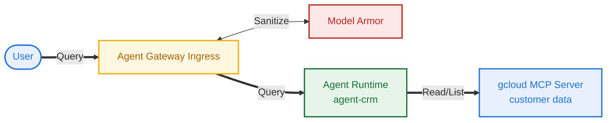
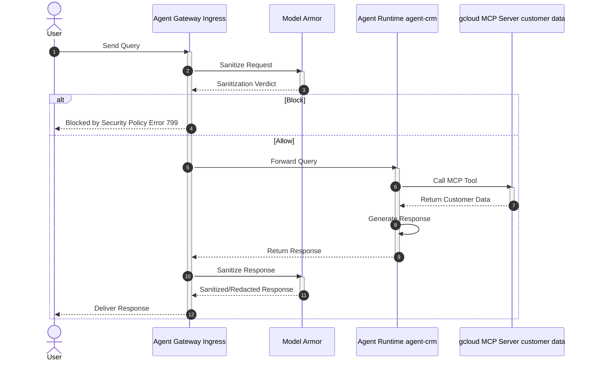

# agent gateway ingress w/ model armor

> lab diagram



## setup

```sh
# set vars
export SLUG="tc2"
export AGW_NAME="agw-${SLUG}-cta"
export REGION="us-west1"
echo ${SLUG}
echo ${AGW_NAME}
echo ${REGION}
```

```sh
# fetch vars
export PROJ_ID=$(gcloud config list --format="value(core.project)")
export PROJ_NO=$(gcloud projects describe ${PROJ_ID} --format="value(projectNumber)")
export ORG_ID=$(gcloud projects get-ancestors ${PROJ_ID} | awk '$2 == "organization" {print $1}')
echo ${PROJ_ID}
echo ${PROJ_NO}
echo ${ORG_ID}
```

```sh
# file bin
mkdir -p cfg
```

> [!note]
> assuming enabled agent platform api bundle already

```sh
# enable apis
gcloud services enable dlp.googleapis.com
```

## gateway (ingress)

```sh
# create config file
cat > cfg/${AGW_NAME}.yaml <<EOF
name: ${AGW_NAME}
protocols:
  - MCP
googleManaged:
  governedAccessPath: CLIENT_TO_AGENT
EOF
```

```sh
# apply config
gcloud alpha network-services agent-gateways import ${AGW_NAME} \
  --source="cfg/${AGW_NAME}.yaml" \
  --location=${REGION}
```

```sh
# list agent gateways
gcloud alpha network-services agent-gateways list --location=${REGION}

# describe agent gateway
gcloud alpha network-services agent-gateways describe ${AGW_NAME} --location=${REGION}
```

## model armor

### sdp templates

ie, [sensitive data protection][^1] used by the model armor response template

[^1]: https://docs.cloud.google.com/sensitive-data-protection/docs/creating-templates-inspect

```sh
# set var
export LOCATION="us-west1"
echo ${LOCATION}
```

```sh
# create dlp inspect and de-identify templates used by the model armor response template

# create inspect template (for flagging us soc sec numbers)
curl -fsS -X POST "https://dlp.googleapis.com/v2/projects/${PROJ_ID}/locations/${LOCATION}/inspectTemplates" \
-H "Authorization: Bearer $(gcloud auth application-default print-access-token)" -H "Content-Type: application/json" \
-H "x-goog-user-project: ${PROJ_ID}" \
-d @- << EOF
{
  "templateId": "agw-ssn-inspect-template",
  "inspectTemplate": {
    "displayName": "SSN Inspect Template",
    "inspectConfig": {
      "infoTypes": [
        { "name": "US_SOCIAL_SECURITY_NUMBER" }
      ],
      "minLikelihood": "POSSIBLE"
    }
  }
}
EOF
```

```sh
# get (describe) inspect templates (w/ jq pretty print)
curl -fsS -X GET "https://dlp.googleapis.com/v2/projects/${PROJ_ID}/locations/${LOCATION}/inspectTemplates" \
  -H "Authorization: Bearer $(gcloud auth application-default print-access-token)" \
  -H "Content-Type: application/json" -H "x-goog-user-project: ${PROJ_ID}" \
  | jq
```

```sh
# create de-identify template (for redacting soc sec numbers)
curl -fsS -X POST "https://dlp.googleapis.com/v2/projects/${PROJ_ID}/locations/${LOCATION}/deidentifyTemplates" \
-H "Authorization: Bearer $(gcloud auth application-default print-access-token)" \
-H "Content-Type: application/json" -H "x-goog-user-project: ${PROJ_ID}" \
-d @- << EOF
{
  "templateId": "agw-ssn-redaction-template",
  "deidentifyTemplate": {
    "displayName": "SSN Redaction Template",
    "deidentifyConfig": {
      "infoTypeTransformations": {
        "transformations": [{
          "primitiveTransformation": { "replaceWithInfoTypeConfig": {} }
        }]
      }
    }
  }
}
EOF
```

```sh
# get (describe) de-identify templates (w/ jq pretty print)
curl -fsS -X GET "https://dlp.googleapis.com/v2/projects/${PROJ_ID}/locations/${LOCATION}/deidentifyTemplates" \
  -H "Authorization: Bearer $(gcloud auth application-default print-access-token)" \
  -H "Content-Type: application/json" -H "x-goog-user-project: ${PROJ_ID}" \
  | jq
```

### modar templates

```sh
# set api endpoint override per location
gcloud config set api_endpoint_overrides/modelarmor "https://modelarmor.${LOCATION}.rep.googleapis.com/"

# view api overrides on active gcloud config
gcloud config list api_endpoint_overrides/
```

```sh
# list templates
gcloud model-armor templates list --location=${LOCATION}
```

```sh
# create model armor template (request)
gcloud model-armor templates create ${AGW_NAME}-modar-req-template \
  --project=${PROJ_ID} \
  --location=${LOCATION} \
  --rai-settings-filters='[{ "filterType": "HATE_SPEECH", "confidenceLevel": "MEDIUM_AND_ABOVE" },{ "filterType": "HARASSMENT", "confidenceLevel": "MEDIUM_AND_ABOVE" },{ "filterType": "SEXUALLY_EXPLICIT", "confidenceLevel": "MEDIUM_AND_ABOVE" }]' \
  --pi-and-jailbreak-filter-settings-enforcement=enabled \
  --pi-and-jailbreak-filter-settings-confidence-level=medium-and-above \
  --malicious-uri-filter-settings-enforcement=enabled \
  --labels=goog-terraform-provisioned=true \
  --template-metadata-custom-llm-response-safety-error-code=798 \
  --template-metadata-custom-llm-response-safety-error-message="LLM response blocked by content filter" \
  --template-metadata-custom-prompt-safety-error-code=799 \
  --template-metadata-custom-prompt-safety-error-message="Your request was blocked by our content filter. Please rephrase your prompt and try again." \
  --template-metadata-ignore-partial-invocation-failures \
  --template-metadata-log-operations \
  --template-metadata-log-sanitize-operations
```

```sh
# create model armor template (response)
gcloud model-armor templates create ${AGW_NAME}-modar-resp-template \
  --project=${PROJ_ID} \
  --location=${LOCATION} \
  --rai-settings-filters='[{ "filterType": "HATE_SPEECH", "confidenceLevel": "MEDIUM_AND_ABOVE" },{ "filterType": "HARASSMENT", "confidenceLevel": "MEDIUM_AND_ABOVE" },{ "filterType": "SEXUALLY_EXPLICIT", "confidenceLevel": "MEDIUM_AND_ABOVE" }]' \
  --malicious-uri-filter-settings-enforcement=enabled \
  --advanced-config-inspect-template=projects/${PROJ_ID}/locations/${LOCATION}/inspectTemplates/agw-ssn-inspect-template \
  --advanced-config-deidentify-template=projects/${PROJ_ID}/locations/${LOCATION}/deidentifyTemplates/agw-ssn-redaction-template \
  --labels=goog-terraform-provisioned=true \
  --template-metadata-custom-llm-response-safety-error-code=798 \
  --template-metadata-custom-llm-response-safety-error-message="LLM response blocked by content filter" \
  --template-metadata-custom-prompt-safety-error-code=799 \
  --template-metadata-custom-prompt-safety-error-message="Your request was blocked by our content filter. Please rephrase your prompt and try again." \
  --template-metadata-ignore-partial-invocation-failures \
  --template-metadata-log-operations \
  --template-metadata-log-sanitize-operations
```

```sh
# list model armor templates
gcloud model-armor templates list --location=${LOCATION}
```

## authz

### iam

```sh
# grant role model armor callout user to dep (service extension) service agent
gcloud projects add-iam-policy-binding ${PROJ_ID} \
  --member="serviceAccount:service-${PROJ_NO}@gcp-sa-dep.iam.gserviceaccount.com" \
  --role="roles/modelarmor.calloutUser"

# grant role service usage consumer to dep (service extension) service agent
gcloud projects add-iam-policy-binding ${PROJ_ID} \
  --member="serviceAccount:service-${PROJ_NO}@gcp-sa-dep.iam.gserviceaccount.com" \
  --role="roles/serviceusage.serviceUsageConsumer"

# grant role model armor user to dep (service extension) service agent
gcloud projects add-iam-policy-binding ${PROJ_ID} \
  --member="serviceAccount:service-${PROJ_NO}@gcp-sa-dep.iam.gserviceaccount.com" \
  --role="roles/modelarmor.user"
```

```sh
# verify iam policy bindings
gcloud projects get-iam-policy ${PROJ_ID} \
  --flatten="bindings[].members" \
  --filter="bindings.members:serviceAccount:service-${PROJ_NO}@gcp-sa-dep.iam.gserviceaccount.com" \
  --format="table(bindings.role)"
```

### authz extension

```sh
# create config file
cat > cfg/${AGW_NAME}-svc-ext-authz-modar.yaml <<EOF
name: ${AGW_NAME}-svc-ext-authz-modar
service: modelarmor.${LOCATION}.rep.googleapis.com
metadata:
  model_armor_settings: '[
    {
      "request_template_id": "projects/${PROJ_ID}/locations/${LOCATION}/templates/${AGW_NAME}-modar-req-template",
      "response_template_id": "projects/${PROJ_ID}/locations/${LOCATION}/templates/${AGW_NAME}-modar-resp-template"
    }
  ]'
failOpen: true
timeout: 1s
EOF
```

```sh
# apply config
gcloud beta service-extensions authz-extensions import ${AGW_NAME}-svc-ext-authz-modar \
  --source=cfg/${AGW_NAME}-svc-ext-authz-modar.yaml \
  --location=${REGION}
```

```sh
# list authz extensions
gcloud beta service-extensions authz-extensions list --location=${REGION}

# describe authz extension
gcloud beta service-extensions authz-extensions describe ${AGW_NAME}-svc-ext-authz-modar --location=${REGION}
```

### authz policy profile

```sh
# create config
cat > cfg/${AGW_NAME}-authz-policy-modar.yaml <<EOF
name: ${AGW_NAME}-authz-policy-modar
target:
  resources:
    - "projects/${PROJ_ID}/locations/${REGION}/agentGateways/${AGW_NAME}"
policyProfile: CONTENT_AUTHZ
action: CUSTOM
customProvider:
  authzExtension:
    resources:
      - "projects/${PROJ_ID}/locations/${REGION}/authzExtensions/${AGW_NAME}-svc-ext-authz-modar"
EOF
```

```sh
# apply config
gcloud beta network-security authz-policies import ${AGW_NAME}-authz-policy-modar \
  --source=cfg/${AGW_NAME}-authz-policy-modar.yaml \
  --location=${REGION}
```

```sh
# show all authz policies
gcloud beta network-security authz-policies list --location=${REGION}

# show authz policy spec
gcloud beta network-security authz-policies describe ${AGW_NAME}-authz-policy-modar --location=${REGION}
```

## agent

> [!note]
> start pwd in project root dir

```sh
# clone repo
git clone https://github.com/miclarso/public.git ./temp_agw_ingress_modar

# copy source files
cp -r temp_agw_ingress_modar/testlabs/agw-ingess-modar/agent-crm ./agent-crm/

# delete temp repo
rm -rf temp_agw_ingress_modar
```

> [!important]
> run through [`agent-crm.md`](./agent-crm/agent-crm.md) to deploy agent... then come back here for the rest

## test

```sh
# set var
export AGENT_NAME="agent-crm"
echo ${AGENT_NAME}
```

```sh
# fetch engine id
export ENGINE_ID=$(curl -s -X GET "https://${REGION}-aiplatform.googleapis.com/v1/projects/${PROJ_ID}/locations/${REGION}/reasoningEngines" \
  -H "Authorization: Bearer $(gcloud auth application-default print-access-token)" \
  | jq -r --arg name "${AGENT_NAME}" '.reasoningEngines[] | select(.displayName==$name) | .name' \
  | awk -F/ '{print $NF}')
echo ${ENGINE_ID}
```

> make a safe query

```sh
# call reasoning engine agent streamQuery
curl --no-buffer -s -X POST "https://${REGION}-aiplatform.googleapis.com/v1beta1/projects/${PROJ_ID}/locations/${REGION}/reasoningEngines/${ENGINE_ID}:streamQuery" \
  -H "Authorization: Bearer $(gcloud auth application-default print-access-token)" \
  -H "Content-Type: application/json" -H "X-Goog-User-Project: ${PROJ_ID}" \
  -d @- <<EOF | jq -r --unbuffered 'if type == "array" then .[] else . end | select(.content.parts != null) | .content.parts[].text // empty'
{
  "input": {
    "message": "what are the names of our west customers?",
    "user_id": "test-user"
  }
}
EOF
```

> trigger redaction (soc sec number)

```sh
# call reasoning engine agent streamQuery
curl --no-buffer -s -X POST "https://${REGION}-aiplatform.googleapis.com/v1beta1/projects/${PROJ_ID}/locations/${REGION}/reasoningEngines/${ENGINE_ID}:streamQuery" \
  -H "Authorization: Bearer $(gcloud auth application-default print-access-token)" \
  -H "Content-Type: application/json" -H "X-Goog-User-Project: ${PROJ_ID}" \
  -d @- <<EOF | jq -r --unbuffered 'if type == "array" then .[] else . end | select(.content.parts != null) | .content.parts[].text // empty'
{
  "input": {
    "message": "what are ssn's for bob johnson and alice brown?",
    "user_id": "test-user"
  }
}
EOF
```

> [!note]
> should see no response (redacted)

> make another safe query

```sh
# call reasoning engine agent streamQuery
curl --no-buffer -s -X POST "https://${REGION}-aiplatform.googleapis.com/v1beta1/projects/${PROJ_ID}/locations/${REGION}/reasoningEngines/${ENGINE_ID}:streamQuery" \
  -H "Authorization: Bearer $(gcloud auth application-default print-access-token)" \
  -H "Content-Type: application/json" -H "X-Goog-User-Project: ${PROJ_ID}" \
  -d @- <<EOF | jq -r --unbuffered 'if type == "array" then .[] else . end | select(.content.parts != null) | .content.parts[].text // empty'
{
  "input": {
    "message": "what are email addresses for bob johnson and alice brown?",
    "user_id": "test-user"
  }
}
EOF
```

## logs

```sh
# show reasoning engine logs for agent
gcloud logging read \
  "resource.type=\"aiplatform.googleapis.com/ReasoningEngine\" AND resource.labels.reasoning_engine_id=\"${ENGINE_ID}\"" \
  --project=${PROJ_ID} \
  --limit=20 \
  --format='table(
    timestamp.date(format="%I:%M:%S %p", tz=LOCAL):label=TIME,
    severity:label=SEVERITY,
    textPayload.trailoff(172):label=LOG_MESSAGE
  )'
```

```sh
# show internal container (fastapi) server access requests
gcloud logging read \
  "resource.type=\"aiplatform.googleapis.com/ReasoningEngine\" AND resource.labels.reasoning_engine_id=\"${ENGINE_ID}\" AND textPayload:\"HTTP/1.1\"" \
  --project=${PROJ_ID} \
  --limit=10 \
  --format='table(
    timestamp.date(format="%I:%M:%S %p", tz=LOCAL):label=TIME,
    textPayload:label=ACCESS_RECORD
  )'
```

```sh
# show model armor sanitize logs (with auto-decoded payload text)
gcloud logging read \
  "logName:\"projects/${PROJ_ID}/logs/modelarmor.googleapis.com%2Fsanitize_operations\"" \
  --project=${PROJ_ID} \
  --limit=10 \
  --format=json \
  | jq -r '.[] | [
      .timestamp,
      .jsonPayload.sanitizationResult.sanitizationVerdict,
      (.jsonPayload.sanitizationInput.byteItem.byteData | @base64d)
    ] | @tsv' \
  | column -t -s $'\t'
```

> [!note]
> see log of sanitize block

```log
yyy-mm-ddThh:mm:ss.ssssssssZ  MODEL_ARMOR_SANITIZATION_VERDICT_ALLOW  Bob Johnson's email address is bob.j@example.com.\nAlice Brown's email address is alice.b@example.com.
yyy-mm-ddThh:mm:ss.ssssssssZ  MODEL_ARMOR_SANITIZATION_VERDICT_BLOCK  ��
yyy-mm-ddThh:mm:ss.ssssssssZ  MODEL_ARMOR_SANITIZATION_VERDICT_ALLOW  Our west customers are: Bob Johnson and Alice Brown.
```

## cleanup

```sh
# delete reasoning engine agent
curl -s -X DELETE "https://${REGION}-aiplatform.googleapis.com/v1/projects/${PROJ_ID}/locations/${REGION}/reasoningEngines/${ENGINE_ID}?force=true" \
  -H "Authorization: Bearer $(gcloud auth application-default print-access-token)" \
  -H "Content-Type: application/json"

# next
```

```sh
# remove agent and agent set iam bindings
gcloud -q projects remove-iam-policy-binding ${PROJ_ID} --member="${AGENT_IDENTITY}" --role="roles/storage.objectViewer"
gcloud -q projects remove-iam-policy-binding ${PROJ_ID} --member="${AGENT_IDENTITY}" --role="roles/aiplatform.user"
gcloud -q projects remove-iam-policy-binding ${PROJ_ID} --member="${AGENT_IDENTITY}" --role="roles/cloudtrace.agent"
gcloud -q projects remove-iam-policy-binding ${PROJ_ID} --member="${AGENT_IDENTITY}" --role="roles/monitoring.metricWriter"
gcloud -q projects remove-iam-policy-binding ${PROJ_ID} --member="${AGENT_IDENTITY}" --role="roles/logging.logWriter"
gcloud -q projects remove-iam-policy-binding ${PROJ_ID} --member="${AGENT_SA_SET}" --role="roles/mcp.toolUser"

# next
```

```sh
# delete storage
gcloud -q storage rm --recursive gs://${STAGING_BUCKET}
gcloud -q storage rm --recursive gs://${DATA_BUCKET}

# next
```

```sh
# delete authz resources
gcloud -q beta network-security authz-policies delete ${AGW_NAME}-authz-policy-modar --location=${REGION}

gcloud -q beta service-extensions authz-extensions delete ${AGW_NAME}-svc-ext-authz-modar --location=${REGION}

# next
```

```sh
# remove dep service agent iam bindings
gcloud -q projects remove-iam-policy-binding ${PROJ_ID} \
  --member="serviceAccount:service-${PROJ_NO}@gcp-sa-dep.iam.gserviceaccount.com" \
  --role="roles/modelarmor.calloutUser"

gcloud -q projects remove-iam-policy-binding ${PROJ_ID} \
  --member="serviceAccount:service-${PROJ_NO}@gcp-sa-dep.iam.gserviceaccount.com" \
  --role="roles/serviceusage.serviceUsageConsumer"

gcloud -q projects remove-iam-policy-binding ${PROJ_ID} \
  --member="serviceAccount:service-${PROJ_NO}@gcp-sa-dep.iam.gserviceaccount.com" \
  --role="roles/modelarmor.user"

# next
```

```sh
# delete model armor templates
gcloud -q model-armor templates delete ${AGW_NAME}-modar-resp-template --location=${LOCATION}
gcloud -q model-armor templates delete ${AGW_NAME}-modar-req-template --location=${LOCATION}

# unset model armor api endpoint override
gcloud config unset api_endpoint_overrides/modelarmor

# next
```

```sh
# delete dlp templates
curl -fsS -X DELETE "https://dlp.googleapis.com/v2/projects/${PROJ_ID}/locations/${LOCATION}/deidentifyTemplates/agw-ssn-redaction-template" \
  -H "Authorization: Bearer $(gcloud auth application-default print-access-token)" \
  -H "x-goog-user-project: ${PROJ_ID}"

curl -fsS -X DELETE "https://dlp.googleapis.com/v2/projects/${PROJ_ID}/locations/${LOCATION}/inspectTemplates/agw-ssn-inspect-template" \
  -H "Authorization: Bearer $(gcloud auth application-default print-access-token)" \
  -H "x-goog-user-project: ${PROJ_ID}"

# next
```

```sh
# delete agent gateway ingress
gcloud -q alpha network-services agent-gateways delete ${AGW_NAME} --location=${REGION}

# end
```

<!-- using script tag so addendum not rendered in gihub markdown -->

<script type="text/template">
# addendum

> sequence diagram


</script>