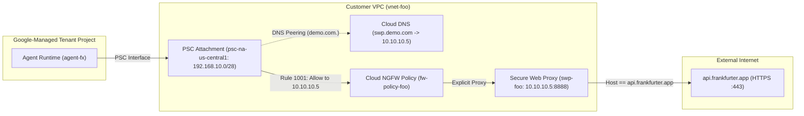

# Agent Runtime Private Egress with PSC Interface and Secure Web Proxy

## Introduction
Duration: 02:00

This Codelab configures private outbound internet egress for a **Vertex AI
Agent Runtime (ADK)** workload using a **Private Service Connect Interface
(PSCI)**, **Cloud DNS**, **Cloud NGFW**, and **Secure Web Proxy (SWP)**,
deployed directly from source with `uv` and `deploy_agent.py`.

### What you build



- **Custom VPC Network (`vnet-foo`):** Subnets for PSC interface attachment
  (`192.168.10.0/28`), Secure Web Proxy (`10.10.10.0/28`), and regional managed
  proxy (`100.100.10.0/26`).
- **Cloud NGFW Global Network Firewall Policy (`fw-policy-foo`):** Egress rules
  allowing PSC subnet traffic to the SWP IP (`1001`), blocking threat
  intelligence lists (`2001`–`2004`), and denying all other PSC subnet egress
  (`9999`).
- **Secure Web Proxy (`swp-foo`) & Private DNS (`demo.com.`):** Explicit proxy
  at `http://swp.demo.com:8888` enforcing an L7 hostname allowlist for
  `api.frankfurter.app`.
- **Source-Deployed ADK Agent (`agent-fx`):** Deployed from CLI using `uv` and
  `deploy_agent.py` with `pscInterfaceConfig` and `PROXY_SERVER_URL`.

### What you need

- A Google Cloud project with billing enabled.
- Access to Cloud Shell or a terminal with `gcloud`, `uv`, `jq`, and `curl`.

---

## Setup
Duration: 05:00

### Project setup

1. In Cloud Shell, set your target project ID:

```sh
# set project id
gcloud config set project SET_YOUR_PROJECT_ID_HERE
```

2. Ensure your user account has the following IAM roles:

| Role Name | Role IAM |
| :--- | :--- |
| Compute Network Admin | `roles/compute.networkAdmin` |
| Compute Security Admin | `roles/compute.securityAdmin` |
| DNS Administrator | `roles/dns.admin` |
| Network Services Admin | `roles/networkservices.admin` |
| Network Security Admin | `roles/networksecurity.admin` |
| Vertex AI Administrator | `roles/aiplatform.admin` |
| Storage Admin | `roles/storage.admin` |
| Project IAM Admin | `roles/resourcemanager.projectIamAdmin` |
| Service Usage Admin | `roles/serviceusage.serviceUsageAdmin` |
| Logs Viewer | `roles/logging.viewer` |

### Environment variables

```sh
# define environment variables
export SLUG="foo"
export REGION="us-central1"
export PROJ_ID=$(gcloud config list --format="value(core.project)")
export PROJ_NO=$(gcloud projects describe ${PROJ_ID} \
  --format="value(projectNumber)")
export RE_AGENT_NAME="agent-fx"
export STAGING_BUCKET="agent-staging-${PROJ_NO}"

# create directory for yaml configurations
mkdir -p cfg
```

### Enable APIs

```sh
# enable required google cloud apis
gcloud services enable \
  aiplatform.googleapis.com \
  cloudresourcemanager.googleapis.com \
  compute.googleapis.com \
  dns.googleapis.com \
  iam.googleapis.com \
  logging.googleapis.com \
  monitoring.googleapis.com \
  networksecurity.googleapis.com \
  networkservices.googleapis.com \
  storage.googleapis.com
```

---

## Network
Duration: 05:00

### VPC and subnets

```sh
# create custom vpc network
gcloud compute networks create vnet-${SLUG} \
  --subnet-mode=custom

# create secure web proxy subnet
gcloud compute networks subnets create subnet-${REGION}-swp \
  --network=vnet-${SLUG} \
  --region=${REGION} \
  --range=10.10.10.0/28 \
  --enable-private-ip-google-access

# create psc interface subnet
gcloud compute networks subnets create subnet-${REGION}-psc \
  --network=vnet-${SLUG} \
  --region=${REGION} \
  --range=192.168.10.0/28 \
  --enable-private-ip-google-access

# create regional managed proxy subnet
gcloud compute networks subnets create subnet-${REGION}-proxy \
  --network=vnet-${SLUG} \
  --region=${REGION} \
  --purpose=REGIONAL_MANAGED_PROXY \
  --role=ACTIVE \
  --range=100.100.10.0/26
```

### Private Service Connect network attachment

```sh
# create psc network attachment for agent runtime
gcloud compute network-attachments create psc-na-${REGION} \
  --region=${REGION} \
  --connection-preference=ACCEPT_AUTOMATIC \
  --subnets=subnet-${REGION}-psc
```

### Cloud NGFW firewall policy

Create a global network firewall policy allowing PSC subnet egress to the
Secure Web Proxy IP (`1001`) and denying all other PSC subnet egress (`9999`):

```sh
# create global network firewall policy
gcloud compute network-firewall-policies create fw-policy-${SLUG} \
  --description="vnet-${SLUG} global network fw policy" \
  --global

# rule 1001: allow egress from psc subnet to secure web proxy ip
gcloud compute network-firewall-policies rules create 1001 \
  --description="allow psc subnet egress to swp" \
  --firewall-policy=fw-policy-${SLUG} \
  --global-firewall-policy \
  --enable-logging \
  --action=allow \
  --direction=EGRESS \
  --layer4-configs=all \
  --src-ip-ranges=192.168.10.0/28 \
  --dest-ip-ranges=10.10.10.5/32

# rule 9999: deny all other egress from psc subnet
gcloud compute network-firewall-policies rules create 9999 \
  --description="deny all other egress from psc subnet" \
  --firewall-policy=fw-policy-${SLUG} \
  --global-firewall-policy \
  --enable-logging \
  --action=deny \
  --direction=EGRESS \
  --layer4-configs=all \
  --src-ip-ranges=192.168.10.0/28 \
  --dest-ip-ranges=0.0.0.0/0

# associate global firewall policy with vpc network
gcloud compute network-firewall-policies associations create \
  --name=fw-policy-bind-${SLUG} \
  --firewall-policy=fw-policy-${SLUG} \
  --network=vnet-${SLUG} \
  --global-firewall-policy
```

### Cloud NGFW Standard rules (optional)

Add Threat Intelligence egress rules (`2001`–`2004`) to block known malicious
IPs, Tor exit nodes, anonymous proxies, and crypto miners:

```sh
# rule 2001: block egress to tor exit nodes
gcloud compute network-firewall-policies rules create 2001 \
  --description="block tor exit nodes" \
  --firewall-policy=fw-policy-${SLUG} \
  --global-firewall-policy \
  --enable-logging \
  --action=deny \
  --direction=EGRESS \
  --layer4-configs=all \
  --dest-threat-intelligence=iplist-tor-exit-nodes

# rule 2002: block egress to known malicious ips
gcloud compute network-firewall-policies rules create 2002 \
  --description="block known malicious ips" \
  --firewall-policy=fw-policy-${SLUG} \
  --global-firewall-policy \
  --enable-logging \
  --action=deny \
  --direction=EGRESS \
  --layer4-configs=all \
  --dest-threat-intelligence=iplist-known-malicious-ips

# rule 2003: block egress to anonymous proxies
gcloud compute network-firewall-policies rules create 2003 \
  --description="block anonymous proxies" \
  --firewall-policy=fw-policy-${SLUG} \
  --global-firewall-policy \
  --enable-logging \
  --action=deny \
  --direction=EGRESS \
  --layer4-configs=all \
  --dest-threat-intelligence=iplist-anon-proxies

# rule 2004: block egress to crypto miners
gcloud compute network-firewall-policies rules create 2004 \
  --description="block crypto miners" \
  --firewall-policy=fw-policy-${SLUG} \
  --global-firewall-policy \
  --enable-logging \
  --action=deny \
  --direction=EGRESS \
  --layer4-configs=all \
  --dest-threat-intelligence=iplist-crypto-miners
```

---

## Secure Web Proxy and Private DNS
Duration: 10:00

### Gateway security policy and rule

```sh
# generate gateway security policy configuration
cat << EOF > cfg/swp-policy-${SLUG}.yaml
description: "swp policy for agent runtime egress"
name: projects/${PROJ_ID}/locations/${REGION}/gatewaySecurityPolicies/swp-policy-${SLUG}
EOF

# import gateway security policy
gcloud network-security gateway-security-policies import swp-policy-${SLUG} \
  --source=cfg/swp-policy-${SLUG}.yaml \
  --location=${REGION}

# generate rule to allow api.frankfurter.app and api.frankfurter.dev
cat << EOF > cfg/swp-rule-allow-frankfurter.yaml
name: projects/${PROJ_ID}/locations/${REGION}/gatewaySecurityPolicies/swp-policy-${SLUG}/rules/allow-frankfurter
description: "allow frankfurter api hosts"
enabled: true
priority: 10
basicProfile: ALLOW
sessionMatcher: "host() == 'api.frankfurter.app' || host() == 'api.frankfurter.dev'"
EOF

# import gateway security policy rule
gcloud network-security gateway-security-policies rules import \
  allow-frankfurter \
  --source=cfg/swp-rule-allow-frankfurter.yaml \
  --location=${REGION} \
  --gateway-security-policy=swp-policy-${SLUG}
```

### Secure Web Proxy instance

> aside positive
> **NOTE:** Deploying a Secure Web Proxy in `EXPLICIT_ROUTING_MODE`
> automatically provisions a managed Cloud Router (`swg-autogen-router-*`) and
> Cloud NAT (`swg-autogen-nat`) in the region with 4 auto-allocated external
> IPs by default.

```sh
# generate secure web proxy configuration
cat << EOF > cfg/swp-${SLUG}.yaml
name: projects/${PROJ_ID}/locations/${REGION}/gateways/swp-${SLUG}
type: SECURE_WEB_GATEWAY
ports: [8888]
addresses: ["10.10.10.5"]
gatewaySecurityPolicy: projects/${PROJ_ID}/locations/${REGION}/gatewaySecurityPolicies/swp-policy-${SLUG}
network: projects/${PROJ_ID}/global/networks/vnet-${SLUG}
subnetwork: projects/${PROJ_ID}/regions/${REGION}/subnetworks/subnet-${REGION}-swp
scope: samplescope
routingMode: EXPLICIT_ROUTING_MODE
EOF

# deploy secure web proxy instance
gcloud network-services gateways import swp-${SLUG} \
  --source=cfg/swp-${SLUG}.yaml \
  --location=${REGION}
```

### Tune Secure Web Proxy Cloud NAT (optional)

By default, `swg-autogen-nat` allocates 4 external IPv4 addresses. For a test
environment or predictable egress allowlisting, tune Cloud NAT to use a single
reserved static external IP (`ip-nat-swp-1`) and Dynamic Port Allocation (DPA):

```sh
# set variable for auto-generated swp cloud router
export SWP_ROUTER=$(gcloud compute routers list \
  --filter="name:(swg-autogen-router-*)" \
  --format="get(name)")
echo ${SWP_ROUTER}

# view the auto-provisioned external ips (4 by default)
gcloud compute routers get-status ${SWP_ROUTER} \
  --region=${REGION}

# reserve 1 external static ip
gcloud compute addresses create ip-nat-swp-1 \
  --region=${REGION}

# view new external ip reservation
gcloud compute addresses list

# update cloud nat to use predefined ip address
gcloud compute routers nats update swg-autogen-nat \
  --router=${SWP_ROUTER} \
  --nat-external-ip-pool=ip-nat-swp-1 \
  --region=${REGION}

# update cloud nat to use dynamic port allocation
gcloud compute routers nats update swg-autogen-nat \
  --router=${SWP_ROUTER} \
  --min-ports-per-vm=2048 \
  --max-ports-per-vm=4096 \
  --enable-dynamic-port-allocation \
  --region=${REGION}

# view new external ip in use
gcloud compute routers get-status ${SWP_ROUTER} \
  --region=${REGION}

# verify dynamic port allocation is enabled
gcloud compute routers nats describe swg-autogen-nat \
  --router=${SWP_ROUTER} \
  --region=${REGION}
```

### Private DNS zone

```sh
# create private cloud dns zone for demo.com
gcloud dns managed-zones create priv-zone-demo \
  --description="private zone for swp" \
  --dns-name="demo.com." \
  --visibility=private \
  --networks=vnet-${SLUG}

# create a record mapping swp.demo.com to 10.10.10.5
gcloud dns record-sets create swp.demo.com. \
  --zone=priv-zone-demo \
  --type=A \
  --ttl=300 \
  --rrdatas="10.10.10.5"
```

---

## Codebase
Duration: 05:00

### Create staging bucket

```sh
# create cloud storage bucket for adk staging artifacts
gcloud storage buckets create gs://${STAGING_BUCKET} \
  --location=${REGION}
```

### Download deployment script

Download `deploy_agent.py` from the `cloud-networking-solutions` repository:

```sh
# create agent directory structure
mkdir -p ${RE_AGENT_NAME}/agent

# download deploy_agent.py
curl -sL https://raw.githubusercontent.com/GoogleCloudPlatform/cloud-networking-solutions/main/codelabs/agw-cuj-arun-egress-vpc/agent-weather/deploy_agent.py \
  -o ${RE_AGENT_NAME}/deploy_agent.py

# patch target_network in deploy_agent.py to use bare vpc name
sed -i 's|tn_value = f"projects/{network_project}/global/networks/{tn_value}"|tn_value = args.target_network.split("/")[-1]|' \
  ${RE_AGENT_NAME}/deploy_agent.py
```

### Agent dependencies and source files

```sh
# create pyproject.toml
cat << 'EOF' > ${RE_AGENT_NAME}/pyproject.toml
[project]
name = "agent-fx"
version = "0.1.0"
description = "ADK currency exchange agent using Secure Web Proxy"
requires-python = ">=3.11,<3.14"
dependencies = [
    "cloudpickle>=3.0.0",
    "google-adk==1.31.1",
    "google-cloud-aiplatform[adk,agent_engines]>=1.40.0",
    "google-genai",
    "opentelemetry-instrumentation-google-genai",
    "opentelemetry-instrumentation-grpc",
    "opentelemetry-instrumentation-httpx",
    "pydantic",
    "python-dotenv",
    "requests",
]
EOF

# create package init file
cat << 'EOF' > ${RE_AGENT_NAME}/agent/__init__.py
from . import agent
EOF

# create agent definition routing http/https through PROXY_SERVER_URL
cat << 'EOF' > ${RE_AGENT_NAME}/agent/agent.py
from __future__ import annotations

import os
import sys
from typing import Any

try:
  import urllib3.contrib.pyopenssl

  urllib3.contrib.pyopenssl.extract_from_urllib3()
except Exception:
  pass

try:
  from pathlib import Path
  from dotenv import load_dotenv

  for parent_level in [1, 2]:
    env_path = Path(__file__).parents[parent_level] / '.env'
    if env_path.exists():
      load_dotenv(dotenv_path=env_path, override=True)
      break
except Exception:
  pass

from google.adk import Agent
import requests

FRANKFURTER_BASE_URL = 'https://api.frankfurter.app'
PROXY_SERVER_URL = os.getenv('PROXY_SERVER_URL', 'http://swp.demo.com:8888')


def _get_proxies() -> dict[str, str] | None:
  """Returns requests proxy mapping when PROXY_SERVER_URL is configured."""
  if not PROXY_SERVER_URL:
    return None
  return {
      'http': PROXY_SERVER_URL,
      'https': PROXY_SERVER_URL,
  }


def get_exchange_rate(
    currency_from: str = 'USD',
    currency_to: str = 'EUR',
    currency_date: str = 'latest',
    amount: float = 1.0,
) -> dict[str, Any]:
  """Retrieves the exchange rate or converted amount between two currencies.

  Uses the Frankfurter API (https://api.frankfurter.app) over the configured
  Secure Web Proxy (PROXY_SERVER_URL).

  Args:
    currency_from: Base currency 3-letter ISO 4217 code (e.g., 'USD', 'EUR').
    currency_to: Target currency 3-letter ISO 4217 code (e.g., 'EUR', 'JPY').
    currency_date: Date in 'YYYY-MM-DD' format or 'latest' for current rates.
    amount: Amount of currency_from to convert. Defaults to 1.0.

  Returns:
    A dictionary containing 'status', 'amount', 'base', 'date', and 'rates',
    or an 'error_message' if the request fails.
  """
  base = currency_from.strip().upper()
  target = currency_to.strip().upper()
  date_path = currency_date.strip().lower() or 'latest'

  if base == target:
    return {
        'status': 'success',
        'amount': amount,
        'base': base,
        'date': date_path,
        'rates': {target: amount},
    }

  url = f'{FRANKFURTER_BASE_URL}/{date_path}'
  params: dict[str, str | float] = {
      'from': base,
      'to': target,
      'amount': amount,
  }
  proxies = _get_proxies()
  print(
      f'[get_exchange_rate] url={url} params={params} proxy={PROXY_SERVER_URL}',
      file=sys.stderr,
  )

  try:
    response = requests.get(
        url,
        params=params,
        proxies=proxies,
        timeout=15,
    )
    response.raise_for_status()
    data = response.json()
    return {'status': 'success', **data}
  except requests.exceptions.RequestException as e:
    print(f'[get_exchange_rate] ERROR: {e}', file=sys.stderr)
    return {
        'status': 'error',
        'error_message': f'Failed to fetch exchange rate from {url}: {e}',
    }


def get_supported_currencies() -> dict[str, Any]:
  """Retrieves all 3-letter ISO 4217 currency codes supported by Frankfurter.

  Returns:
    A dictionary mapping 3-letter currency codes (e.g., 'USD') to their full
    currency names (e.g., 'United States Dollar'), or an error dictionary.
  """
  url = f'{FRANKFURTER_BASE_URL}/currencies'
  proxies = _get_proxies()
  print(
      f'[get_supported_currencies] url={url} proxy={PROXY_SERVER_URL}',
      file=sys.stderr,
  )

  try:
    response = requests.get(url, proxies=proxies, timeout=15)
    response.raise_for_status()
    return {'status': 'success', 'currencies': response.json()}
  except requests.exceptions.RequestException as e:
    print(f'[get_supported_currencies] ERROR: {e}', file=sys.stderr)
    return {
        'status': 'error',
        'error_message': f'Failed to fetch currencies from {url}: {e}',
    }


root_agent = Agent(
    model='gemini-2.5-flash',
    name='agent_fx',
    description=(
        'Currency exchange rate and conversion assistant using the '
        'Frankfurter API over Secure Web Proxy.'
    ),
    instruction=(
        'You are a currency exchange assistant. Use get_exchange_rate to look '
        'up current or historical exchange rates and convert amounts between '
        'currencies. Always pass 3-letter ISO 4217 currency codes (such as '
        'USD, EUR, GBP, JPY) and use YYYY-MM-DD for historical dates or '
        "'latest' for current rates. If a user asks which currencies are "
        'available or provides an ambiguous currency name, call '
        'get_supported_currencies first.'
    ),
    tools=[get_exchange_rate, get_supported_currencies],
)
EOF
```

---

## ADK Agent
Duration: 10:00

### Configure service agent IAM

Grant the Vertex AI Service Agent (`service-${PROJ_NO}@gcp-sa-aiplatform...`)
permissions to attach the PSC interface and peer DNS with `vnet-${SLUG}`, and
grant the default Compute Engine service account `roles/aiplatform.user`:

```sh
# provision vertex ai service identity
gcloud beta services identity create \
  --service=aiplatform.googleapis.com \
  --project=${PROJ_NO}

# grant compute network admin to vertex ai service agent
gcloud projects add-iam-policy-binding ${PROJ_ID} \
  --member="serviceAccount:service-${PROJ_NO}@gcp-sa-aiplatform.iam.gserviceaccount.com" \
  --role="roles/compute.networkAdmin"

# grant dns peer to vertex ai service agent
gcloud projects add-iam-policy-binding ${PROJ_ID} \
  --member="serviceAccount:service-${PROJ_NO}@gcp-sa-aiplatform.iam.gserviceaccount.com" \
  --role="roles/dns.peer"

# grant vertex ai user to default compute service account
gcloud projects add-iam-policy-binding ${PROJ_ID} \
  --member="serviceAccount:${PROJ_NO}-compute@developer.gserviceaccount.com" \
  --role="roles/aiplatform.user"
```

### Deploy agent from source

Deploy the agent runtime with `psc-na-${REGION}`, DNS peering for `demo.com.`,
and `PROXY_SERVER_URL=http://swp.demo.com:8888`:

```sh
# deploy agent runtime from source
uv --directory ${RE_AGENT_NAME} run python3 deploy_agent.py \
  --project=${PROJ_ID} \
  --region=${REGION} \
  --src-dir=./agent \
  --staging-bucket=${STAGING_BUCKET} \
  --display-name="${RE_AGENT_NAME}" \
  --description="agent for currency exchange rates" \
  --network-attachment=psc-na-${REGION} \
  --target-network=vnet-${SLUG} \
  --dns-domains="demo.com." \
  --enable-telemetry \
  --env-var="PROXY_SERVER_URL=http://swp.demo.com:8888"
```

Retrieve the deployed Reasoning Engine ID:

```sh
# export reasoning engine resource id
export RE_ENGINE_ID=$(curl -s \
  -H "Authorization: Bearer $(gcloud auth print-access-token)" \
  "https://${REGION}-aiplatform.googleapis.com/v1/projects/${PROJ_ID}/locations/${REGION}/reasoningEngines" \
  | jq -r ".reasoningEngines[] | select(.displayName==\"${RE_AGENT_NAME}\") | .name" \
  | awk -F'/' '{print $NF}')
echo "RE_ENGINE_ID=${RE_ENGINE_ID}"
```

---

## Validation
Duration: 05:00

### Verify PSC attachment status

Verify that the Vertex AI tenant project attached a network interface to
`psc-na-${REGION}`:

```sh
# inspect psc network attachment connection endpoints
gcloud compute network-attachments describe psc-na-${REGION} \
  --region=${REGION} \
  --format="yaml(connectionEndpoints)"
```

Example output:

```text
connectionEndpoints:
- ipAddress: 192.168.10.2
  projectIdOrNum: '887075291533'
  status: ACCEPTED
  subnetwork: https://www.googleapis.com/compute/v1/projects/PROJECT_ID/regions/us-central1/subnetworks/subnet-us-central1-psc
```

### Test agent via Playground or CLI

Output the Cloud Console Playground URL:

```sh
# print agent engine playground link
echo "https://console.cloud.google.com/agent-platform/runtimes/locations/${REGION}/agent-engines/${RE_ENGINE_ID}/playground?project=${PROJ_ID}"
```

Or query the deployed agent directly from the CLI:

```sh
# query reasoning engine
curl -s -X POST "https://${REGION}-aiplatform.googleapis.com/v1/projects/${PROJ_ID}/locations/${REGION}/reasoningEngines/${RE_ENGINE_ID}:streamQuery" \
  -H "Authorization: Bearer $(gcloud auth application-default print-access-token)" \
  -H "Content-Type: application/json" \
-d @- <<EOF
  {
    "class_method": "async_stream_query",
    "input": {
      "user_id": "test-user",
      "message": "what is the exchange rate from usd to eur?"
    }
  }
EOF
```

```sh
# query reasoning engine (only print final answer)
curl -s -X POST "https://${REGION}-aiplatform.googleapis.com/v1/projects/${PROJ_ID}/locations/${REGION}/reasoningEngines/${RE_ENGINE_ID}:streamQuery" \
  -H "Authorization: Bearer $(gcloud auth application-default print-access-token)" \
  -H "Content-Type: application/json" \
-d @- <<EOF | jq -r '.content.parts[]?.text // empty'
  {
    "class_method": "async_stream_query",
    "input": {
      "user_id": "test-user",
      "message": "what is the exchange rate from gbp to jpy?"
    }
  }
EOF
```

```sh
# query reasoning engine (print step by step trace)
curl -s -X POST "https://${REGION}-aiplatform.googleapis.com/v1/projects/${PROJ_ID}/locations/${REGION}/reasoningEngines/${RE_ENGINE_ID}:streamQuery" \
  -H "Authorization: Bearer $(gcloud auth application-default print-access-token)" \
  -H "Content-Type: application/json" \
  -d @- <<EOF | jq -r '.content.parts[]? |
  if .function_call then "CALL:   \(.function_call.name)(\(.function_call.args | tojson))"
  elif .function_response then "RESULT: \(.function_response.response | tojson)"
  elif .text then "ANSWER: \(.text)"
  else empty end'
  {
    "class_method": "async_stream_query",
    "input": {
      "user_id": "test-user",
      "message": "what is the exchange rate from aud to cad?"
    }
  }
EOF
```

```sh
# query reasoning engine (remove thought signature from trace)
curl -s -X POST "https://${REGION}-aiplatform.googleapis.com/v1/projects/${PROJ_ID}/locations/${REGION}/reasoningEngines/${RE_ENGINE_ID}:streamQuery" \
  -H "Authorization: Bearer $(gcloud auth application-default print-access-token)" \
  -H "Content-Type: application/json" \
  -d @- <<EOF | jq '.content.parts[]? | del(.thought_signature)'
  {
    "class_method": "async_stream_query",
    "input": {
      "user_id": "test-user",
      "message": "what is the exchange rate from inr to chf?"
    }
  }
EOF
```

### Logs

#### Firewall

```sh
# show firewall logs
gcloud logging read 'logName:"compute.googleapis.com%2Ffirewall"' \
  --project=${PROJ_ID} \
  --limit=5 \
  --format="table( \
    timestamp.date(tz=LOCAL):label=TIMESTAMP, \
    jsonPayload.connection.src_ip:label=SRC_IP, \
    jsonPayload.connection.dest_ip:label=DEST_IP, \
    jsonPayload.connection.dest_port:label=PORT, \
    jsonPayload.rule_details.reference.basename():label=RULE, \
    jsonPayload.disposition:label=DISPOSITION, \
    jsonPayload.rule_details.priority:label=RULE_PRIORITY
  )"
```

#### SWP

```sh
# show swp logs
gcloud logging read 'logName:"networkservices.googleapis.com%2Fgateway_requests"' \
  --project=${PROJ_ID} \
  --limit=5 \
  --format="table( \
    timestamp.date(tz=LOCAL):label=TIMESTAMP, \
    resource.labels.gateway_name:label=GATEWAY, \
    httpRequest.protocol:label=PROTOCOL, \
    httpRequest.remoteIp:label=REMOTE_IP, \
    httpRequest.serverIp:label=SERVER_IP, \
    httpRequest.requestMethod:label=METHOD, \
    jsonPayload.enforcedGatewaySecurityPolicy.hostname:label=HOSTNAME, \
    httpRequest.status:label=STATUS, \
    jsonPayload.enforcedGatewaySecurityPolicy.matchedRules[0].action:label=ACTION
  )"
```

#### Agent Runtime

```sh
# show reasoning engine stderr logs (llm calls and tool http requests)
gcloud logging read 'logName:"aiplatform.googleapis.com%2Freasoning_engine_stderr"' \
  --project=${PROJ_ID} \
  --limit=10 \
  --format="table( \
    timestamp.date(tz=LOCAL):label=TIMESTAMP, \
    resource.labels.reasoning_engine_id:label=ENGINE_ID, \
    textPayload:label=MESSAGE
  )"
```

```sh
# show reasoning engine stdout otel genai events
gcloud logging read \
  "logName:aiplatform.googleapis.com%2Freasoning_engine_stdout \
   AND labels.\"event.name\":*" \
  --project=${PROJ_ID} \
  --limit=10 \
  --format="table( \
    timestamp.date(tz=LOCAL):label=TIMESTAMP, \
    trace.basename().sub('^(.{8}).*$', '\1'):label=TRACE_ID, \
    spanId:label=SPAN_ID, \
    labels.\"event.name\":label=EVENT, \
    jsonPayload.content.role:label=ROLE, \
    jsonPayload.content.parts[0].function_call.name:label=TOOL_CALL, \
    jsonPayload.content.parts[0].text:label=TEXT, \
    jsonPayload.finish_reason:label=FINISH
  )"
```

```sh
# show reasoning engine inbound http access logs
gcloud logging read \
  "logName:aiplatform.googleapis.com%2Freasoning_engine_stdout
   AND textPayload:/api/" \
  --project=${PROJ_ID} \
  --limit=5 \
  --format="table( \
    timestamp.date(tz=LOCAL):label=TIMESTAMP, \
    resource.labels.reasoning_engine_id:label=ENGINE_ID, \
    textPayload:label=HTTP_ACCESS
  )"
```

### Traces

```sh
# fetch latest reasoning engine trace id
export TRACE_ID=$(gcloud logging read 'logName:"aiplatform.googleapis.com%2Freasoning_engine_stdout" AND trace:*' \
  --project=${PROJ_ID} --limit=1 --format="value(trace)")
echo ${TRACE_ID}
```

```sh
# show reasoning engine trace (otel span timeline)
curl -s -H "Authorization: Bearer $(gcloud auth print-access-token)" \
  "https://cloudtrace.googleapis.com/v1/projects/${PROJ_ID}/traces/${TRACE_ID}" \
  | jq -r '["START_TIME","SPAN_NAME","OPERATION","MODEL_OR_TOOL"], (.spans | sort_by(.startTime)[] | [
      .startTime,
      .name,
      (.labels."gen_ai.operation.name" // "-"),
      (.labels."gen_ai.tool.name" // .labels."gen_ai.request.model" // "-")
    ]) | @tsv' | column -t -s $'\t'
```

---

## Cleanup <!-- phase: cleanup -->
Duration: 05:00

```sh
# 1. delete reasoning engine and staging bucket
curl -s -X DELETE \
  -H "Authorization: Bearer $(gcloud auth print-access-token)" \
  "https://${REGION}-aiplatform.googleapis.com/v1/projects/${PROJ_ID}/locations/${REGION}/reasoningEngines/${RE_ENGINE_ID}?force=true"

gcloud storage rm --recursive gs://${STAGING_BUCKET} --quiet || true

# 2. delete secure web proxy instance, rule, and security policy
gcloud network-services gateways delete swp-${SLUG} \
  --location=${REGION} \
  --quiet || true

gcloud network-security gateway-security-policies rules delete \
  allow-frankfurter \
  --gateway-security-policy=swp-policy-${SLUG} \
  --location=${REGION} \
  --quiet || true

gcloud network-security gateway-security-policies delete swp-policy-${SLUG} \
  --location=${REGION} \
  --quiet || true

# 3. delete private dns record and zone
gcloud dns record-sets delete swp.demo.com. \
  --zone=priv-zone-demo \
  --type=A \
  --quiet || true

gcloud dns managed-zones delete priv-zone-demo \
  --quiet || true

# 4. delete global firewall policy association and firewall policy
gcloud compute network-firewall-policies associations delete \
  --name=fw-policy-bind-${SLUG} \
  --firewall-policy=fw-policy-${SLUG} \
  --global-firewall-policy \
  --quiet || true

gcloud compute network-firewall-policies delete fw-policy-${SLUG} \
  --global \
  --quiet || true

# 5. delete swp auto-generated cloud nat, router, and reserved nat ip
export SWP_ROUTER=$(gcloud compute routers list \
  --filter="name:(swg-autogen-router-*)" \
  --format="get(name)")

gcloud compute routers nats delete swg-autogen-nat \
  --router=${SWP_ROUTER} \
  --region=${REGION} \
  --quiet || true

gcloud compute routers delete ${SWP_ROUTER} \
  --region=${REGION} \
  --quiet || true

gcloud compute addresses delete ip-nat-swp-1 \
  --region=${REGION} \
  --quiet || true

# 6. delete psc network attachment, subnets, and vpc network
gcloud compute network-attachments delete psc-na-${REGION} \
  --region=${REGION} \
  --quiet || true

gcloud compute networks subnets delete \
  subnet-${REGION}-swp \
  subnet-${REGION}-psc \
  subnet-${REGION}-proxy \
  --region=${REGION} \
  --quiet || true

gcloud compute networks delete vnet-${SLUG} \
  --quiet || true

# 7. remove local directories
rm -rf cfg ${RE_AGENT_NAME}
```

---

## Conclusion
Duration: 00:00

Congratulations! You have deployed a Vertex AI Agent Runtime (ADK) workload
from source with Private Service Connect Interface egress, Cloud DNS peering,
Cloud NGFW threat intelligence rules, and Secure Web Proxy hostname filtering.

### What's next?

- Learn more about [Private Service Connect interface with Agent Runtime][08-01]
- Explore [Secure Web Proxy overview][08-02]
- Review [Google Threat Intelligence for firewall policy rules][08-03]


Thank you!

[08-01]: https://docs.cloud.google.com/gemini-enterprise-agent-platform/scale/runtime/private-service-connect-interface
[08-02]: https://docs.cloud.google.com/secure-web-proxy/docs/overview
[08-03]: https://docs.cloud.google.com/firewall/docs/threat-intelligence-overview
