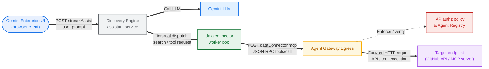

# ge agent gateway connector

for data stores

> [!note]
> - using github connector for ge --> [docs](https://docs.cloud.google.com/gemini/enterprise/docs/connectors/github)
> - configuring discovery engine (ge app) egress routing to agent gateway --> [docs](https://docs.cloud.google.com/gemini-enterprise-agent-platform/govern/gateways/agent-gateway-ge-deploy#route-traffic)




> [!important]
> (for now) this lab assumes the agent gateway, ge app, and datastore have already been configured

> [!warning]
> - agent gateway must be deployed is a specific region, see location table [here](https://docs.cloud.google.com/gemini-enterprise-agent-platform/govern/gateways/set-up-agent-gateway#agw-region)
> - agent gateway must be configured to use the global registry, see setup guidance [here](https://docs.cloud.google.com/gemini-enterprise-agent-platform/govern/gateways/set-up-agent-gateway#agent-registry)

## setup

```sh
# set base vars
export SLUG="foo"
export REGION="us-central1"
export MREGION="us"
echo ${SLUG}
echo ${REGION}
echo ${MREGION}
```

```sh
# define ge vars
export GE_LOCATION="global"
export GE_APP_NAME="app-${SLUG}-${GE_LOCATION}"
echo ${GE_LOCATION}
echo ${GE_APP_NAME}
```

```sh
# define gateway var
export AGW_NAME="agw-${SLUG}-${REGION}-ata"
echo ${AGW_NAME}
```

```sh
# fetch proj vars
export PROJ_ID=$(gcloud config list --format="value(core.project)")
export PROJ_NO=$(gcloud projects describe $PROJ_ID --format="value(projectNumber)")
export ORG_ID=$(gcloud projects get-ancestors ${PROJ_ID} --format="value(id)" | tail -n 1)
echo ${PROJ_ID}
echo ${PROJ_NO}
echo ${ORG_ID}
```

## iam

> [!note]
> for registry actions (grant permission to discovery engine sa)

```sh
# create custom role
gcloud iam roles create AgentGatewayRouting \
  --project=${PROJ_ID} \
  --title="agent gateway and registry ops" \
  --description="custom role for agent gateway and registry ops for routing" \
  --permissions="agentregistry.agents.list,agentregistry.agents.search,agentregistry.agents.get,agentregistry.mcpServers.list,agentregistry.mcpServers.search,agentregistry.mcpServers.get,networkservices.agentGateways.list,networkservices.agentGateways.get,networkservices.agentGateways.use"
```

```sh
# verify custom role permissions
gcloud iam roles describe AgentGatewayRouting --project=${PROJ_ID}
```

```sh
# grant the custom role to discovery engine (ge) sa
gcloud projects add-iam-policy-binding ${PROJ_ID} \
  --member="serviceAccount:service-${PROJ_NO}@gcp-sa-discoveryengine.iam.gserviceaccount.com" \
  --role="projects/${PROJ_ID}/roles/AgentGatewayRouting"
```

```sh
# verfiy iam binding on discovery engine (ge) sa
gcloud projects get-iam-policy ${PROJ_ID} \
  --flatten="bindings[].members" \
  --filter="bindings.members:serviceAccount:service-${PROJ_NO}@gcp-sa-discoveryengine.iam.gserviceaccount.com" \
  --format="table(bindings.role:label=ROLE, bindings.members:label=IDENTITY)"
```

## registry

```sh
# register endpoints (global)
gcloud alpha agent-registry services create api-github-com \
  --location=global \
  --interfaces="url=https://api.github.com,protocolBinding=JSONRPC"

gcloud alpha agent-registry services create github-com \
  --location=global \
  --interfaces="url=https://github.com,protocolBinding=JSONRPC"
```

## gateway

> [!note]
> check gateway is configured in region supporting global registry and using global registry resource

```sh
# describe agent gateway
gcloud alpha network-services agent-gateways describe ${AGW_NAME} --location=${REGION}
```

```
<snip>
name: projects/${PROJ_ID}/locations/us-central1/agentGateways/${AGW_NAME}
protocols:
- MCP
registries:
- //agentregistry.googleapis.com/projects/${PROJ_ID}/locations/global
</snip>
```

## ge app

```sh
# list discovery engine instances (ge apps)
curl -s -X GET "https://${GE_LOCATION}-discoveryengine.googleapis.com/v1/projects/${PROJ_ID}/locations/${GE_LOCATION}/collections/default_collection/engines" \
  -H "Authorization: Bearer $(gcloud auth application-default print-access-token)" -H "Content-Type: application/json" \
  -H "X-Goog-User-Project: ${PROJ_ID}" | jq '.engines[]? | {displayName: .displayName, name: .name}'
```

```sh
# fetch discovery engine instance (ge app) id
export GE_APP_ID=$(curl -s -X GET "https://${GE_LOCATION}-discoveryengine.googleapis.com/v1/projects/${PROJ_ID}/locations/${GE_LOCATION}/collections/default_collection/engines" \
  -H "Authorization: Bearer $(gcloud auth application-default print-access-token)" -H "X-Goog-User-Project: ${PROJ_ID}" \
  | jq -r --arg name "${GE_APP_NAME}" '.engines[] | select(.displayName==$name) | .name | split("/") | last')
echo ${GE_APP_ID}
```

```sh
# show config for discovery engine instance (ge app)
curl -s -X GET "https://${GE_LOCATION}-discoveryengine.googleapis.com/v1/projects/${PROJ_ID}/locations/${GE_LOCATION}/collections/default_collection/engines/${GE_APP_ID}" \
  -H "Authorization: Bearer $(gcloud auth application-default print-access-token)" -H "Content-Type: application/json" \
  -H "X-Goog-User-Project: ${PROJ_ID}" | jq .
```

```sh
# set observability on discovery engine instance (ge app)
curl -X PATCH "https://${GE_LOCATION}-discoveryengine.googleapis.com/v1/projects/${PROJ_ID}/locations/${GE_LOCATION}/collections/default_collection/engines/${GE_APP_ID}?updateMask=observabilityConfig" \
  -H "Authorization: Bearer $(gcloud auth application-default print-access-token)" -H "X-Goog-User-Project: ${PROJ_ID}" -H "Content-Type: application/json" \
  -d @- <<EOF
{
  "observabilityConfig": {
    "observabilityEnabled": true,
    "sensitiveLoggingEnabled": true
  }
}
EOF
```

```sh
# bind discovery engine instance (ge app) to agent gateway
curl -X PATCH "https://${GE_LOCATION}-discoveryengine.googleapis.com/v1/projects/${PROJ_ID}/locations/${GE_LOCATION}/collections/default_collection/engines/${GE_APP_ID}?updateMask=agentGatewaySetting.defaultEgressAgentGateway.name" \
  -H "Authorization: Bearer $(gcloud auth application-default print-access-token)" -H "X-Goog-User-Project: ${PROJ_ID}" -H "Content-Type: application/json" \
  -d @- <<EOF
{
  "agentGatewaySetting": {
    "defaultEgressAgentGateway": {
      "name": "projects/${PROJ_NO}/locations/${REGION}/agentGateways/${AGW_NAME}"
    }
  }
}
EOF
```

> [!tip]
> verify agent gateway egress is configured

```sh
# show agent gateway config on discovery engine instance (ge app)
curl -s -X GET "https://global-discoveryengine.googleapis.com/v1/projects/${PROJ_ID}/locations/${GE_LOCATION}/collections/default_collection/engines/${GE_APP_ID}" \
  -H "Authorization: Bearer $(gcloud auth application-default print-access-token)" -H "X-Goog-User-Project: ${PROJ_ID}" \
  | jq '{name: .name, displayName: .displayName, agentGatewaySetting: .agentGatewaySetting}'
```

## test

```sh
# goto ge app dashboard
echo "https://console.cloud.google.com/gemini-enterprise/locations/${GE_LOCATION}/engines/${GE_APP_ID}/overview/dashboard?project=${PROJ_ID}"
```

> [!tip]
> enter query in chat like
> - `what are the details of the latest commit in my github repo`, or
> - `show me a list of github available repos`


```sh
# check ge user activity logs
gcloud logging read \
  'log_id("discoveryengine.googleapis.com/gemini_enterprise_user_activity") AND jsonPayload.request.query.parts.text:*' \
  --project=${PROJ_ID} \
  --limit=5 \
  --order=desc \
  --format='table(
    timestamp.date(format="%Y-%m-%d %H:%M:%S", tz=LOCAL):label=TIME,
    jsonPayload.request.query.parts[0].text.trailoff(60):label=USER_QUERY,
    jsonPayload.serviceTextReply.yesno(no="").trailoff(60):label=GENERATED_REPLY
  )'
```

```log
TIME                 USER_QUERY                                                    GENERATED_REPLY
2026-06-23 15:11:45  show me a list of github available repos                      **Searching Repositories Now**

                                                                                   I'm currently working on ...
2026-06-23 15:09:34  what are the details of the latest commit in my github repo   **Exploring GitHub Repositories**

                                                                                   I'm currently focused ...
```

```sh
# check agent gateway access logs (with client ip)
gcloud logging read \
  'resource.type="networkservices.googleapis.com/Gateway" AND httpRequest.requestUrl:*' \
  --project=${PROJ_ID} \
  --limit=10 \
  --order=desc \
  --format='table(
    timestamp.date(format="%Y-%m-%d %H:%M:%S", tz=LOCAL):label=TIMESTAMP,
    httpRequest.requestMethod:label=METHOD,
    httpRequest.status:label=STATUS,
    jsonPayload.authzPolicyInfo.result:label=AUTHZ,
    httpRequest.remoteIp:label=CLIENT_IP,
    httpRequest.serverIp:label=DEST_IP,
    httpRequest.requestUrl.trailoff(100):label=URL
  )'
```

```log
TIMESTAMP            METHOD  STATUS  AUTHZ    CLIENT_IP            DEST_IP             URL
2026-06-23 15:10:49  POST    200     ALLOWED  198.51.100.16:55379  216.239.32.223:443  https://discoveryengine.googleapis.com/v1/projects/${PROJ_NO}/locations/global/collections/gith...
2026-06-23 15:10:49  POST    200              198.51.100.16:60307                      https://discoveryengine.googleapis.com/v1/projects/${PROJ_NO}/locations/global/collections/gith...
2026-06-23 15:10:48  POST    200     ALLOWED  198.51.100.18:44955  216.239.32.223:443  https://discoveryengine.googleapis.com/v1/projects/${PROJ_NO}/locations/global/collections/gith...
2026-06-23 15:10:48  POST    200     ALLOWED  198.51.100.19:44401  216.239.32.223:443  https://discoveryengine.googleapis.com/v1/projects/${PROJ_NO}/locations/global/collections/gith...
```
