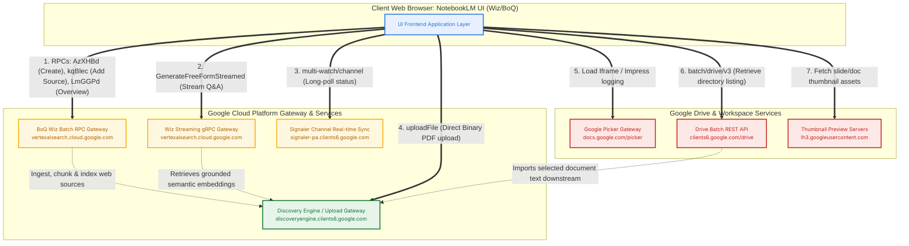
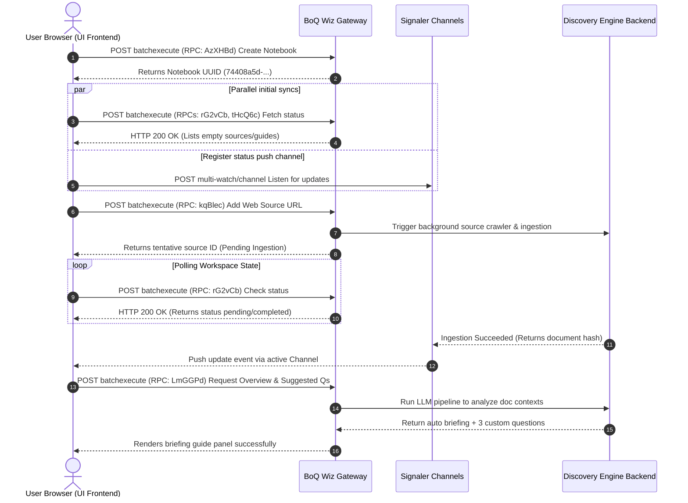
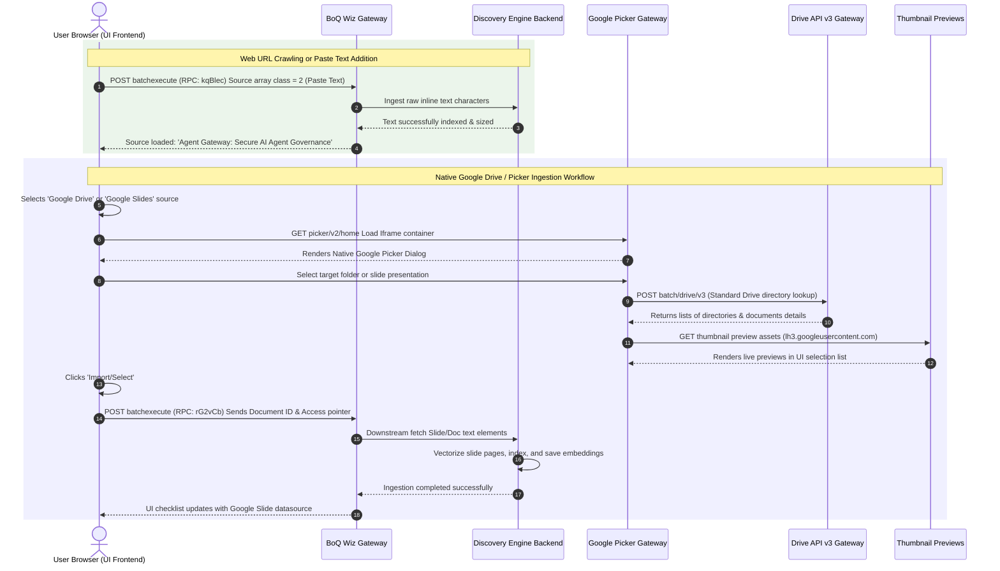
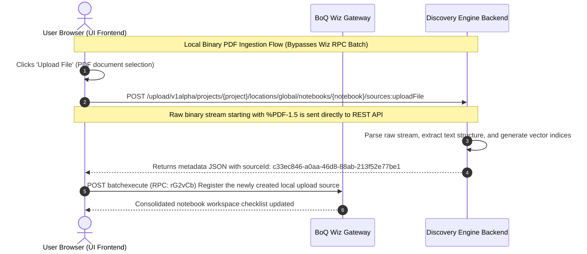
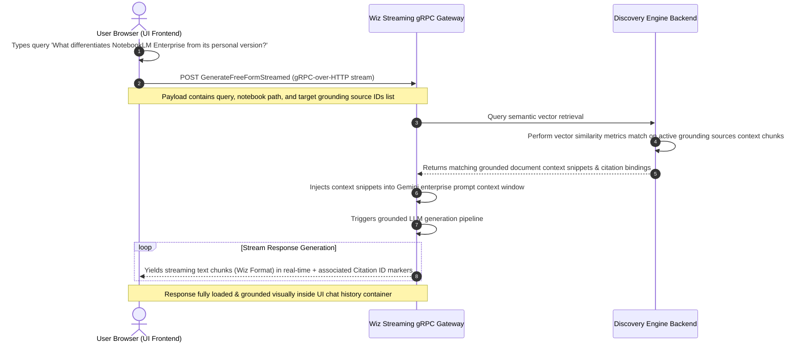

# HAR Trace Diagrams: NotebookLM Enterprise Architecture Flows

For the complete technical breakdown of the individual sessions, payloads, and API methods, see [har-analysis.md](har-analysis.md).

---

## 1. System Communication Architecture (High-Level)

This flowchart illustrates how the client-side UI frontend communicates across various Google Cloud backends and Google Workspace authentication gateways to manage workspace settings, ingest documents, and execute grounded generation.

---

## 2. Session Network Sequence Flows

The interactive sequence diagrams below detail how distinct user workflows are routed, negotiated, and processed under the hood.

### Sequence Flow A: Session 1 - Notebook Creation & Web Ingestion

This sequence maps out creating a new workspace project container and adding a crawling web URL datasource.

---

### Sequence Flow B: Session 2 & 5 - Web Crawling vs. Google Picker & Drive Ingestion Routing

This flow contrasts adding text manually vs. utilizing the secure, native Google Docs & Google Slides gateway and directory mapping integration.

---

### Sequence Flow C: Session 3 - Local Binary PDF Ingestion Flow

Direct local binary/stream uploads bypass the multiplexed `batchexecute` gate and connect straight to the REST API endpoint context.

---

### Sequence Flow D: Session 4 - Grounded Streamed Chat Q&A Generation

Low-latency gRPC-over-HTTP streaming generation flow grounding prompt queries using semantic indices retrieved across active selections.

