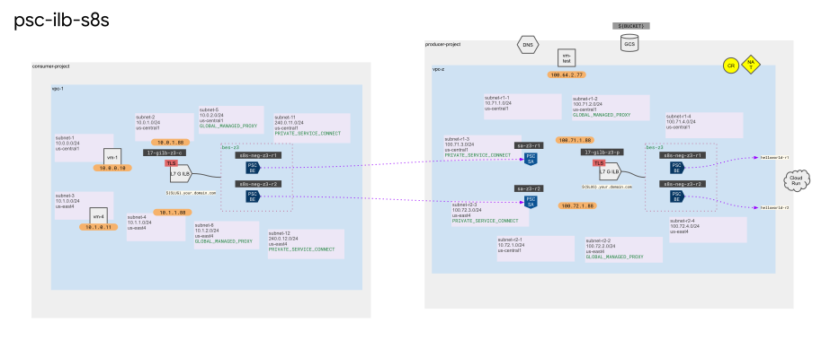

# ilb psc neg to ilb s8s neg (consumer)



## setup

```sh
# set env vars
export PROJ_ID=$(gcloud config list --format="value(core.project)")
export PROJ_NO=$(gcloud projects describe $PROJ_ID --format="value(projectNumber)")
export ORG_ID=$(gcloud organizations list --format="value(name)")
export REGION_A="us-central1"
export ZONE_A="us-central1-f"
export REGION_B="us-east4"
export ZONE_B="us-east4-c"
export GCE_SA="${PROJ_NO}-compute@developer.gserviceaccount.com"
export USER_EMAIL=$(gcloud auth list --filter="status:ACTIVE" --format="value(account)")
export SLUG="phoenix"
export LOCAL_PATH="${HOME}/path/to/certs"
export PRODUCER_PROJ_ID="<PRODUCER_PROJECT_ID>"
echo ${PROJ_ID}
echo ${PROJ_NO}
echo ${ORG_ID}
echo ${REGION_A}
echo ${ZONE_A}
echo ${REGION_B}
echo ${ZONE_B}
echo ${GCE_SA}
echo ${USER_EMAIL}
echo ${SLUG}
echo ${LOCAL_PATH}
echo ${PRODUCER_PROJ_ID}
```

```sh
# enable apis
gcloud services enable \
  certificatemanager.googleapis.com
```

## network

```sh
# create subnet for psc nat
gcloud compute networks subnets create subnet-11 \
  --range=240.0.11.0/24 \
  --network=vpc-1 \
  --region=${REGION_A} \
  --purpose=PRIVATE_SERVICE_CONNECT

gcloud compute networks subnets create subnet-12 \
  --range=240.0.12.0/24 \
  --network=vpc-1 \
  --region=${REGION_B} \
  --purpose=PRIVATE_SERVICE_CONNECT
```

## load balancer

### certs

```sh
# upload certs to cert man
gcloud certificate-manager certificates create cert-priv-${SLUG} \
  --certificate-file="${LOCAL_PATH}/as-${SLUG}-cert.pem" \
  --private-key-file="${LOCAL_PATH}/as-${SLUG}-key.pem" \
  --scope=all-regions
```

### gilb

```sh
# create psc neg
gcloud compute network-endpoint-groups create psc-neg-z3-r1 \
  --network-endpoint-type=private-service-connect \
  --psc-target-service=projects/${PRODUCER_PROJ_ID}/regions/${REGION_A}/serviceAttachments/psc-sa-z3-r1 \
  --region=${REGION_A} \
  --network=vpc-1 \
  --subnet=subnet-11

gcloud compute network-endpoint-groups create psc-neg-z3-r2 \
  --network-endpoint-type=private-service-connect \
  --psc-target-service=projects/${PRODUCER_PROJ_ID}/regions/${REGION_B}/serviceAttachments/psc-sa-z3-r2 \
  --region=${REGION_B} \
  --network=vpc-1 \
  --subnet=subnet-12
```

```sh
# create backend service
gcloud compute backend-services create bes-z3 \
  --load-balancing-scheme=INTERNAL_MANAGED \
  --protocol=HTTPS \
  --global
```

```sh
# add negs groups to backend service
gcloud compute backend-services add-backend bes-z3 \
  --network-endpoint-group=psc-neg-z3-r1 \
  --network-endpoint-group-region=${REGION_A} \
  --global

gcloud compute backend-services add-backend bes-z3 \
  --network-endpoint-group=psc-neg-z3-r2 \
  --network-endpoint-group-region=${REGION_B} \
  --global
```

```sh
# create url map
gcloud compute url-maps create l7-gilb-z3 \
  --default-service=bes-z3 \
  --global
```

```sh
# create https proxy with cert
gcloud compute target-https-proxies create proxy-l7-gilb-z3 \
  --url-map=l7-gilb-z3 \
  --certificate-manager-certificates=cert-priv-${SLUG} \
  --global
```

```sh
# create forwarding rule
gcloud compute forwarding-rules create fr-l7-gilb-z3-r1 \
  --load-balancing-scheme=INTERNAL_MANAGED \
  --network=vpc-1 \
  --subnet=subnet-2 \
  --subnet-region=${REGION_A} \
  --address=10.0.1.88 \
  --ports=443 \
  --target-https-proxy=proxy-l7-gilb-z3 \
  --global

gcloud compute forwarding-rules create fr-l7-gilb-z3-r2 \
  --load-balancing-scheme=INTERNAL_MANAGED \
  --network=vpc-1 \
  --subnet=subnet-4 \
  --subnet-region=${REGION_B} \
  --address=10.1.1.88 \
  --ports=443 \
  --target-https-proxy=proxy-l7-gilb-z3 \
  --global
```

### dns

```sh
# create record
gcloud dns record-sets create ${SLUG}.your.domain.com \
  --ttl="30" \
  --type="A" \
  --zone="priv-zone-altostrat" \
  --routing-policy-type="GEO" \
  --enable-health-checking \
  --routing-policy-item=location=us-central1,internal_load_balancers=fr-l7-gilb-z3-r1@global \
  --routing-policy-item=location=us-east4,internal_load_balancers=fr-l7-gilb-z3-r2@global
```

### test

```sh
# Get access token with the custom audience
TOKEN=$(gcloud compute ssh vm-1 --zone=${ZONE_A} --command="
  curl -s 'http://metadata.google.internal/computeMetadata/v1/instance/service-accounts/default/identity?audience=https://${SLUG}.your.domain.com' \
  -H 'Metadata-Flavor: Google'")

# make authenticated call
gcloud compute ssh vm-1 --zone=${ZONE_A} --command="
  curl -k -s -H 'Authorization: Bearer ${TOKEN}' https://${SLUG}.your.domain.com"
```

```sh
# Get access token with the custom audience
TOKEN=$(gcloud compute ssh vm-4 --zone=${ZONE_B} --command="
  curl -s 'http://metadata.google.internal/computeMetadata/v1/instance/service-accounts/default/identity?audience=https://${SLUG}.your.domain.com' \
  -H 'Metadata-Flavor: Google'")

# make authenticated call
gcloud compute ssh vm-4 --zone=${ZONE_B} --command="
  curl -k -s -H 'Authorization: Bearer ${TOKEN}' https://${SLUG}.your.domain.com"
```

## results

```
$ gcloud compute ssh vm-1 --zone=${ZONE_A} --command="
  curl -k -s -H 'Authorization: Bearer ${TOKEN}' https://${SLUG}.your.domain.com"
Hello World from region 1!
```

```
$ gcloud compute ssh vm-4 --zone=${ZONE_B} --command="
  curl -k -s -H 'Authorization: Bearer ${TOKEN}' https://${SLUG}.your.domain.com"
Hello World from region 1!
```

## cleanup

```sh
# delete
gcloud -q dns record-sets delete ${SLUG}.your.domain.com --type="A" --zone="priv-zone-${SLUG}"

gcloud -q compute forwarding-rules delete fr-l7-gilb-z3-r2 --global

gcloud -q compute forwarding-rules delete fr-l7-gilb-z3-r1 --global

gcloud -q compute target-https-proxies delete proxy-l7-gilb-z3 --global

gcloud -q compute url-maps delete l7-gilb-z3 --global

gcloud -q compute backend-services delete bes-z3 --global

gcloud -q compute network-endpoint-groups delete psc-neg-z3-r2 --region=${REGION_B}

gcloud -q compute network-endpoint-groups delete psc-neg-z3-r1 --region=${REGION_A}

gcloud -q certificate-manager certificates delete cert-priv-${SLUG} 

gcloud -q compute networks subnets delete subnet-12 --region=${REGION_B}

gcloud -q compute networks subnets delete subnet-11 --region=${REGION_A}

# end
```


